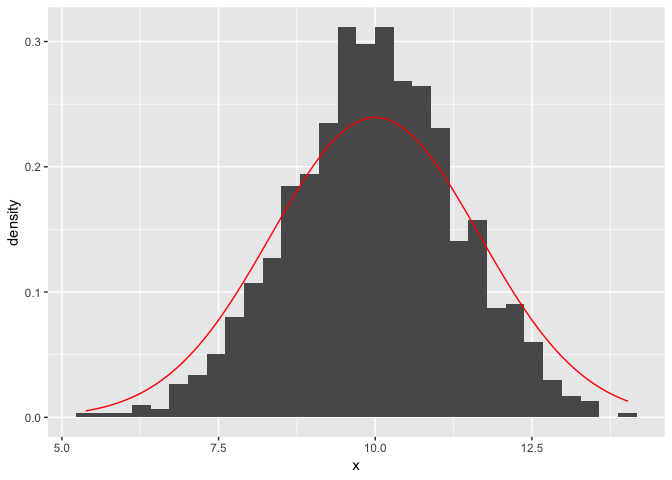
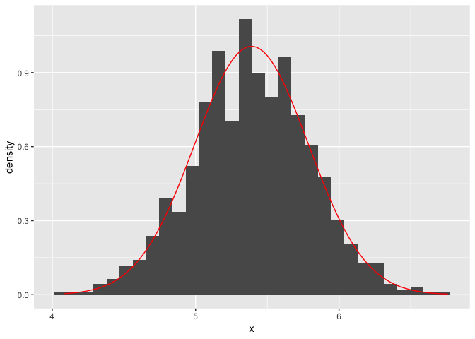

Concepts and methods from basic probability and statistics
================

## Question 1

### (a)

We wish to transform \(X\) into \(Y\) such that \(Y = aX + b\). We are
given that:

\[
\begin{aligned}
E[X] &= 35 \\
Var[X] &= 10^2
\end{aligned}
\]

and that we would like:

\[
\begin{aligned}
E[Y] &= 100 \\
Var[Y] &= 15^2
\end{aligned}
\]

Substituting \(Y = aX + b\) implies:

\[
\begin{aligned}
a E[X] + b &= 100 \\
a^2 Var[X] &= 15^2
\end{aligned}
\]

and substituing \(E[X] = 35\) and \(Var[X] = 10^2\) implies:

\[
\begin{aligned}
35a + b = 100 &\implies b = 100 - 35a \\
10^2 a^2 = 15^2 &\implies a^2 = \frac{15^2}{10^2}
\end{aligned}
\]

so that \(a = 1.5\) and \(b = 47.5\).

### (b)

An alternative transformation would be \(a = -1.5\) and \(b = 152\).
However, this is problematic since it reorders the data:

\[
x_i > x_j \implies y_i < y_j
\]

## Question 2

Import the data:

``` r
dat <- read_lines(str_c(arm_url, 'girls/births.txt'))

dat[4] <- "month\ttotal births\t\tproportion girls" 
dat[6] <- "Feb\t\t\t.4875"
dat[7] <- "Mar\t\t\t.4859"
dat[8] <- "Apr\t\t\t.4754"
dat <- read.delim(textConnection(dat[4:28]), sep = '\t')
```

### (a)

``` r
sd_dat <- sd(dat$proportion.girls)
print(sd_dat)
```

    ## [1] 0.006409724

### (b)

Note that the theoretical standard deviation is provided in the text
file. However, it can be calculated as follows:

``` r
pr_dat <- mean(dat$proportion.girls)
sd_exp <- sqrt(pr_dat * (1 - pr_dat) / 3903)
print(sd_exp)
```

    ## [1] 0.008000045

The hint tells us that:

\[
\frac{(n - 1) s ^ 2}{\sigma ^ 2} \sim \chi^2_{23}
\]

which we can compare to the lower and upper bounds of the 95% confidence
interval for a \(\chi^2_{23}\):

``` r
tstat <- (23 * sd_dat ^ 2) / sd_exp ^ 2
lower <- qchisq(0.025, 23)
upper <- qchisq(0.975, 23)

# test
tstat < upper & tstat > lower
```

    ## [1] TRUE

## Question 3

``` r
dat <- tibble(x = replicate(1000, sum(runif(20, 0, 1))))

# theoretical values
mn_exp <- 20 * (1 / 2) * (1 + 0)
sd_exp <- 20 * (1 / 12) * (1 - 0) ^ 2

# plot
p <- ggplot(dat) + 
  geom_histogram(aes(x, y = ..density..)) +
  stat_function(
    fun = dnorm,
    args = list(mean = mn_exp, sd = sd_exp),
    col = 'red'
  )
p
```

<!-- -->

## Question 4

``` r
ht_diff <- function() {mean(rnorm(100, 69.1, 2.9)) - mean(rnorm(100, 63.7, 2.7))}
dat <- tibble(x = replicate(1000, ht_diff()))

# theoretical values
mn_exp <- 69.1 - 63.71
sd_exp <- sqrt(2.9 ^ 2 / 100 + 2.7 ^ 2 / 100)

# plot
p <- ggplot(dat) + 
  geom_histogram(aes(x, y = ..density..)) +
  stat_function(
    fun = dnorm,
    args = list(mean = mn_exp, sd = sd_exp),
    col = 'red'
  )
p
```

<!-- -->

## Question 5

The mean and standard deviation are given by:

``` r
mn_exp <- (69.1 + 63.71) / 2
print(mn_exp)
```

    ## [1] 66.405

``` r
sd_exp <- 0.25 * sqrt(2.9 ^ 2 + 2.7 ^ 2 + 2 * 0.3 * 2.9 * 2.7)
print(sd_exp)
```

    ## [1] 1.129104
