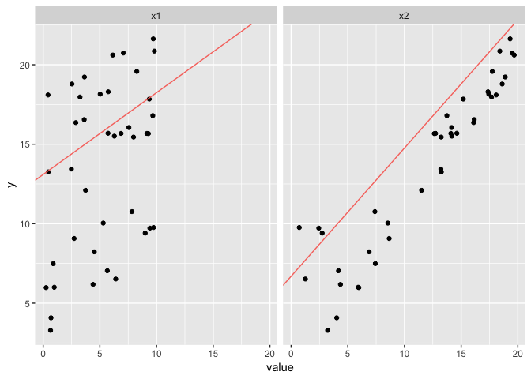
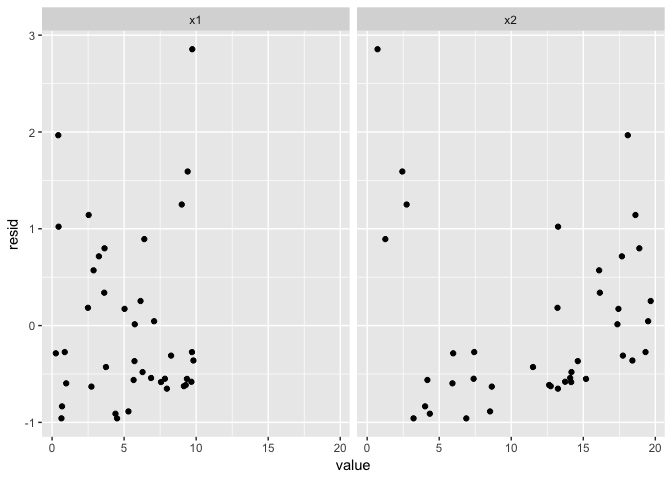
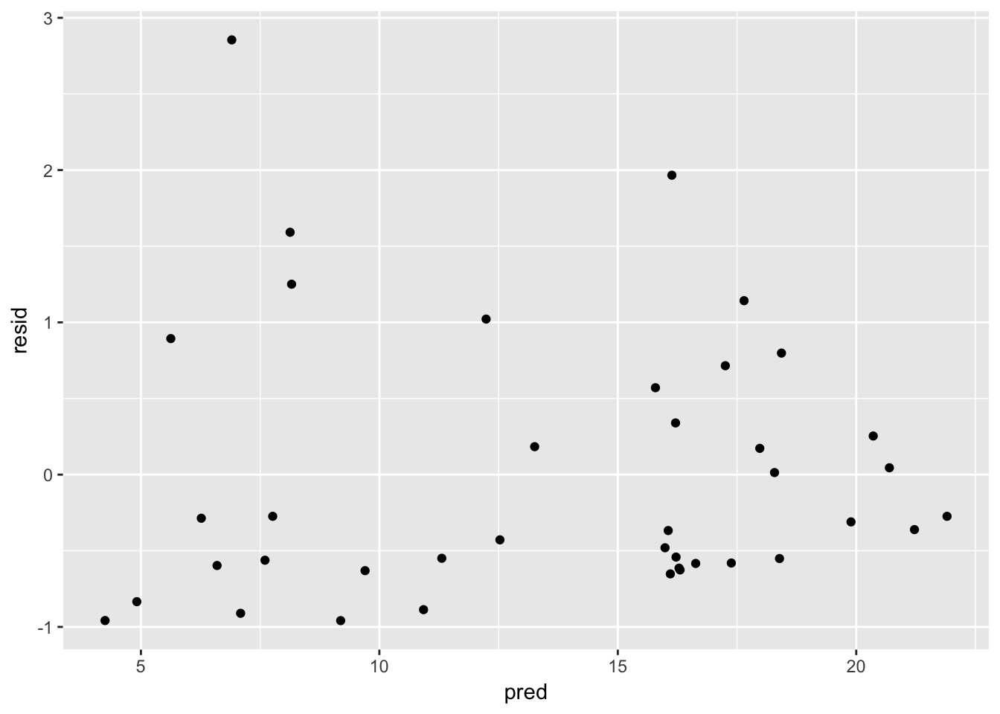
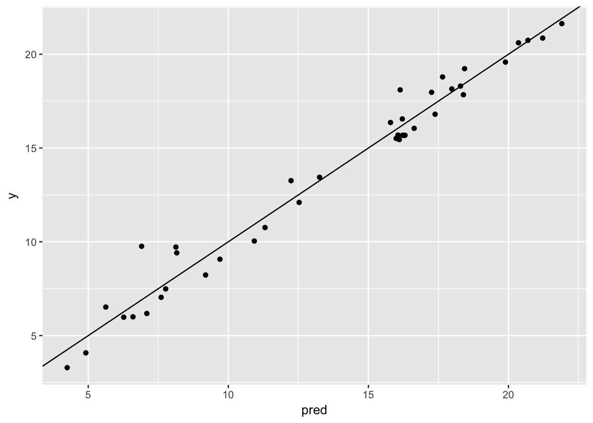
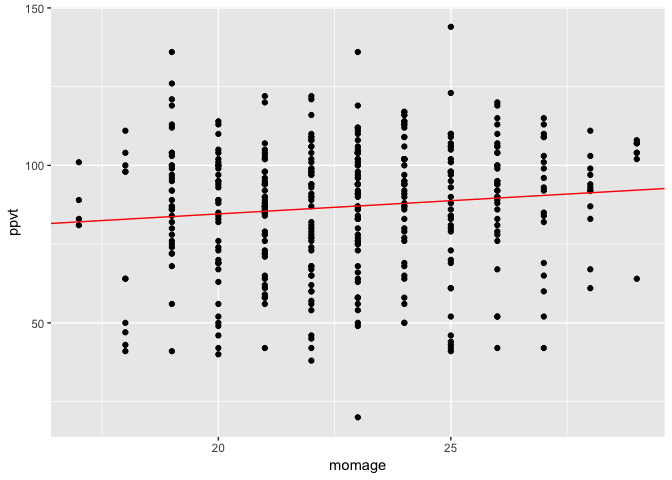
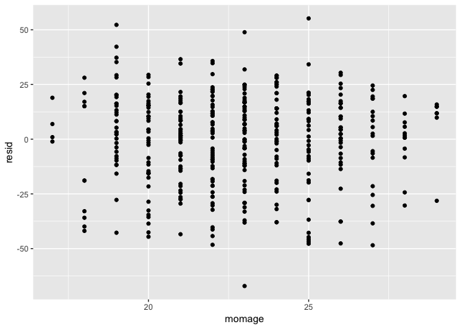
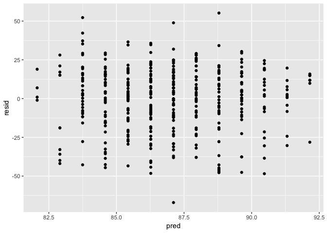
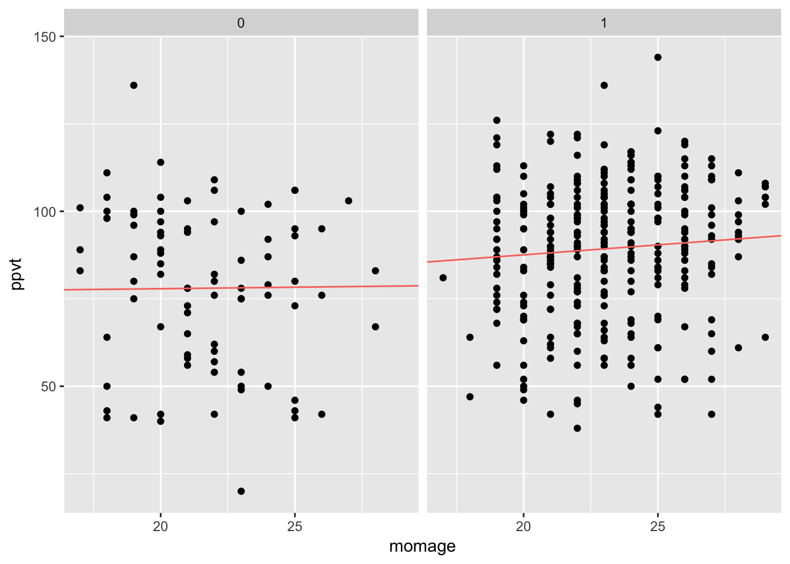
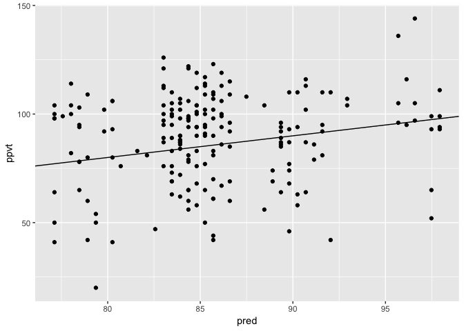
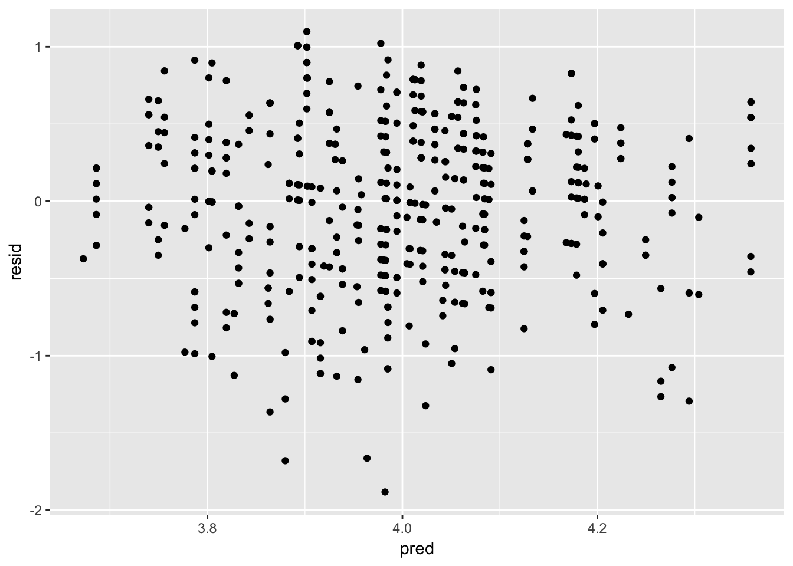

Linear regression: the basics
================

### Question 1

Import the data:

``` r
dat <- read_delim(str_c(arm_url, 'pyth/exercise2.1.dat'), delim = ' ')
```

#### (a)

``` r
reg <- lm(y ~ x1 + x2, data = dat[1:40, ]) ; summary(reg)
```

    ## 
    ## Call:
    ## lm(formula = y ~ x1 + x2, data = dat[1:40, ])
    ## 
    ## Residuals:
    ##     Min      1Q  Median      3Q     Max 
    ## -0.9585 -0.5865 -0.3356  0.3973  2.8548 
    ## 
    ## Coefficients:
    ##             Estimate Std. Error t value Pr(>|t|)    
    ## (Intercept)  1.31513    0.38769   3.392  0.00166 ** 
    ## x1           0.51481    0.04590  11.216 1.84e-13 ***
    ## x2           0.80692    0.02434  33.148  < 2e-16 ***
    ## ---
    ## Signif. codes:  0 '***' 0.001 '**' 0.01 '*' 0.05 '.' 0.1 ' ' 1
    ## 
    ## Residual standard error: 0.9 on 37 degrees of freedom
    ## Multiple R-squared:  0.9724, Adjusted R-squared:  0.9709 
    ## F-statistic: 652.4 on 2 and 37 DF,  p-value: < 2.2e-16

#### (b)

``` r
dat_long <- gather(dat[1:40, ], covar, value, -y)

p <- ggplot(dat_long) +
  geom_point(aes(value, y)) +
  geom_abline(
    aes(
      intercept = reg$coefficients[1] + mean(dat$x2[1:40]), 
      slope = reg$coefficients[2],
      col = 'red'
      ),
    data = filter(dat_long, covar == 'x1')
    ) +
  geom_abline(
    aes(
      intercept = reg$coefficients[1] + mean(dat$x1[1:40]), 
      slope = reg$coefficients[3],
      col = 'red'
      ),
    data = filter(dat_long, covar == 'x2')
    ) +
  facet_grid(~covar) +
  theme(legend.position = "none")
p
```

<!-- -->

#### (c)

``` r
dat <- dat %>%
  mutate(
    pred  = predict(reg, newdata = dat),
    resid = y - pred
  )

dat_long <- gather(dat[1:40, ], covar, value, -y, -pred, -resid)

p1 <- ggplot(dat_long) +
  geom_point(aes(x = value, y = resid)) +
  facet_grid(~covar)
p1
```

<!-- -->

``` r
p2 <- ggplot(dat) +
  geom_point(aes(pred, resid))
p2
```

<!-- -->

#### (d)

``` r
p <- ggplot(dat) +
  geom_point(aes(pred, y)) +
  geom_abline(intercept = 0, slope = 1)
p
```

<!-- -->

### Question 2

#### (a)

The log earnings model is given by:   
 = a + b \\times \\ln(height)
\\end{aligned}
")  
The first two bullet points imply that 
and . The third bullet point implies that:   
 \\leq \\ln(\\hat y) + 1.96 \\hat \\sigma \\\\
")  
and also that:   
 &\\leq \\ln(\\hat y) + \\ln(1.1)
\\end{align}
")  
Combining we have:   
 \\\\
\\hat \\sigma &= 0.0486276
\\end{align}
")  

#### (b)

Given that  we have that:\`   
  

### Question 3

#### (a)

``` r
var1 <- rnorm(1000, 0, 1)
var2 <- rnorm(1000, 0, 1)

reg <- lm(var2 ~ var1) ; summary(reg)
```

    ## 
    ## Call:
    ## lm(formula = var2 ~ var1)
    ## 
    ## Residuals:
    ##     Min      1Q  Median      3Q     Max 
    ## -4.1965 -0.6866  0.0356  0.6344  3.3222 
    ## 
    ## Coefficients:
    ##               Estimate Std. Error t value Pr(>|t|)
    ## (Intercept)  0.0001719  0.0316043   0.005    0.996
    ## var1        -0.0084689  0.0324884  -0.261    0.794
    ## 
    ## Residual standard error: 0.9993 on 998 degrees of freedom
    ## Multiple R-squared:  6.808e-05,  Adjusted R-squared:  -0.0009339 
    ## F-statistic: 0.06795 on 1 and 998 DF,  p-value: 0.7944

The slope coefficient is not statistically significant.

#### (b)

``` r
q3b <- function(trials) {
  set.seed(trials)
  var1 <- rnorm(1000, 0, 1)
  var2 <- rnorm(1000, 0, 1)

  reg <- lm(var2 ~ var1) %>% summary()
  reg$coefficients[2, 1] / reg$coefficients[2, 2]
}

dat <- map_dbl(1:100, q3b)

table(abs(dat) >= 2)['TRUE']
```

    ## TRUE 
    ##    6

### Question 4

Import the data:

``` r
dat <- read_stata(str_c(arm_url, 'child.iq/child.iq.dta'))
```

#### (a)

``` r
reg <- lm(ppvt ~ momage, data = dat) ; summary(reg)
```

    ## 
    ## Call:
    ## lm(formula = ppvt ~ momage, data = dat)
    ## 
    ## Residuals:
    ##     Min      1Q  Median      3Q     Max 
    ## -67.109 -11.798   2.971  14.860  55.210 
    ## 
    ## Coefficients:
    ##             Estimate Std. Error t value Pr(>|t|)    
    ## (Intercept)  67.7827     8.6880   7.802 5.42e-14 ***
    ## momage        0.8403     0.3786   2.219    0.027 *  
    ## ---
    ## Signif. codes:  0 '***' 0.001 '**' 0.01 '*' 0.05 '.' 0.1 ' ' 1
    ## 
    ## Residual standard error: 20.34 on 398 degrees of freedom
    ## Multiple R-squared:  0.01223,    Adjusted R-squared:  0.009743 
    ## F-statistic: 4.926 on 1 and 398 DF,  p-value: 0.02702

``` r
p1 <- ggplot(dat) +
  geom_point(aes(momage, ppvt)) +
  geom_abline(
    intercept = reg$coefficients[1],
    slope = reg$coefficients[2],
    col = 'red'
    )
p1
```

<!-- -->

``` r
dat <- dat %>%
  mutate(
    pred = predict(reg),
    resid = ppvt - pred
  )

p2 <- ggplot(dat) +
  geom_point(aes(momage, resid))
p2
```

<!-- -->

``` r
p3 <- ggplot(dat) +
  geom_point(aes(pred, resid))
p3
```

<!-- -->

Residual plots indicate the assumptions of the model hold. The slope
coefficient inidcates that a one year increase in mother’s age is
associated with an increase in test score of 0.840; this coefficient is
also significantly different from zero. On the basis of this coefficient
alone, a mother should wait until as long as possible to have a child.
Of course, this ingnores all sorts of other factors; for example, it
becomes more difficult to get pregnant as a woman ages.

#### (b)

``` r
reg <- lm(ppvt ~ momage + educ_cat, data = dat) ; summary(reg)
```

    ## 
    ## Call:
    ## lm(formula = ppvt ~ momage + educ_cat, data = dat)
    ## 
    ## Residuals:
    ##     Min      1Q  Median      3Q     Max 
    ## -61.763 -13.130   2.495  14.620  55.610 
    ## 
    ## Coefficients:
    ##             Estimate Std. Error t value Pr(>|t|)    
    ## (Intercept)  69.1554     8.5706   8.069 8.51e-15 ***
    ## momage        0.3433     0.3981   0.862 0.389003    
    ## educ_cat      4.7114     1.3165   3.579 0.000388 ***
    ## ---
    ## Signif. codes:  0 '***' 0.001 '**' 0.01 '*' 0.05 '.' 0.1 ' ' 1
    ## 
    ## Residual standard error: 20.05 on 397 degrees of freedom
    ## Multiple R-squared:  0.04309,    Adjusted R-squared:  0.03827 
    ## F-statistic: 8.939 on 2 and 397 DF,  p-value: 0.0001594

The slope cofficient on age decreases to 0.343; however, it is no longer
statistically significant from zero. The slope coffiecient on education
category indicates that moving up one category is associated with an
increase in test score of 4.711; this coefficent is significantly
different from zero.

#### (c)

``` r
dat$momhs <- 0
dat$momhs <- replace(dat$momhs, dat$educ_cat != 1, 1)

reg <- lm(ppvt ~ momage + momage:momhs, data = dat) ; summary(reg)
```

    ## 
    ## Call:
    ## lm(formula = ppvt ~ momage + momage:momhs, data = dat)
    ## 
    ## Residuals:
    ##    Min     1Q Median     3Q    Max 
    ## -58.14 -12.42   1.87  14.73  58.21 
    ## 
    ## Coefficients:
    ##              Estimate Std. Error t value Pr(>|t|)    
    ## (Intercept)   76.1470     8.7276   8.725  < 2e-16 ***
    ## momage         0.0865     0.4104   0.211    0.833    
    ## momage:momhs   0.4842     0.1133   4.275 0.000024 ***
    ## ---
    ## Signif. codes:  0 '***' 0.001 '**' 0.01 '*' 0.05 '.' 0.1 ' ' 1
    ## 
    ## Residual standard error: 19.91 on 397 degrees of freedom
    ## Multiple R-squared:  0.05569,    Adjusted R-squared:  0.05093 
    ## F-statistic: 11.71 on 2 and 397 DF,  p-value: 0.00001149

``` r
p <- ggplot(dat) +
  geom_point(aes(momage, ppvt)) +
  geom_abline(
    aes(
      intercept = reg$coefficients[1],
      slope = reg$coefficients[2],
      col = 'red'
    ),
    data = filter(dat, momhs == 0)
  ) +
  geom_abline(
    aes(
      intercept = reg$coefficients[1],
      slope = reg$coefficients[2] + reg$coefficients[3],
      col = 'red'
    ),
    data = filter(dat, momhs == 1)
  ) +
  facet_grid(~momhs) +
  theme(legend.position="none")
p
```

<!-- -->

#### (d)

``` r
reg <- lm(ppvt ~ momage + educ_cat, data = dat[1:200, ])

dat <- dat %>%
  mutate(
    pred = predict(reg, newdata = dat)
  )

p <- ggplot(dat[201:400, ]) +
  geom_point(aes(pred, ppvt)) +
  geom_abline(intercept = 0, slope = 1)
p
```

<!-- -->

### Question 5

Import the data:

``` r
dat <- read_csv(str_c(arm_url, 'beauty/ProfEvaltnsBeautyPublic.csv'))
```

#### (a)

Without a description of the dataset it is difficult to come up with a
model. Here we choose the standardized average beauty score, an
indicator for female, and an indicator for minority as predictors:

``` r
reg <- lm(courseevaluation ~ btystdave + female + minority, data = dat)
summary(reg)
```

    ## 
    ## Call:
    ## lm(formula = courseevaluation ~ btystdave + female + minority, 
    ##     data = dat)
    ## 
    ## Residuals:
    ##      Min       1Q   Median       3Q      Max 
    ## -1.88219 -0.35398  0.02137  0.38489  1.09804 
    ## 
    ## Coefficients:
    ##             Estimate Std. Error t value   Pr(>|t|)    
    ## (Intercept)  4.10565    0.03413 120.300    < 2e-16 ***
    ## btystdave    0.14944    0.03192   4.682 0.00000375 ***
    ## female      -0.18971    0.05124  -3.702    0.00024 ***
    ## minority    -0.10327    0.07276  -1.419    0.15653    
    ## ---
    ## Signif. codes:  0 '***' 0.001 '**' 0.01 '*' 0.05 '.' 0.1 ' ' 1
    ## 
    ## Residual standard error: 0.5367 on 459 degrees of freedom
    ## Multiple R-squared:  0.07037,    Adjusted R-squared:  0.0643 
    ## F-statistic: 11.58 on 3 and 459 DF,  p-value: 0.0000002488

``` r
dat <- dat %>%
  mutate(
    pred = predict(reg, data = dat),
    resid = courseevaluation - pred
  )

p <- ggplot(dat) +
  geom_point(aes(pred, resid))
p
```

<!-- -->

A one point in increase in beauty score for any instructor is associated
with a 0.1494 increase in course evaluation score. A male and
non-minority instructor with a standardized beauty score of zero
receives, on average, a course evaluation score of 4.1056. A female and
non-minority instructor with a standardized beauty score of zero
receives, on average, a course evaluation score of 3.92. These averages
decline by 0.1033 for minority instructors.

The residual standard error in this case is 0.537; this suggests that
the model can predict course evaluation score to within a half a point.

#### (b)

Let’s consider one additional model where the interaction of the beauty
score and the indicator for female is added as a predictator:

``` r
reg <- lm(
  courseevaluation ~ btystdave + female + minority + btystdave:female, 
  data = dat
  )
summary(reg)
```

    ## 
    ## Call:
    ## lm(formula = courseevaluation ~ btystdave + female + minority + 
    ##     btystdave:female, data = dat)
    ## 
    ## Residuals:
    ##     Min      1Q  Median      3Q     Max 
    ## -1.8503 -0.3733  0.0338  0.3930  1.1028 
    ## 
    ## Coefficients:
    ##                  Estimate Std. Error t value   Pr(>|t|)    
    ## (Intercept)       4.11142    0.03429 119.917    < 2e-16 ***
    ## btystdave         0.19500    0.04357   4.475 0.00000964 ***
    ## female           -0.19769    0.05143  -3.844   0.000138 ***
    ## minority         -0.08315    0.07383  -1.126   0.260655    
    ## btystdave:female -0.09965    0.06499  -1.533   0.125872    
    ## ---
    ## Signif. codes:  0 '***' 0.001 '**' 0.01 '*' 0.05 '.' 0.1 ' ' 1
    ## 
    ## Residual standard error: 0.5359 on 458 degrees of freedom
    ## Multiple R-squared:  0.07512,    Adjusted R-squared:  0.06704 
    ## F-statistic:   9.3 on 4 and 458 DF,  p-value: 0.0000003115

The inputs correspond to the predictors used in part (a). We see similar
results to (a) but are able to determine that the influence of beauty
score on evaulation score does not depend on gender; this is supported
by the fact the coefficient for the interaction term is not
statistically different from zero.
