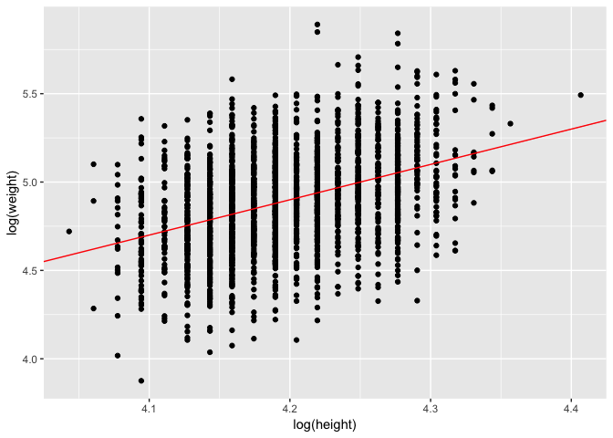
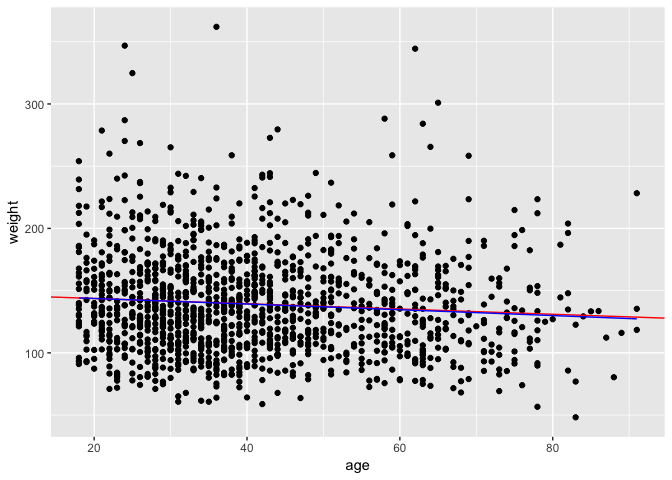
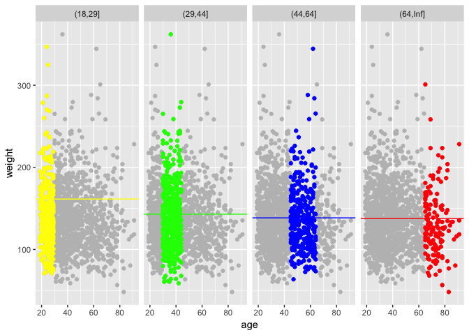
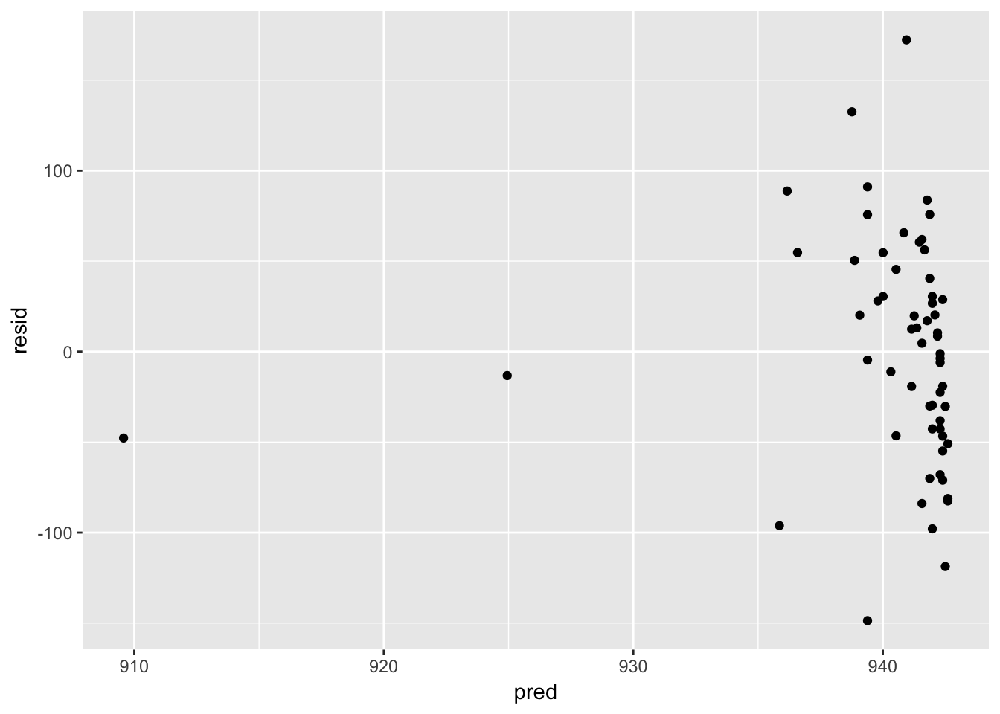
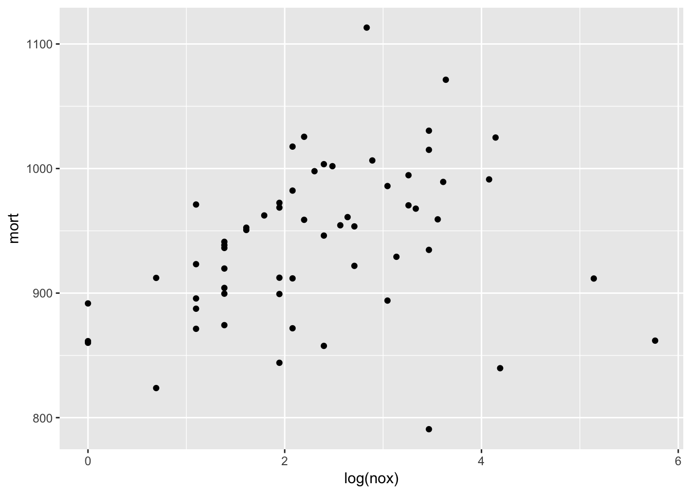
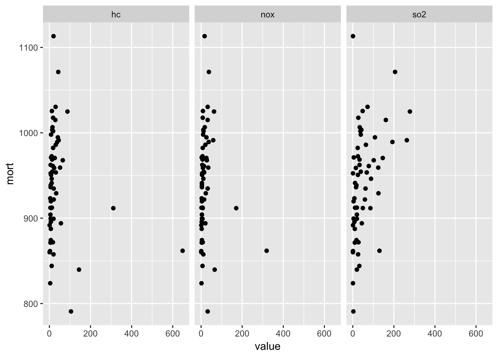
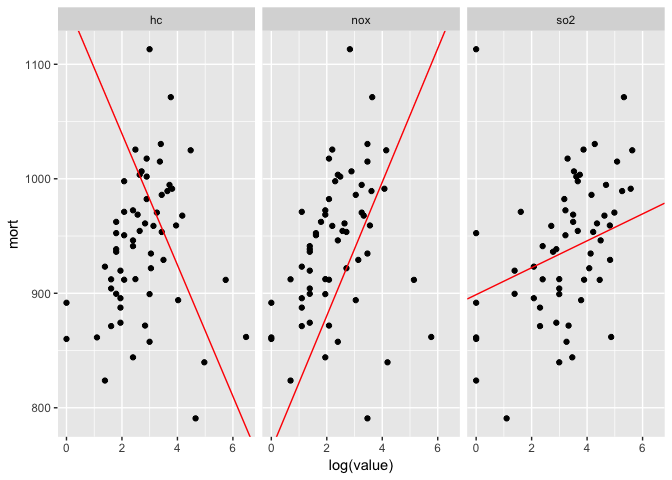
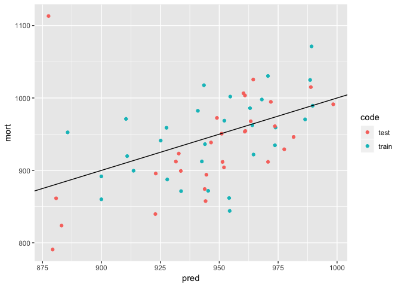

Linear regression: before and after fitting the model
================

## Question 1

### (a)

The factors are \(e^{-0.25}\) and \(e^{0.25}\).

### (b)

Import the height data used in Chapter 4, simulate weights, and plot:

``` r
set.seed(1)

dat <- read_stata(str_c(arm_url, 'earnings/heights.dta'))

dat$weight <- exp(-3.5 + 2 * log(dat$height) + rnorm(nrow(dat), 0, 0.25))

p <- ggplot(dat) +
  geom_point(aes(log(height), log(weight))) +
  geom_abline(aes(intercept = -3.5, slope = 2), col = 'red')
p
```

<!-- -->

## Question 2

### (a)

Remove missing values from the data:

``` r
dat <- na.omit(dat)
```

### (b)

Center height:

``` r
dat$height_c <- dat$height - mean(dat$height, na.rm = T)

reg <- lm(earn ~ height_c, data = dat) ; summary(reg)
```

    ## 
    ## Call:
    ## lm(formula = earn ~ height_c, data = dat)
    ## 
    ## Residuals:
    ##    Min     1Q Median     3Q    Max 
    ## -30031 -12497  -3215   7474 174659 
    ## 
    ## Coefficients:
    ##             Estimate Std. Error t value Pr(>|t|)    
    ## (Intercept)  20014.9      507.7   39.42   <2e-16 ***
    ## height_c      1563.1      133.4   11.71   <2e-16 ***
    ## ---
    ## Signif. codes:  0 '***' 0.001 '**' 0.01 '*' 0.05 '.' 0.1 ' ' 1
    ## 
    ## Residual standard error: 18850 on 1377 degrees of freedom
    ## Multiple R-squared:  0.09061,    Adjusted R-squared:  0.08995 
    ## F-statistic: 137.2 on 1 and 1377 DF,  p-value: < 2.2e-16

So a person of average height earns $20,014.86 on average.

### (c)

Skip

## Question 3

Create similar dataset and models:

``` r
# age (the original paper indicates the survey was conducted in 1990)
dat$age <- 90 - dat$yearbn
dat$age[dat$age <= 0] <- 1990 - (1800 + dat$yearbn[dat$age <= 0])

# age bins
age_brks <- c(0, 18, 29, 44, 64, Inf)
dat <- dat %>%
  mutate(
    age_10  = age / 10,
    age_bin = cut(age, breaks = age_brks, include.lowest = T)
  )

# models
reg1 <- lm(weight ~ age_10, data = dat)
reg2 <- lm(weight ~ age_10 + I(age_10 ^ 2), data = dat)
reg3 <- lm(weight ~ age_bin, data = dat)
```

### (a) - (b)

``` r
reg2_fun <- function(x) (-0.0157) / 100 * x ^ 2 + (-2.13) / 10 * x + 148

p <- ggplot(dat) +
  geom_point(aes(age, weight)) +
  geom_abline(
    aes(intercept = reg1$coefficients[1], slope = reg1$coefficients[2] / 10),
    col = 'red'
  ) +
  stat_function(fun = reg2_fun, col = 'blue')
p
```

<!-- -->

### (c)

``` r
p <- ggplot(filter(dat, age_bin != '[0,18]')) + 
  geom_point(
    aes(age, weight),
    col = 'grey',
    data = select(filter(dat, age_bin != '[0,18]'), age, weight)
  ) +
  geom_point(aes(age, weight, colour = age_bin)) +
  scale_colour_manual(values = c("yellow", "green", "blue", "red")) +
  geom_hline(
    aes(yintercept = reg3$coefficients[1]),
    col = 'yellow',
    data = filter(dat, age_bin == '(18,29]')
  ) +
  geom_hline(
    aes(yintercept = reg3$coefficients[1] + reg3$coefficients[2]),
    col = 'green',
    data = filter(dat, age_bin == '(29,44]')
  ) +
  geom_hline(
    aes(yintercept = reg3$coefficients[1] + reg3$coefficients[3]),
    col = 'blue',
    data = filter(dat, age_bin == '(44,64]')
  ) +
  geom_hline(
    aes(yintercept = reg3$coefficients[1] + reg3$coefficients[4]),
    col = 'red',
    data = filter(dat, age_bin == '(64,Inf]')
  ) +
  facet_grid(~age_bin) +
  theme(legend.position = 'none')
p
```

<!-- -->

## Question 4

Import the data:

``` r
dat <- read_stata(str_c(arm_url, 'pollution/pollution.dta'))
```

### (a)

``` r
p1 <- ggplot(dat) +
  geom_point(aes(nox, mort))
p1
```

<!-- -->

``` r
reg <- lm(mort ~ nox, data = dat) ; summary(reg)
```

    ## 
    ## Call:
    ## lm(formula = mort ~ nox, data = dat)
    ## 
    ## Residuals:
    ##      Min       1Q   Median       3Q      Max 
    ## -148.654  -43.710    1.751   41.663  172.211 
    ## 
    ## Coefficients:
    ##             Estimate Std. Error t value Pr(>|t|)    
    ## (Intercept) 942.7115     9.0034 104.706   <2e-16 ***
    ## nox          -0.1039     0.1758  -0.591    0.557    
    ## ---
    ## Signif. codes:  0 '***' 0.001 '**' 0.01 '*' 0.05 '.' 0.1 ' ' 1
    ## 
    ## Residual standard error: 62.55 on 58 degrees of freedom
    ## Multiple R-squared:  0.005987,   Adjusted R-squared:  -0.01115 
    ## F-statistic: 0.3494 on 1 and 58 DF,  p-value: 0.5568

``` r
dat <- dat %>%
  mutate(
    pred = predict(reg, data = dat),
    resid = mort - pred
  )

p2 <- ggplot(dat) +
  geom_point(aes(pred, resid))
p2
```

<!-- -->

Linearity seems like a stretch here. The outlier where nox is 319
results in a poor fit. The residual plot confirms this approach is
problematic.

### (b)

Let’s try using the log of nox:

``` r
p1 <- ggplot(dat) +
  geom_point(aes(log(nox), mort))
p1
```

<!-- -->

``` r
reg <- lm(mort ~ log(nox), dat = dat) ; summary(reg)
```

    ## 
    ## Call:
    ## lm(formula = mort ~ log(nox), data = dat)
    ## 
    ## Residuals:
    ##      Min       1Q   Median       3Q      Max 
    ## -167.140  -28.368    8.778   35.377  164.983 
    ## 
    ## Coefficients:
    ##             Estimate Std. Error t value Pr(>|t|)    
    ## (Intercept)  904.724     17.173  52.684   <2e-16 ***
    ## log(nox)      15.335      6.596   2.325   0.0236 *  
    ## ---
    ## Signif. codes:  0 '***' 0.001 '**' 0.01 '*' 0.05 '.' 0.1 ' ' 1
    ## 
    ## Residual standard error: 60.01 on 58 degrees of freedom
    ## Multiple R-squared:  0.08526,    Adjusted R-squared:  0.06949 
    ## F-statistic: 5.406 on 1 and 58 DF,  p-value: 0.02359

``` r
dat <- dat %>%
  mutate(
    pred = predict(reg, data = dat),
    resid = mort - pred
  )

p2 <- ggplot(dat) +
  geom_point(aes(pred, resid))
p2
```

<!-- -->

This works better.

### (c)

A one percent increase in nox is associated with an increase of
mortality of 15.3355.

### (d)

``` r
dat_long <- gather(dat, poll, value, hc:so2)

p1 <- ggplot(dat_long) +
  geom_point(aes(value, mort)) +
  facet_grid(~poll)
p1
```

<!-- -->

``` r
reg <- lm(mort ~ log(hc) + log(nox) + log(so2), data = dat) ; summary(reg)
```

    ## 
    ## Call:
    ## lm(formula = mort ~ log(hc) + log(nox) + log(so2), data = dat)
    ## 
    ## Residuals:
    ##     Min      1Q  Median      3Q     Max 
    ## -97.793 -34.728  -3.118  34.148 194.567 
    ## 
    ## Coefficients:
    ##             Estimate Std. Error t value Pr(>|t|)    
    ## (Intercept)  924.965     21.449  43.125  < 2e-16 ***
    ## log(hc)      -57.300     19.419  -2.951  0.00462 ** 
    ## log(nox)      58.336     21.751   2.682  0.00960 ** 
    ## log(so2)      11.762      7.165   1.642  0.10629    
    ## ---
    ## Signif. codes:  0 '***' 0.001 '**' 0.01 '*' 0.05 '.' 0.1 ' ' 1
    ## 
    ## Residual standard error: 54.36 on 56 degrees of freedom
    ## Multiple R-squared:  0.2752, Adjusted R-squared:  0.2363 
    ## F-statistic: 7.086 on 3 and 56 DF,  p-value: 0.0004044

``` r
c1 <- reg$coefficients
c2 <- apply(dat[c('hc' ,'nox', 'so2')], 2, mean) %>% log()
c3 <- c1[2:4] * c2  

p2 <- ggplot(dat_long) +
  geom_point(aes(log(value), mort)) +
  facet_grid(~poll) +
  geom_abline(
    aes(intercept = c1[1] + c3[2] + c3[3], slope = c1[2]),
    col = 'red',
    data = filter(dat_long, poll == 'hc')
  ) +
  geom_abline(
    aes(intercept = c1[1] + c3[1] + c3[3], slope = c1[3]),
    col = 'red',
    data = filter(dat_long, poll == 'nox')
  ) +
  geom_abline(
    aes(intercept = c1[1] + c3[1] + c3[2], slope = c1[4]),
    col = 'red',
    data = filter(dat_long, poll == 'so2')
  )
p2
```

<!-- -->

Given a single pollutant with the levels of the other two fixed (perhaps
at their mean values), the coefficients correspond to the change in
mortality for a one percent change in the given
pollutant.

### (e)

``` r
reg <- lm(mort ~ log(hc) + log(nox) + log(so2), data = dat[1:30, ]) ; summary(reg)
```

    ## 
    ## Call:
    ## lm(formula = mort ~ log(hc) + log(nox) + log(so2), data = dat[1:30, 
    ##     ])
    ## 
    ## Residuals:
    ##      Min       1Q   Median       3Q      Max 
    ## -110.358  -36.766   -1.032   35.049   82.107 
    ## 
    ## Coefficients:
    ##             Estimate Std. Error t value Pr(>|t|)    
    ## (Intercept)   899.97      25.71  35.009   <2e-16 ***
    ## log(hc)       -17.47      26.21  -0.667   0.5108    
    ## log(nox)       10.57      29.59   0.357   0.7240    
    ## log(so2)       21.87      12.32   1.774   0.0877 .  
    ## ---
    ## Signif. codes:  0 '***' 0.001 '**' 0.01 '*' 0.05 '.' 0.1 ' ' 1
    ## 
    ## Residual standard error: 52.07 on 26 degrees of freedom
    ## Multiple R-squared:  0.2522, Adjusted R-squared:  0.1659 
    ## F-statistic: 2.922 on 3 and 26 DF,  p-value: 0.05277

``` r
dat <- dat %>%
  mutate(
    pred = predict(reg, newdata = dat),
    resid = mort - pred,
    code = c(rep('train', 30), rep('test', 30))
  )

p <- ggplot(dat) +
  geom_point(aes(pred, mort, colour = code)) +
  geom_abline(intercept = 0, slope = 1)
p
```

<!-- -->

## Question 5

### (a)

  - This measure implicitly assumes that a dollar has the same impact on
    vote share across districts. This is likely unrealistic; for
    example, advertising costs are likely to vary by district.
  - This measure improves on the last but may be problematic in
    uncontested districts; it also may be skewed by noncompetitive
    districts.
  - This measure improves on the last in terms of skewness but still may
    be problematic in uncontested districts.
  - This measure seems the best as it is standardized, ranging between 0
    and 1, and has a clear demarcation at one half where the candidates
    raise equal amounts.

### (b)

One possiblity would be to use the last measure
\(M_i = D_i / (D_i + R_i)\) but introduce nonlinearity using polynomial
transformations.

## Question 6

This represents an elasticity. Most likely the authors meant
\(\beta = -0.3\); economists often consider elasticities in absolute
terms. This means that a one percent increase in price is associated
with a 0.3 percent decrease in quantity. As expected, demand for
cigarettes is inelastic.

## Question 7

Skip

## Question 8

Skip
