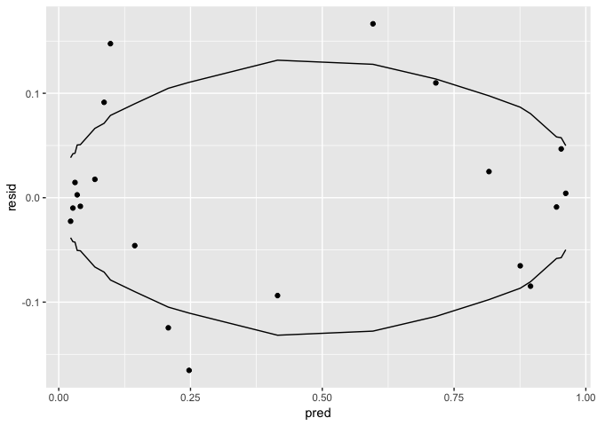
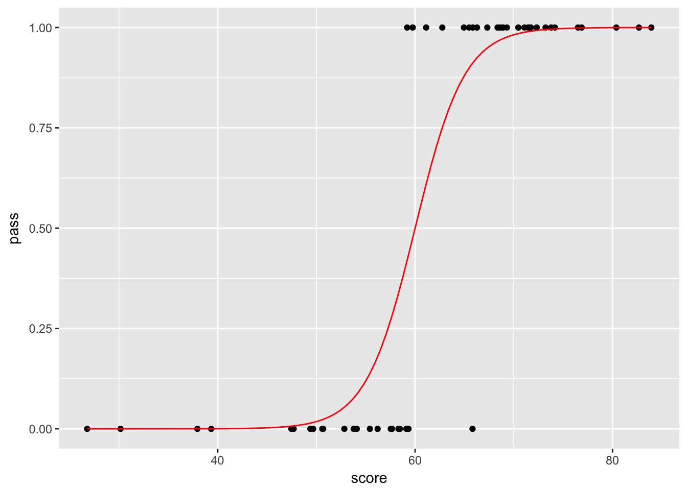
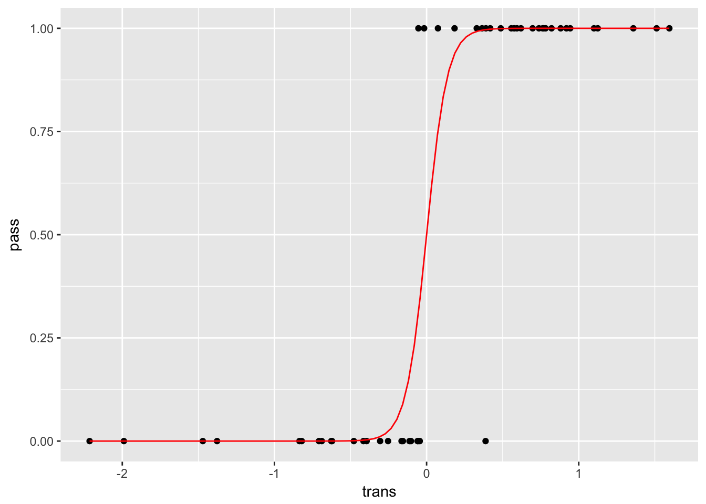
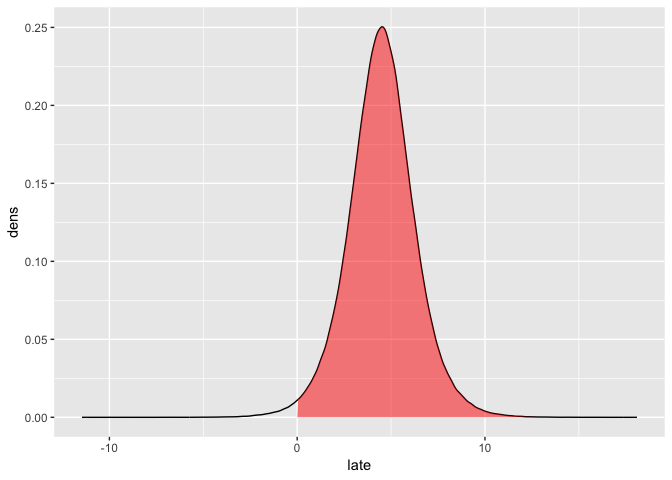
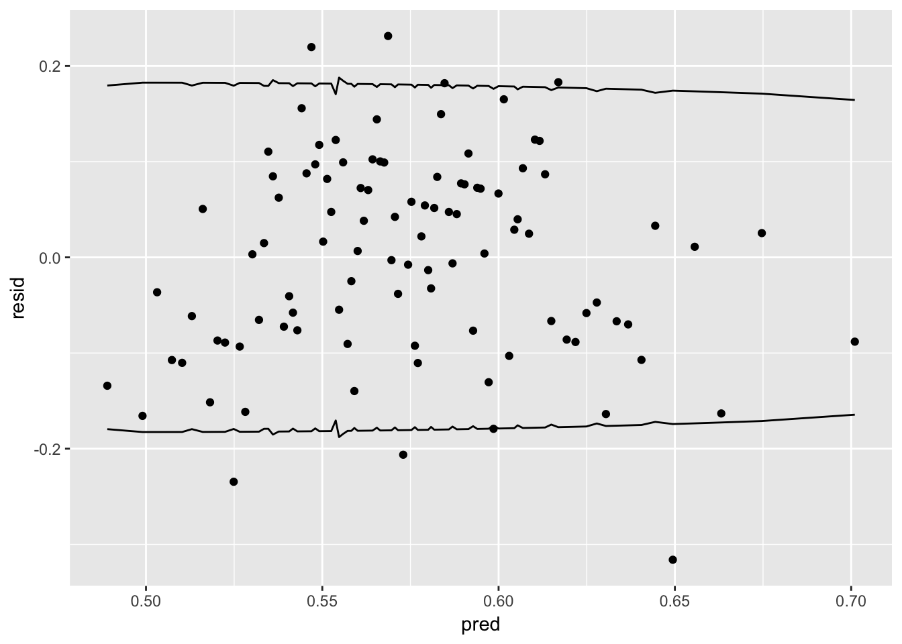
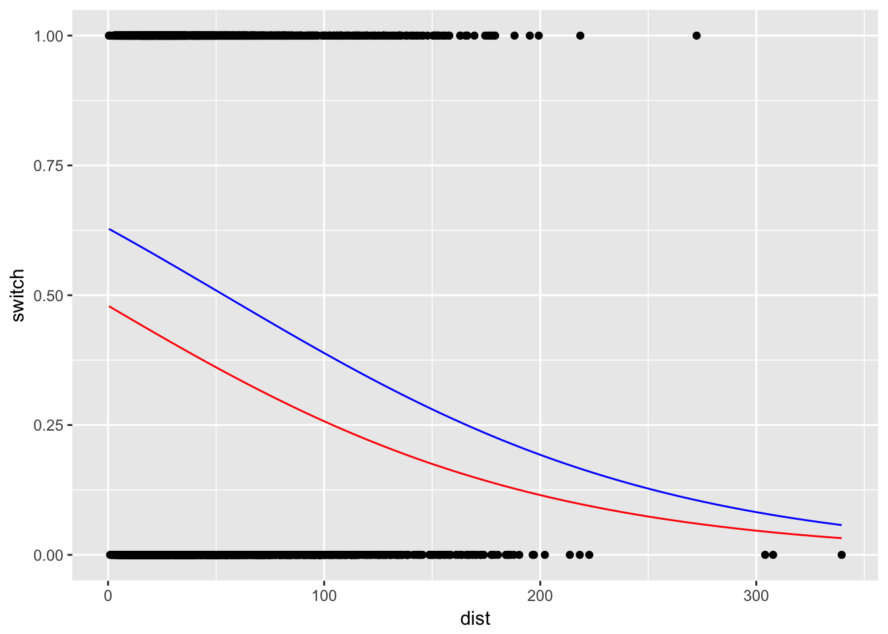
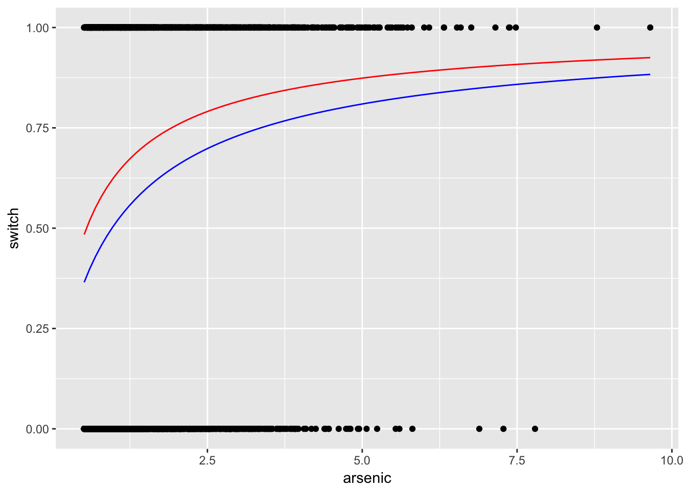
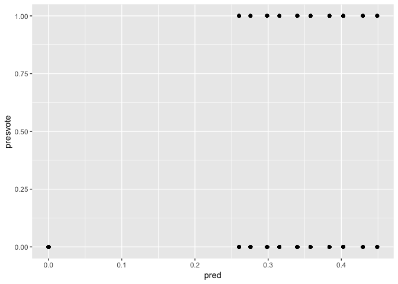

Logistic regression
================

## Question 1

Import the
data:

``` r
dat <- read_stata(str_c(arm_url, 'nes/nes5200_processed_voters_realideo.dta'))
```

### (a)

Unfortunately, the data is not accompanied by a description of the
variables.

``` r
# presvote_intent(1 = Clinton, 2 = Bush)
dat_92 <- dat %>%
  filter(year == 1992) %>%
  mutate(
    presvote = replace(presvote_2party, presvote_2party != 2, 0),
    presvote = presvote / 2
  )

# partyid7 (1 = strong Democrat... 7 = strong Republican)
# ideo7 (1 = strong liberal... 7 = strong Conservative)
# educ3 (1 = no high school... 4 = college graduate)
mod <- 'presvote ~ income + female + white + educ3 + partyid7'
reg <- glm(as.formula(mod), family = binomial(link = 'logit'), data = dat_92)
summary(reg)
```

    ## 
    ## Call:
    ## glm(formula = as.formula(mod), family = binomial(link = "logit"), 
    ##     data = dat_92)
    ## 
    ## Deviance Residuals: 
    ##     Min       1Q   Median       3Q      Max  
    ## -2.6007  -0.4501  -0.2364   0.4651   2.6930  
    ## 
    ## Coefficients:
    ##             Estimate Std. Error z value Pr(>|z|)    
    ## (Intercept) -4.79418    0.42147 -11.375   <2e-16 ***
    ## income       0.04224    0.09453   0.447    0.655    
    ## female       0.21507    0.18769   1.146    0.252    
    ## white        0.33786    0.23623   1.430    0.153    
    ## educ3       -0.05314    0.05899  -0.901    0.368    
    ## partyid7     1.07667    0.05640  19.090   <2e-16 ***
    ## ---
    ## Signif. codes:  0 '***' 0.001 '**' 0.01 '*' 0.05 '.' 0.1 ' ' 1
    ## 
    ## (Dispersion parameter for binomial family taken to be 1)
    ## 
    ##     Null deviance: 1608.78  on 1189  degrees of freedom
    ## Residual deviance:  800.11  on 1184  degrees of freedom
    ##   (757 observations deleted due to missingness)
    ## AIC: 812.11
    ## 
    ## Number of Fisher Scoring iterations: 5

``` r
# add residuals
dat_92 <- model.frame(reg) %>%
  mutate(
    pred = predict(reg, type = 'response'),
    resid = presvote - pred
  )
```

Recall that the variance of an individual observation is:

\[
\sigma^2 = p(1-p)
\]

so that the standard error for a sample of size \(n\) is:

\[
s = \sqrt{\frac{\sigma}{n}}
\]

``` r
# bin the data
bins <- quantile(dat_92$pred, probs = seq(0, 1, 0.05), na.rm = T)
dat_92 <- dat_92 %>%
  mutate(
    pred_bin = cut(pred, bins, include.lowest = T)
    ) %>%
  group_by(pred_bin) %>%
  mutate_at(vars(pred, resid), mean, na.rm = T) %>%
  ungroup()

# summarise and add standard errors
dat_92_bin <- dat_92 %>%
  count(pred, resid) %>%
  mutate(
    lower = -2 * sqrt(pred * (1 - pred) / n),
    upper = 2 * sqrt(pred * (1 - pred) / n)
  )

# plot
p <- ggplot(dat_92_bin) +
  geom_point(aes(pred, resid)) +
  geom_line(aes(pred, lower)) +
  geom_line(aes(pred, upper))
p
```

<!-- -->

``` r
table(abs(dat_92_bin$resid) < dat_92_bin$upper)
```

    ## 
    ## FALSE  TRUE 
    ##     6    14

### (b)

The above model has coefficients consistent with expecation: weathly
white Republican respondents are more likely to support Bush.
Conversely, more educated respondents are more likely to support to
Clinton.

The binned residual plot suggests the model fits reasonable well; 70
percent of the predictions are consistent with the model being true.

### (c)

Skip

## Question 2

Skip

## Question 3

The model is given by:

\[
\text{Pr}(\text{graduation}_i = 1) = \text{logit}^{-1} \left( \alpha + \beta \times \text{income}_i \right)
\]

and we are given the information that:

\[
\begin{align}
0.27 &= \text{logit}^{-1} \left( \alpha \right) \\
0.81 &= \text{logit}^{-1} \left (\alpha + \beta \times 6 \right)
\end{align}
\]

which implies:

\[
\begin{align}
\alpha &= \ln(0.27) - \ln(1 - 0.27) = -0.9946226 \\
\beta &= \frac{1}{6} \times \left[ \ln(0.81) - \ln(1 - 0.81) - \alpha \right] = 2.4446328
\end{align}
\]

## Question 4

Skip

## Question 5

### (a)

Steps to create consistent data:

1.  Simulate test scores
2.  Simulate the value for the linear predictor (which includes error
    following a logistic distribution)
3.  Predict the probability of passing
4.  Classify as pass or fail using the probability and a 0.5 cutoff

<!-- end list -->

``` r
set.seed(1)

dat <- tibble(score = rnorm(50, 60, 15)) %>%
  mutate(
    pred = -24 + 0.4 * score + rlogis(50, 0, 1),
    pass = 1,
    pass = replace(pass, pred < 0, 0)
  )

p <- ggplot(dat) +
  geom_point(aes(score, pass)) +
  stat_function(fun = function(x) {1 / (1 + exp(24 - 0.4 * x))}, col = 'red')
p
```

<!-- -->

### (b)

The transformation is given by:

\[
Z = \frac{X - 60}{15}
\]

with the fitted model being:

\[
\text{Pr} (\text{pass}) = \text{logit}^{-1} (\beta' z)
\]

Recall that \(z=0\) implies a test score of 60 which translates to
\(\text{Pr} (\text{pass}) = 0\); hence, the model has no constant term.
Substituting we have:

\[
\text{Pr} (\text{pass}) = - 1.6 + \underbrace{(0.027 \times \beta')}_{=\beta} x
\]

so that:

\[
\beta' = \frac{0.4}{0.027} 
\]

``` r
dat <- dat %>% 
  mutate(
    trans = (score - 60) / 15
  )

p <- ggplot(dat) +
  geom_point(aes(trans, pass)) +
  stat_function(fun = function(z) 1 / (1 + exp(-14.8 * z)), col = 'red')
p
```

<!-- -->

### (c)

``` r
dat <- dat %>% mutate(noise = score + rnorm(50, 0, 1))

reg1 <- glm(pass ~ score, data = dat, family = binomial(link = 'logit'))
reg2 <- glm(pass ~ score + noise, data = dat, family = binomial(link = 'logit'))

summary(reg1)$deviance - summary(reg2)$deviance
```

    ## [1] 0.02511759

There is a small change in deviance but less than one.

## Question 6

``` r
# simulate latent values
latent = rlogis(1E6, 1 + 2 * 1 + 3 * 0.5, 1)

# construct density
dens <- tibble(late = density(latent)$x, dens = density(latent)$y)
```

The proability that \(y = 1\) is given by:

\[
\text{Pr}(y = 1) = 1 - \text{Pr}(y \leq 0) = \text{Pr}(\epsilon \leq -4.5)
\]

where \(\epsilon \sim \text{Logistic}(0, 1)\). Hence:

\[
\text{Pr}(\epsilon \leq -4.5) = 1 - \frac{1}{1 + e ^ {4.5}} = 0.989
\]

``` r
# construct data for polygon where y = 1
cutoff <- min(abs(dens$late))
area <- tibble(late = cutoff, dens = 0) %>%
  rbind(filter(dens, late > 0)) %>%
  add_row(late = max(dens$late), dens = 0)

# plot
p <- ggplot(dens) +
  geom_line(aes(late, dens)) +
  geom_polygon(aes(late, dens), data = area, fill = 'red', alpha = 0.5)
p
```

<!-- -->

## Question 7

``` r
dat <- tibble(x = 1:20, y = rep(c(rep(1, 5), rep(0, 5)), 2))

reg <- glm(y ~ x, data = dat, family = binomial(link = 'logit'))
summary(reg)
```

    ## 
    ## Call:
    ## glm(formula = y ~ x, family = binomial(link = "logit"), data = dat)
    ## 
    ## Deviance Residuals: 
    ##     Min       1Q   Median       3Q      Max  
    ## -1.5168  -0.9124   0.0000   0.9124   1.5168  
    ## 
    ## Coefficients:
    ##             Estimate Std. Error z value Pr(>|z|)  
    ## (Intercept)  1.79600    1.10684   1.623   0.1047  
    ## x           -0.17105    0.09422  -1.816   0.0694 .
    ## ---
    ## Signif. codes:  0 '***' 0.001 '**' 0.01 '*' 0.05 '.' 0.1 ' ' 1
    ## 
    ## (Dispersion parameter for binomial family taken to be 1)
    ## 
    ##     Null deviance: 27.726  on 19  degrees of freedom
    ## Residual deviance: 23.726  on 18  degrees of freedom
    ## AIC: 27.726
    ## 
    ## Number of Fisher Scoring iterations: 4

## Question 8

Import the data:

``` r
dat <- read_delim(str_c(arm_url, 'rodents/rodents.dat'), delim = ' ')
```

### (a)

We will disregard race = 7 and treat the variable as categorical:

``` r
reg <- glm(
  rodent2 ~ factor(race), 
  data = filter(dat, race != 7), 
  family = binomial(link = 'logit')
  )
summary(reg)
```

    ## 
    ## Call:
    ## glm(formula = rodent2 ~ factor(race), family = binomial(link = "logit"), 
    ##     data = filter(dat, race != 7))
    ## 
    ## Deviance Residuals: 
    ##     Min       1Q   Median       3Q      Max  
    ## -2.0197   0.5279   0.6304   0.6955   0.7397  
    ## 
    ## Coefficients:
    ##               Estimate Std. Error z value Pr(>|z|)    
    ## (Intercept)     1.9002     0.1548  12.279  < 2e-16 ***
    ## factor(race)2  -0.5265     0.2351  -2.239  0.02513 *  
    ## factor(race)3  -0.7438     0.2663  -2.793  0.00521 ** 
    ## factor(race)4  -0.3855     0.2516  -1.532  0.12550    
    ## factor(race)5  -0.6041     0.1964  -3.075  0.00210 ** 
    ## factor(race)6  -0.3213     0.2903  -1.107  0.26840    
    ## ---
    ## Signif. codes:  0 '***' 0.001 '**' 0.01 '*' 0.05 '.' 0.1 ' ' 1
    ## 
    ## (Dispersion parameter for binomial family taken to be 1)
    ## 
    ##     Null deviance: 1317.1  on 1377  degrees of freedom
    ## Residual deviance: 1304.0  on 1372  degrees of freedom
    ##   (279 observations deleted due to missingness)
    ## AIC: 1316
    ## 
    ## Number of Fisher Scoring iterations: 4

Non-whites have between approximately between an 8% and 18% higher
probability of having rodents present.

### (b)

``` r
reg <- glm(
  rodent2 ~ totincom2 + factor(race) + totincom2:factor(race), 
  data = filter(dat, race != 7), 
  family = binomial(link = 'logit')
  )
summary(reg)
```

    ## 
    ## Call:
    ## glm(formula = rodent2 ~ totincom2 + factor(race) + totincom2:factor(race), 
    ##     family = binomial(link = "logit"), data = filter(dat, race != 
    ##         7))
    ## 
    ## Deviance Residuals: 
    ##     Min       1Q   Median       3Q      Max  
    ## -2.2385   0.5412   0.5583   0.6467   0.8416  
    ## 
    ## Coefficients:
    ##                         Estimate Std. Error z value Pr(>|z|)    
    ## (Intercept)               1.8471     0.1680  10.992  < 2e-16 ***
    ## totincom2                 0.5733     0.5479   1.046 0.295430    
    ## factor(race)2            -0.6397     0.2702  -2.367 0.017925 *  
    ## factor(race)3            -0.3885     0.3892  -0.998 0.318213    
    ## factor(race)4            -0.7485     0.3514  -2.130 0.033163 *  
    ## factor(race)5            -0.9914     0.2649  -3.743 0.000182 ***
    ## factor(race)6            -0.4972     0.4562  -1.090 0.275800    
    ## totincom2:factor(race)2  -0.2766     0.7055  -0.392 0.695026    
    ## totincom2:factor(race)3  -1.1156     0.7235  -1.542 0.123091    
    ## totincom2:factor(race)4   0.1079     0.6920   0.156 0.876083    
    ## totincom2:factor(race)5   0.2734     0.6116   0.447 0.654902    
    ## totincom2:factor(race)6  -0.1149     0.7723  -0.149 0.881738    
    ## ---
    ## Signif. codes:  0 '***' 0.001 '**' 0.01 '*' 0.05 '.' 0.1 ' ' 1
    ## 
    ## (Dispersion parameter for binomial family taken to be 1)
    ## 
    ##     Null deviance: 1163.0  on 1233  degrees of freedom
    ## Residual deviance: 1135.6  on 1222  degrees of freedom
    ##   (423 observations deleted due to missingness)
    ## AIC: 1159.6
    ## 
    ## Number of Fisher Scoring iterations: 4

## Question 9

Import the data:

``` r
dat <- read.table(str_c(arm_url, 'arsenic/wells.dat'))
```

### (a)

``` r
reg <- glm(
  switch ~ log(dist), 
  data = dat, 
  family = binomial(link = 'logit')
  )
summary(reg)
```

    ## 
    ## Call:
    ## glm(formula = switch ~ log(dist), family = binomial(link = "logit"), 
    ##     data = dat)
    ## 
    ## Deviance Residuals: 
    ##     Min       1Q   Median       3Q      Max  
    ## -1.6365  -1.2795   0.9785   1.0616   1.2220  
    ## 
    ## Coefficients:
    ##             Estimate Std. Error z value       Pr(>|z|)    
    ## (Intercept)  1.01971    0.16314   6.251 0.000000000409 ***
    ## log(dist)   -0.20044    0.04428  -4.526 0.000006000454 ***
    ## ---
    ## Signif. codes:  0 '***' 0.001 '**' 0.01 '*' 0.05 '.' 0.1 ' ' 1
    ## 
    ## (Dispersion parameter for binomial family taken to be 1)
    ## 
    ##     Null deviance: 4118.1  on 3019  degrees of freedom
    ## Residual deviance: 4097.3  on 3018  degrees of freedom
    ## AIC: 4101.3
    ## 
    ## Number of Fisher Scoring iterations: 4

### (b)

``` r
dat <- dat %>%
  mutate(
    pred = predict(reg, newdata = dat, type = 'response'),
    log_dist = log(dist),
    resid = switch - pred
  )

cf <- reg$coefficients

p <- ggplot(dat) +
  geom_point(aes(log_dist, pred)) +
  stat_function(fun = function(x) 1 / (1 + exp(-cf[1] - cf[2] * x)), col = 'red')
p
```

<!-- -->

### (c)

``` r
# bin the data
bins <- quantile(dat$pred, probs = seq(0, 1, 0.01), na.rm = T)
dat <- dat %>%
  mutate(
    pred_bin = cut(pred, bins, include.lowest = T)
    ) %>%
  group_by(pred_bin) %>%
  mutate_at(vars(pred, resid), mean, na.rm = T) %>%
  ungroup()

# summarise and add standard errors
dat_bin <- dat %>%
  count(pred, resid) %>%
  mutate(
    lower = -2 * sqrt(pred * (1 - pred) / n),
    upper = 2 * sqrt(pred * (1 - pred) / n)
  )

# plot
p <- ggplot(dat_bin) +
  geom_point(aes(pred, resid)) +
  geom_line(aes(pred, lower)) +
  geom_line(aes(pred, upper))
p
```

<!-- -->

### (d)

``` r
x <- dat$pred > 0.5 & dat$switch == 0
y <- dat$pred < 0.5 & dat$switch == 1
e_rate <- mean(x | y, na.rm = T)
t_null <- table(dat$switch)
e_null <- min(t_null['0'], t_null['1']) / (t_null['0'] + t_null['1'])
names(e_null) <- NULL
```

Using the error rates, there is only a modest improvement over the null
model.

### (e)

Skip

## Question 10

### (a)

``` r
reg <- glm(
  switch ~ dist + log(arsenic), 
  data = dat, 
  family = binomial(link = 'logit')
  )
summary(reg)
```

    ## 
    ## Call:
    ## glm(formula = switch ~ dist + log(arsenic), family = binomial(link = "logit"), 
    ##     data = dat)
    ## 
    ## Deviance Residuals: 
    ##     Min       1Q   Median       3Q      Max  
    ## -2.1298  -1.1742   0.7556   1.0415   1.8211  
    ## 
    ## Coefficients:
    ##               Estimate Std. Error z value Pr(>|z|)    
    ## (Intercept)   0.526490   0.062260   8.456   <2e-16 ***
    ## dist         -0.009796   0.001059  -9.252   <2e-16 ***
    ## log(arsenic)  0.875950   0.068479  12.792   <2e-16 ***
    ## ---
    ## Signif. codes:  0 '***' 0.001 '**' 0.01 '*' 0.05 '.' 0.1 ' ' 1
    ## 
    ## (Dispersion parameter for binomial family taken to be 1)
    ## 
    ##     Null deviance: 4118.1  on 3019  degrees of freedom
    ## Residual deviance: 3898.4  on 3017  degrees of freedom
    ## AIC: 3904.4
    ## 
    ## Number of Fisher Scoring iterations: 4

``` r
cf <- coef(reg)
```

The baseline probability of switching – a distance of zero and the
minimum arsenic level – is 0.4841738. A 100 meter increase in the
distance to the nearest safe well is associated with a 0.2448935 change
in the probability of switching. A one percent increase in arsenic level
is associated with a 0.2189875 change in the probability of switching.

### (b)

``` r
p1 <- ggplot(dat) +
  geom_point(aes(dist, switch)) +
  stat_function(
    fun = function(x) 1 / (1 + exp(-cf[1] - cf[2] * x - cf[3] * log(0.5))),
    col = 'red'
    ) +
  stat_function(
    fun = function(x) 1 / (1 + exp(-cf[1] - cf[2] * x - cf[3] * log(1))),
    col = 'blue'
    )
p1
```

<!-- -->

``` r
p2 <- ggplot(dat) +
  geom_point(aes(arsenic, switch)) +
  stat_function(
    fun = function(x) 1 / (1 + exp(-cf[1] - cf[2] * 0 - cf[3] * log(x))),
    col = 'red'
    ) +
  stat_function(
    fun = function(x) 1 / (1 + exp(-cf[1] - cf[2] * 50 - cf[3] * log(x))),
    col = 'blue'
    )
p2
```

<!-- -->

### (c)

Skip

## Question 11

``` r
dat <- read_stata(str_c(arm_url, 'nes/nes5200_processed_voters_realideo.dta'))

dat_64 <- dat %>%
  filter(year == 1964) %>%
  mutate(
    presvote = replace(presvote_2party, presvote_2party != 2, 0),
    presvote = presvote / 2
  )

reg <- glm(
  presvote ~ female + black + income, 
  data = dat_64,
  family = binomial(link = 'logit')
)
summary(reg)
```

    ## 
    ## Call:
    ## glm(formula = presvote ~ female + black + income, family = binomial(link = "logit"), 
    ##     data = dat_64)
    ## 
    ## Deviance Residuals: 
    ##     Min       1Q   Median       3Q      Max  
    ## -1.0918  -0.9412  -0.8422   1.3490   1.6406  
    ## 
    ## Coefficients:
    ##              Estimate Std. Error z value     Pr(>|z|)    
    ## (Intercept)  -1.15513    0.21592  -5.350 0.0000000881 ***
    ## female       -0.07918    0.13611  -0.582      0.56072    
    ## black       -16.82942  420.51043  -0.040      0.96808    
    ## income        0.19010    0.05839   3.256      0.00113 ** 
    ## ---
    ## Signif. codes:  0 '***' 0.001 '**' 0.01 '*' 0.05 '.' 0.1 ' ' 1
    ## 
    ## (Dispersion parameter for binomial family taken to be 1)
    ## 
    ##     Null deviance: 1337.7  on 1061  degrees of freedom
    ## Residual deviance: 1254.0  on 1058  degrees of freedom
    ##   (297 observations deleted due to missingness)
    ## AIC: 1262
    ## 
    ## Number of Fisher Scoring iterations: 16

``` r
dat_64 <- dat_64 %>%
  mutate(
    pred = predict(reg, newdata = dat_64, type = 'response')
  )

p <- ggplot(dat_64) +
  geom_point(aes(pred, presvote))
p
```

<!-- -->
