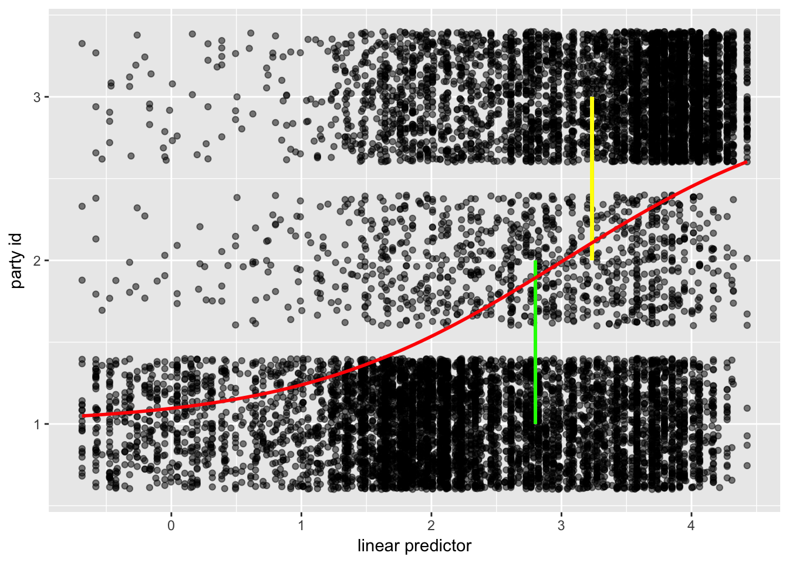
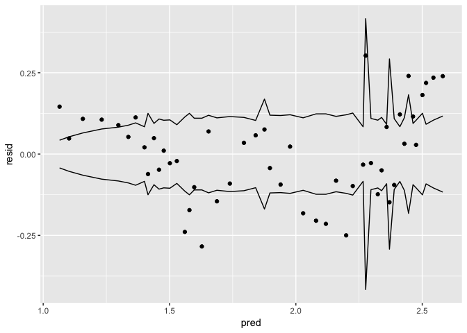
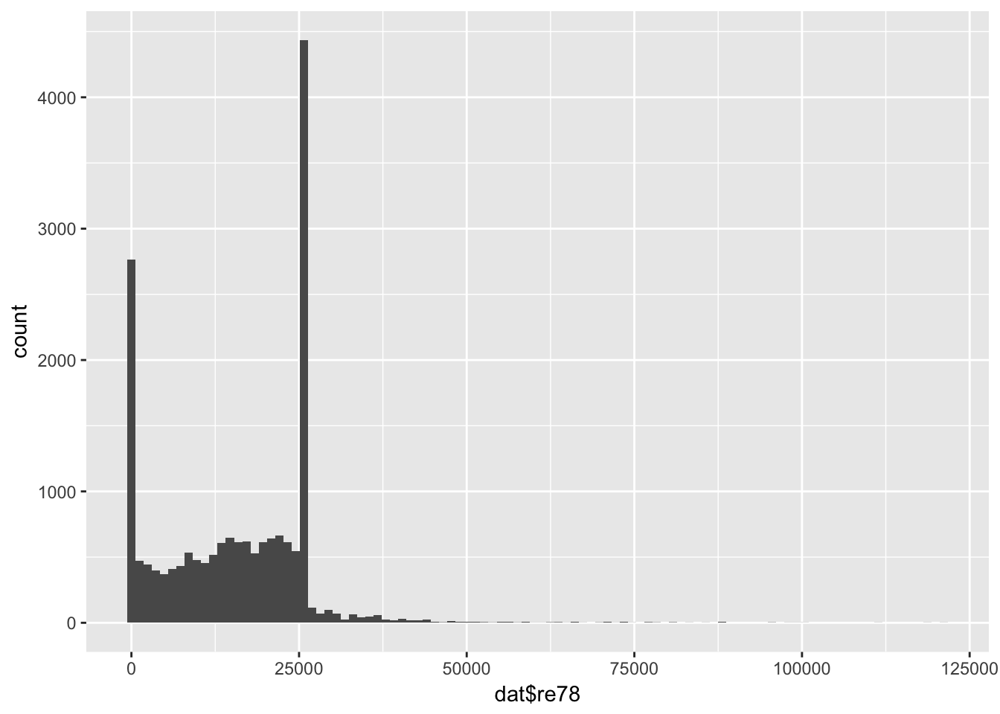
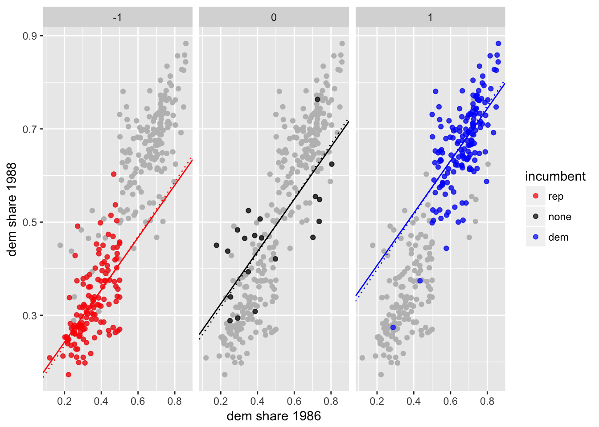

Generalized linear models
================

## Question 1

Import the data:

``` r
dat <- read_stata(str_c(arm_url, 'risky.behavior/risky_behaviors.dta'))

# prep data
dat %<>% mutate_at(vars(fupacts, bupacts), as.integer)
dat %<>% filter(bupacts != 0)
```

### (a)

``` r
rega <- glm(
  fupacts ~ couples + women_alone, 
  data = dat,
  family = poisson(link = 'log'),
  offset = log(bupacts)
  )
summary(rega)
```

    ## 
    ## Call:
    ## glm(formula = fupacts ~ couples + women_alone, family = poisson(link = "log"), 
    ##     data = dat, offset = log(bupacts))
    ## 
    ## Deviance Residuals: 
    ##     Min       1Q   Median       3Q      Max  
    ## -16.086   -3.260   -1.059    2.101   21.633  
    ## 
    ## Coefficients:
    ##             Estimate Std. Error z value       Pr(>|z|)    
    ## (Intercept) -0.11819    0.01910  -6.189 0.000000000606 ***
    ## couples     -0.46014    0.02745 -16.763        < 2e-16 ***
    ## women_alone -0.57917    0.03044 -19.024        < 2e-16 ***
    ## ---
    ## Signif. codes:  0 '***' 0.001 '**' 0.01 '*' 0.05 '.' 0.1 ' ' 1
    ## 
    ## (Dispersion parameter for poisson family taken to be 1)
    ## 
    ##     Null deviance: 10552  on 419  degrees of freedom
    ## Residual deviance: 10119  on 417  degrees of freedom
    ## AIC: 11436
    ## 
    ## Number of Fisher Scoring iterations: 6

``` r
fu_hat <- predict(rega, type = 'response')
z <- (dat$fupacts - fu_hat) / sqrt(fu_hat)
pchisq(sum(fu_hat ^ 2), 420 - 3)
```

    ## [1] 1

Based on the reduction in deviance, the model does help explain the
reduction in \`\`number of unprotected sex acts." However, the
overdispersion factor is 45.5438968 which is huge.

### (b)

``` r
regb <- glm(
  fupacts ~ couples + women_alone + sex + bs_hiv, 
  data = dat,
  family = poisson(link = 'log'),
  offset = log(bupacts)
  )
summary(regb)
```

    ## 
    ## Call:
    ## glm(formula = fupacts ~ couples + women_alone + sex + bs_hiv, 
    ##     family = poisson(link = "log"), data = dat, offset = log(bupacts))
    ## 
    ## Deviance Residuals: 
    ##     Min       1Q   Median       3Q      Max  
    ## -16.288   -3.219   -1.077    2.063   21.572  
    ## 
    ## Coefficients:
    ##             Estimate Std. Error z value    Pr(>|z|)    
    ## (Intercept) -0.03512    0.02254  -1.558       0.119    
    ## couples     -0.40066    0.02808 -14.269     < 2e-16 ***
    ## women_alone -0.55901    0.03052 -18.318     < 2e-16 ***
    ## sex         -0.12043    0.02377  -5.067 0.000000404 ***
    ## bs_hiv      -0.32709    0.03582  -9.131     < 2e-16 ***
    ## ---
    ## Signif. codes:  0 '***' 0.001 '**' 0.01 '*' 0.05 '.' 0.1 ' ' 1
    ## 
    ## (Dispersion parameter for poisson family taken to be 1)
    ## 
    ##     Null deviance: 10552  on 419  degrees of freedom
    ## Residual deviance: 10006  on 415  degrees of freedom
    ## AIC: 11327
    ## 
    ## Number of Fisher Scoring iterations: 6

``` r
fu_hat <- predict(regb, type = 'response')
z <- (dat$fupacts - fu_hat) / sqrt(fu_hat)
pchisq(sum(z ^ 2), 420 - 4)
```

    ## [1] 1

Presumably, inclusion of pre-treatment measure of the outcome means
adding `bupacts` as an offset. Adding baseline HIV status does not
affect the previous coefficients. Furthermore, the coefficient on HIV
status seems plausible and is statistically significant. However, the
over-dispersion factor is 46.1186039 which is huge.

### (c)

``` r
regc <- glm(
  fupacts ~ couples + women_alone + sex + bs_hiv, 
  data = dat,
  family = quasipoisson(link = 'log'),
  offset = log(bupacts)
  )
summary(regc)
```

    ## 
    ## Call:
    ## glm(formula = fupacts ~ couples + women_alone + sex + bs_hiv, 
    ##     family = quasipoisson(link = "log"), data = dat, offset = log(bupacts))
    ## 
    ## Deviance Residuals: 
    ##     Min       1Q   Median       3Q      Max  
    ## -16.288   -3.219   -1.077    2.063   21.572  
    ## 
    ## Coefficients:
    ##             Estimate Std. Error t value Pr(>|t|)   
    ## (Intercept) -0.03512    0.15328  -0.229  0.81891   
    ## couples     -0.40066    0.19091  -2.099  0.03645 * 
    ## women_alone -0.55901    0.20750  -2.694  0.00735 **
    ## sex         -0.12043    0.16159  -0.745  0.45654   
    ## bs_hiv      -0.32709    0.24356  -1.343  0.18002   
    ## ---
    ## Signif. codes:  0 '***' 0.001 '**' 0.01 '*' 0.05 '.' 0.1 ' ' 1
    ## 
    ## (Dispersion parameter for quasipoisson family taken to be 46.22975)
    ## 
    ##     Null deviance: 10552  on 419  degrees of freedom
    ## Residual deviance: 10006  on 415  degrees of freedom
    ## AIC: NA
    ## 
    ## Number of Fisher Scoring iterations: 6

The intervention is justified and the results (with regard to treatment)
appear robust.

### (d)

If responses from both the man and the woman in a couple are being
included then this is a problem since these observations will be
correlated and not i.i.d.

## Question 2

Import the data and estimate the model given by:

\[
z_{i} = X_i \beta  + \epsilon_{i}
\]

\[
y_{i} = \begin{cases} 
D &\text{ if } z_{i} \lt c_{D|I} \\ 
I &\text{ if } z_{i} \in (c_{D|I}, c_{I|R}) \\ 
R &\text{ if } z_{i} \gt c_{I|R}
\end{cases}
\]

``` r
dat <- read_stata(str_c(arm_url, 'nes/nes5200_processed_voters_realideo.dta'))

# partyid3 (1 = Democrat, 2 = Independent, 3 = Republican, 4 = Apolitical)
# ideo (1 = liberal 3 = moderate, 5 = conservative)
# educ3 (1 = no high school... 4 = college graduate)

reg <- polr(
  factor(partyid3) ~ income + female + white + black + educ3 + ideo,
  data = filter(dat, partyid3 != 9)
  )
```

### (a)

``` r
summary(reg)
```

    ## Call:
    ## polr(formula = factor(partyid3) ~ income + female + white + black + 
    ##     educ3 + ideo, data = filter(dat, partyid3 != 9))
    ## 
    ## Coefficients:
    ##          Value Std. Error t value
    ## income  0.1537    0.01946   7.898
    ## female -0.1170    0.03898  -3.002
    ## white   0.4972    0.06397   7.773
    ## black  -1.3131    0.09634 -13.630
    ## educ3   0.1059    0.01265   8.375
    ## ideo    0.4842    0.01200  40.358
    ## 
    ## Intercepts:
    ##     Value    Std. Error t value 
    ## 1|2   2.7988   0.1010    27.7083
    ## 2|3   3.2339   0.1022    31.6281
    ## 
    ## Residual Deviance: 19481.14 
    ## AIC: 19497.14 
    ## (27867 observations deleted due to missingness)

``` r
exp_fun <- function(x, c_di, c_ir) {
  p1 <- invlogit(c_di - x)
  p2 <- invlogit(c_ir - x)
  p1 + 2 * (p2 - p1) + 3 * (1 - p2)
}

pdat <- tibble(
  partyid3 = as.numeric(model.frame(reg)[, 1]),
  lpred = as.numeric(as.matrix(model.frame(reg)[, 2:7]) %*% reg$coefficients)
)

p <- ggplot(pdat) +
  geom_jitter(aes(lpred, partyid3), alpha = 0.5) +
  geom_segment(
    x = reg$zeta[1], xend = reg$zeta[1],
    y = 1, yend = 2,
    col = 'green', 
    size = 1
    ) +
  geom_segment(
    x = reg$zeta[2], xend = reg$zeta[2],
    y = 2, yend = 3,
    col = 'yellow', 
    size = 1
    ) +
  stat_function(
    fun = exp_fun,
    args = list(c_di = reg$zeta[1], c_ir = reg$zeta[2]),
    col = 'red',
    size = 1
  ) +
  labs(x = 'linear predictor', y = 'party id')
p
```

<!-- -->

### (b)

Skip

### (c)

The variance of an individual observation is:

\[
\sigma^2 = p_D + 4 p_I + 9 p_R - \left( p_D + 2 p_I + 3 p_R \right)^2
\]

so that the standard error for a sample of size \(n\) is:

\[
s = \sqrt{\frac{\sigma}{n}}
\]

``` r
pdat <- cbind(pdat, data.frame(predict(reg, type = 'probs')))
names(pdat)[3:5] <- c('probD', 'probI', 'probR')
pdat %<>% 
  mutate(
    pred = probD + 2 * probI + 3 * probR,
    resid = partyid3 - pred
    )

bins <- quantile(pdat$pred, probs = seq(0, 1, 0.02), na.rm = T)

pdat <- pdat %>%
  mutate(
    pred_bin = cut(pred, bins, include.lowest = T)
  ) %>%
  group_by(pred_bin) %>%
  mutate_at(vars(contains('prob'), pred, resid), mean, na.rm = T) %>%
  ungroup()

var_fun <- function(p1, p2, p3) {
  (p1 + 4 * p2 + 9 * p3) - (p1 + 2 * p2 + 3 * p3) ^ 2
}

pdat_bin <- pdat %>%
  count(probD, probI, probR, pred, resid) %>%
  mutate(
    lower = -2 * sqrt(var_fun(probD, probI, probR) / n),
    upper =  2 * sqrt(var_fun(probD, probI, probR) / n)
  )

p <- ggplot(pdat_bin) +
  geom_point(aes(pred, resid)) +
  geom_line(aes(pred, lower)) +
  geom_line(aes(pred, upper))
p
```

<!-- -->

``` r
table(abs(pdat_bin$resid) < pdat_bin$upper)
```

    ## 
    ## FALSE  TRUE 
    ##    21    29

## Question 3

``` r
dat_92 <- dat %>% 
  filter(year == 1992) %>%
  mutate(
    presvote = replace(presvote_2party, presvote_2party != 2, 0),
    presvote = presvote / 2
  )

regp <- glm(
  presvote ~ income + female + white + educ3 + partyid7,
  family = binomial(link = 'probit'),
  data = dat_92
  )

regl <- glm(
  presvote ~ income + female + white + educ3 + partyid7,
  family = binomial(link = 'logit'),
  data = dat_92
  )

# values should be close to one
regl$coefficients / (regp$coefficients * 1.6)
```

    ## (Intercept)      income      female       white       educ3    partyid7 
    ##    1.105588    1.054384    1.084491    1.061820    1.145776    1.108559

## Question 4

Skip

## Question 5

The Tobit model is given by:

\[
y_i^* = X_i \beta + \epsilon_i
\]

\[
y_i =
\begin{cases}
  y_i^* &\text{ if } y_i^* > 0 \\
  0     &\text{ if } y_i^* \leq 0
\end{cases}
\]

where \(y_i\) corresponds to individual \(i\)’s post-treatment earnings.

``` r
dat <- read_stata(str_c(arm_url, 'lalonde/NSW.dw.obs.dta'))
qplot(dat$re78, bins = 100)
```

<!-- -->

From the plot, it is apparent the data is truncated from the left and
from the right.

``` r
library(VGAM)

ll <- 0
ul <- count(dat, re78) %>% 
  arrange(desc(n)) %>%
  use_series(re78) %>%
  magrittr::extract(1)

reg <- vglm(
  re78 ~ age + educ + black + married + hisp + educ_cat4 + treat,
  family = tobit(Lower = ll, Upper = ul),
  data = dat
)
summary(reg)
```

    ## 
    ## Call:
    ## vglm(formula = re78 ~ age + educ + black + married + hisp + educ_cat4 + 
    ##     treat, family = tobit(Lower = ll, Upper = ul), data = dat)
    ## 
    ## 
    ## Pearson residuals:
    ##             Min      1Q  Median    3Q   Max
    ## mu       -1.253 -0.8421 -0.2600 1.149 1.992
    ## loge(sd) -1.061 -0.9277 -0.4601 0.569 4.280
    ## 
    ## Coefficients: 
    ##                   Estimate   Std. Error  z value Pr(>|z|)    
    ## (Intercept):1   971.878253   792.977080    1.226 0.220347    
    ## (Intercept):2     9.557327     0.007944 1203.068  < 2e-16 ***
    ## age              77.722126    11.203745    6.937 4.00e-12 ***
    ## educ            512.640217    87.322744    5.871 4.34e-09 ***
    ## black         -2690.023487   372.075000   -7.230 4.84e-13 ***
    ## married        6903.918697   271.856879   25.395  < 2e-16 ***
    ## hisp          -1511.502166   448.718147   -3.368 0.000756 ***
    ## educ_cat4      1092.967423   243.815263    4.483 7.37e-06 ***
    ## treat         -5046.167735  1167.608318   -4.322 1.55e-05 ***
    ## ---
    ## Signif. codes:  0 '***' 0.001 '**' 0.01 '*' 0.05 '.' 0.1 ' ' 1
    ## 
    ## Number of linear predictors:  2 
    ## 
    ## Names of linear predictors: mu, loge(sd)
    ## 
    ## Log-likelihood: -129208.7 on 37325 degrees of freedom
    ## 
    ## Number of iterations: 9 
    ## 
    ## Warning: Hauck-Donner effect detected in the following estimate(s):
    ## '(Intercept):2'

## Question 6

Import the data:

``` r
# 1986
dat86 <- read.table(str_c(arm_url, 'congress/cong3/1986.asc'))
names(dat86) <- c('icpsr', 'district', 'incumb', 'dem', 'rep')
dat86 %<>% mutate(dshare = dem / (dem + rep))

# 1988
dat88 <- read.table(str_c(arm_url, 'congress/cong3/1988.asc'))
names(dat88) <- c('icpsr', 'district', 'incumb', 'dem', 'rep')
dat88 %<>% mutate(dshare = dem / (dem + rep))

# join
dat <- left_join(
  dat86, dat88,
  by = c('icpsr', 'district'), 
  suffix = c('86', '88')
  )

# contested
dat %<>% 
  filter(dshare86 > 0.1 & dshare86 < 0.9) %>%
  filter(dshare88 > 0.1 & dshare88 < 0.9)

# bad elections
dat %<>% filter(incumb86 != -9 & incumb88 != -9)

# flips
dat %<>% mutate(
  flip = if_else(dshare86 < 0.5 & dshare88 > 0.5, 1, 0),
  flip = if_else(dshare86 > 0.5 & dshare88 < 0.5, 1, 0)
  )
```

### (a)

``` r
rega <- lm(dshare88 ~ dshare86 + incumb88, data = dat)
summary(rega)
```

    ## 
    ## Call:
    ## lm(formula = dshare88 ~ dshare86 + incumb88, data = dat)
    ## 
    ## Residuals:
    ##       Min        1Q    Median        3Q       Max 
    ## -0.182030 -0.034913 -0.005089  0.042887  0.210236 
    ## 
    ## Coefficients:
    ##             Estimate Std. Error t value Pr(>|t|)    
    ## (Intercept) 0.212352   0.018837   11.27   <2e-16 ***
    ## dshare86    0.561315   0.036498   15.38   <2e-16 ***
    ## incumb88    0.082241   0.007005   11.74   <2e-16 ***
    ## ---
    ## Signif. codes:  0 '***' 0.001 '**' 0.01 '*' 0.05 '.' 0.1 ' ' 1
    ## 
    ## Residual standard error: 0.06723 on 310 degrees of freedom
    ## Multiple R-squared:  0.8726, Adjusted R-squared:  0.8718 
    ## F-statistic:  1061 on 2 and 310 DF,  p-value: < 2.2e-16

``` r
ba <- rega$coefficients
```

### (b)

``` r
library(hett)

regb <- tlm(dshare88 ~ dshare86 + incumb88, data = dat)
summary(regb)
```

    ## Location model :
    ## 
    ## Call:
    ## tlm(lform = dshare88 ~ dshare86 + incumb88, data = dat)
    ## 
    ## Residuals: 
    ##        Min          1Q      Median          3Q         Max  
    ## -0.1757440  -0.0362461   0.0001893   0.0408827   0.2142788  
    ## 
    ## Coefficients:
    ##             Estimate Std. Error t value Pr(>|t|)    
    ## (Intercept) 0.199982   0.017165   11.65   <2e-16 ***
    ## dshare86    0.584698   0.033259   17.58   <2e-16 ***
    ## incumb88    0.081599   0.006383   12.78   <2e-16 ***
    ## ---
    ## Signif. codes:  0 '***' 0.001 '**' 0.01 '*' 0.05 '.' 0.1 ' ' 1
    ## 
    ## (Scale parameter(s) as estimated below)
    ## 
    ## 
    ## Scale Model :
    ## 
    ## Call:
    ## tlm(lform = dshare88 ~ dshare86 + incumb88, data = dat)
    ## 
    ## Residuals: 
    ##     Min       1Q   Median       3Q      Max  
    ## -2.0000  -1.6305  -0.6305   1.4081   4.8758  
    ## 
    ## Coefficients:
    ##             Estimate Std. Error z value Pr(>|z|)    
    ## (Intercept)   -5.990      0.113  -52.99   <2e-16 ***
    ## ---
    ## Signif. codes:  0 '***' 0.001 '**' 0.01 '*' 0.05 '.' 0.1 ' ' 1
    ## 
    ## (Scale parameter taken to be  2 )
    ## 
    ## 
    ## Est. degrees of freedom parameter:  3
    ## Standard error for d.o.f:  NA
    ## No. of iterations of model : 8 in 0.006
    ## Heteroscedastic t Likelihood : 398.9941

``` r
bb <- regb$loc.fit$coefficients
```

``` r
# plot
p <- ggplot(dat) +
  geom_point(
    data = select(dat, dshare86, dshare88),
    aes(dshare86, dshare88),
    col = 'grey'
    ) +
  geom_point(aes(dshare86, dshare88, col = factor(incumb88)), alpha = 0.7) +
  scale_color_manual(
    name = 'incumbent',
    labels = c('rep', 'none', 'dem'),
    values = c('red', 'black', 'blue')
    ) +
  geom_abline(
    aes(intercept = ba[1] + ba[3], slope = ba[2]),
    col = 'blue',
    data = filter(dat, incumb88 == 1)
    ) +
  geom_abline(
    aes(intercept = ba[1] - ba[3], slope = ba[2]),
    col = 'red',
    data = filter(dat, incumb88 == -1)
    ) +
  geom_abline(
    aes(intercept = bb[1] + bb[3], slope = bb[2]),
    linetype = 3,
    col = 'blue',
    data = filter(dat, incumb88 == 1)
    ) +
  geom_abline(
    aes(intercept = bb[1] - bb[3], slope = bb[2]),
    linetype = 3,
    col = 'red',
    data = filter(dat, incumb88 == -1)
    ) +
  geom_abline(
    aes(intercept = ba[1], slope = ba[2]),
    col = 'black',
    data = filter(dat, incumb88 == 0)
    ) +
  geom_abline(
    aes(intercept = bb[1], slope = bb[2]),
    linetype = 3,
    col = 'black',
    data = filter(dat, incumb88 == 0)
    ) +
  labs(x = 'dem share 1986', y = 'dem share 1988') +
  facet_grid(~incumb88)
p
```

<!-- -->

### (c)

The models have similar coefficients although `tlm()` seems to account
better for the outliers in some of the elections where incumbents lost.

## Question 7

### (a)

``` r
dat %<>% mutate(
  doutcome = if_else(dshare88 > 0.5, 1, 0)
  )

regl <- glm(
  doutcome ~ dshare86 + incumb88,
  family = binomial(link = 'logit'),
  data = dat
  )
summary(regl)
```

    ## 
    ## Call:
    ## glm(formula = doutcome ~ dshare86 + incumb88, family = binomial(link = "logit"), 
    ##     data = dat)
    ## 
    ## Deviance Residuals: 
    ##      Min        1Q    Median        3Q       Max  
    ## -2.84088  -0.16183   0.05605   0.15541   2.36478  
    ## 
    ## Coefficients:
    ##             Estimate Std. Error z value   Pr(>|z|)    
    ## (Intercept)  -7.6423     1.8266  -4.184 0.00002866 ***
    ## dshare86     15.1330     3.6777   4.115 0.00003876 ***
    ## incumb88      1.9417     0.4178   4.647 0.00000336 ***
    ## ---
    ## Signif. codes:  0 '***' 0.001 '**' 0.01 '*' 0.05 '.' 0.1 ' ' 1
    ## 
    ## (Dispersion parameter for binomial family taken to be 1)
    ## 
    ##     Null deviance: 432.756  on 312  degrees of freedom
    ## Residual deviance:  74.235  on 310  degrees of freedom
    ## AIC: 80.235
    ## 
    ## Number of Fisher Scoring iterations: 7

### (b)

The model is given:

\[
P(\text{Democrat wins}) = P(X_i \beta + \epsilon_i > 0)
\]

where:

\[
\epsilon_i \sim t_\nu \left( 0, \frac{\nu - 2}{\nu} \right)
\]

which is estimated using maximum likelihood and the EM-type algorithm
taken from
[here](http://www.stat.purdue.edu/~chuanhai/teaching/Stat598A/robit.pdf):

``` r
robit_em <- function(par, y, X, tol = 1E-5, maxiter = 1000) {
  
  # robit likelihood
  rll <- function(nu, b, y, X) {
    ll <- y * log(pt(X %*% b, nu)) + (1 - y) * log(1 - pt(X %*% b, nu))
    -sum(ll[is.finite(ll)])
  }
  
  # inits
  n  <- length(y)
  b  <- par$beta
  nu <- par$nu
  it <- 0
  ll <- rll(nu, b, y, X)
  conv = F
    
  while ((!conv) & (it < maxiter)) {
    
    # e step - compute sufficient statistics
    tau_numer <- y - (2 * y - 1) * pt(-(1 + 2 / nu) ^ 0.5 * X %*% b, nu + 2)
    tau_denom <- y - (2 * y - 1) * pt(-X %*% b, nu)
    tau <- tau_numer / tau_denom
    z <- X %*% b + (2 * y - 1) * dt(X %*% b, nu) / tau_numer
    S_txx <- Reduce('+', map(1:n, ~tau[.x] * X[.x, ] %*% t(X[.x, ])))
    S_txz <- Reduce('+', map(1:n, ~tau[.x] * X[.x, ] * z[.x]))
    
    # m step 1 - update beta
    b <- solve(S_txx) %*% S_txz
    
    # m step 2 - search for nu
    m <- 'Brent'
    l <- 2
    u <- 1E9
    opt <- optim(nu, rll, b = b, y = y, X = X, method = m, lower = l, upper = u)
    nu <- opt$par
    
    # check convergence
    conv <- abs(opt$value - ll) < tol
    ll <- opt$value
    
    # increase step
    it <- it + 1
    
  } # end while loop
  
  # exit information
  if (it == maxiter) {
    exit <- 'maxiter reached'
  } else {
    exit <- str_c('Flag: ', opt$convergence, ', Iterations: ', it)
  }
  
  return(
    list(
      coefficents = t(b), 
      nu = nu, 
      logLik = -ll[length(ll)],
      exit = exit
    )
  )
}

par0 <- list(beta = regl$coefficients, nu = 7)
y <- model.frame(regl)[, 1]
X <- cbind(1, model.frame(regl)[, -1])
X %<>% as.matrix()
colnames(X)[1] <- '(Intercept)'
regr <- robit_em(par0, y, X)
print(regr)
```

    ## $coefficents
    ##      (Intercept) dshare86 incumb88
    ## [1,]   -3.920423 7.715683 1.119673
    ## 
    ## $nu
    ## [1] 999998270
    ## 
    ## $logLik
    ## [1] -36.44703
    ## 
    ## $exit
    ## [1] "Flag: 0, Iterations: 699"

### (c)

Given the above, it would appear a standard probit model would work best
in this case (i.e. \(\nu \rightarrow \infty\)).

## Question 8

Skip

## Question 9

Skip

## Question 10

### (a)

Voter \(i\)’s ideal point is given by:

\[
\theta_i = X_i \beta + \epsilon_i
\]

with the voter’s utility for candidates \(A\) and \(B\) given by:

\[
\begin{align}
u_{iA} &= || \theta_i - \theta_A || ^ 2 = \theta_i ^ 2 - \theta_i \theta_A + \theta_A ^ 2 \\
u_{iB} &= || \theta_i - \theta_B || ^ 2 = \theta_i ^ 2 - \theta_i \theta_B + \theta_B ^ 2
\end{align}
\]

### (b)

The voter will choose candidate \(A\) if:

\[
u_{iA} > u_{iB} \iff \theta_A ^ 2 - \theta_B ^ 2 + (\theta_B - \theta_A) \theta_i > 0
\]

or equivalently:

\[
-\epsilon_i < \frac{(\theta_A ^ 2 - \theta_B ^ 2)}{(\theta_B - \theta_A)} + X_i \beta
\]

Relabeling and using the distributional assumption for \(\epsilon_i\)
imply:

\[
P(\text{voter i chooses A}) = \Phi(\alpha + X_i \beta)
\]

where \(\Phi(\cdot)\) is the CDF for a standard normal.

## Question 11

Skip
