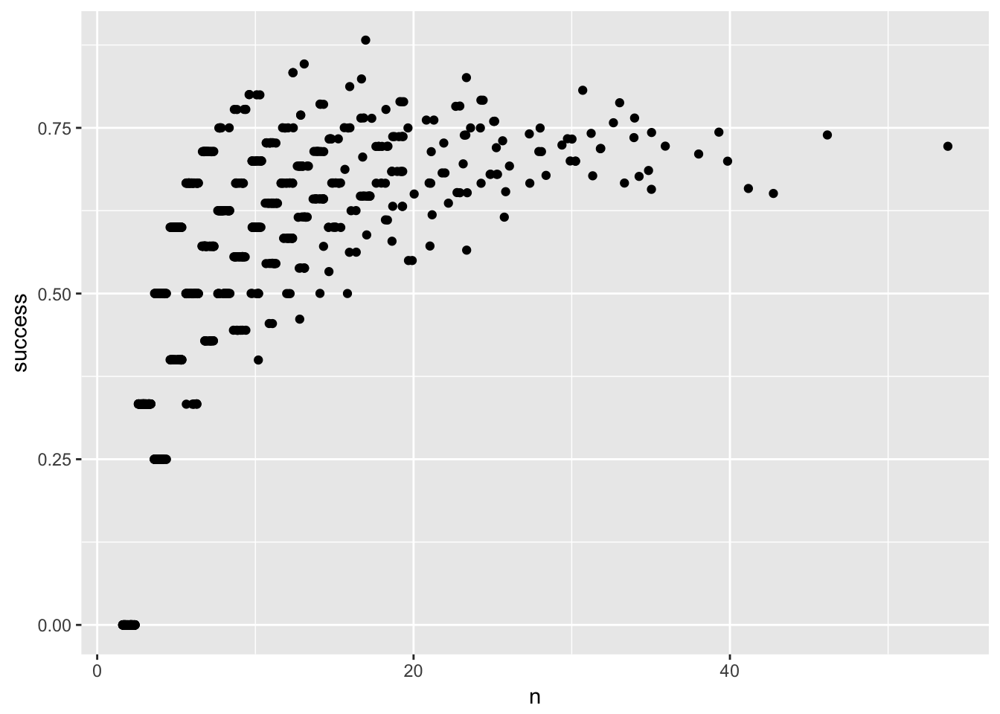
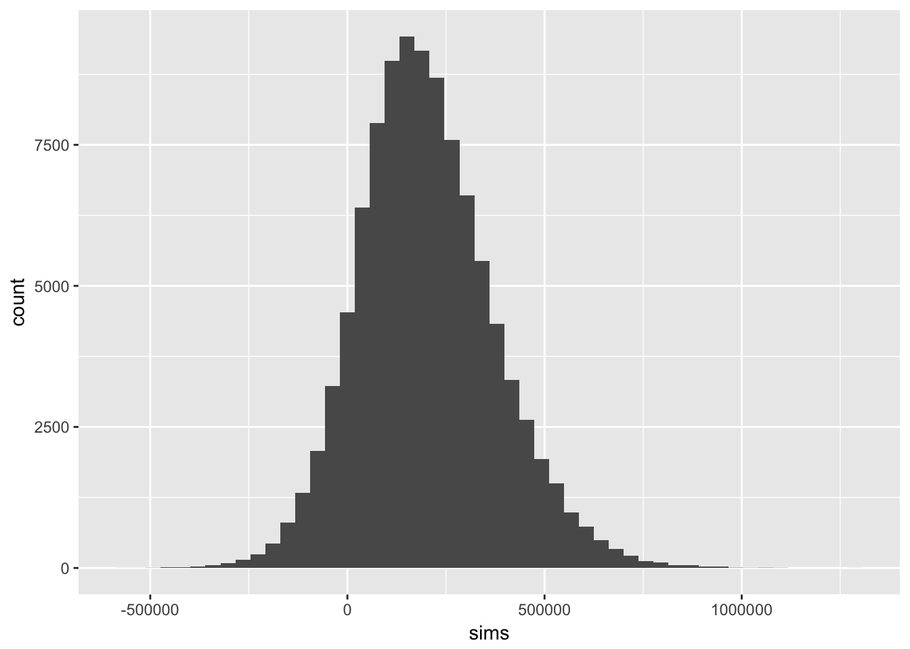
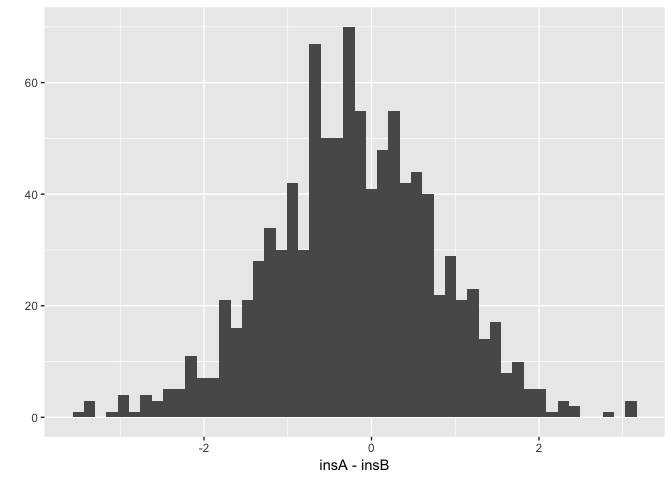
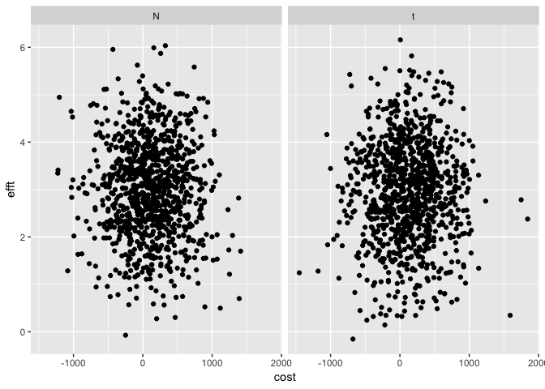
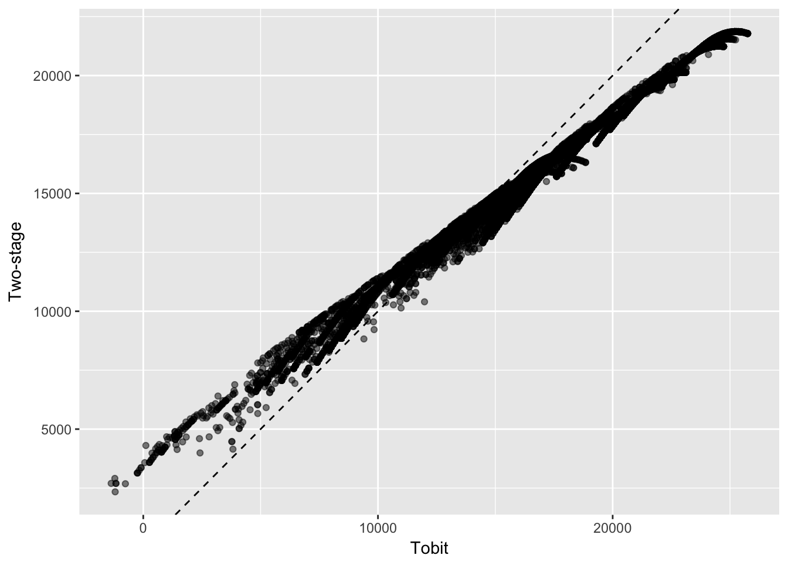

Simulation of probability models and statistical inferences
================

## Question 1

### (a)

``` r
shots <- function(p) {
  s <- rbinom(2, 1, p)
  i <- 2
  two_miss = F
  while (!two_miss) {
    if (sum(s[i - 1]:s[i]) == 0) {
      two_miss <- T
    } else {
      s <- append(s, rbinom(1, 1, p))
      i <- i + 1
    }
  }
  list(shots = s, n = length(s))
}
```

### (b)

``` r
shots_sims <- list()
for (s in 1:1000) {
  shots_sims[[s]] <- shots(0.6)
}
n <- map_int(shots_sims, ~.x$n)
mean(n)
```

    ## [1] 9.001

``` r
sd(n)
```

    ## [1] 7.730897

``` r
qplot(n, bins = 50)
```

<!-- -->

### (c)

``` r
dat <- tibble(n = n, makes = map_int(shots_sims, ~sum(.x$shots)))
dat %<>% mutate(success = makes / n)

qplot(n, success, data = dat, geom = 'jitter')
```

<!-- -->

## Question 2

``` r
m <- c(5.13, 0.17)
f <- c(4.96, 0.20)
x <- 1750

cable <- function(people, male = m, female = f, threshold = x) {
  nm <- rbinom(1, people, 0.5)
  sum(exp(c(rnorm(nm, m[1], m[2]), rnorm(people - nm, f[1], f[2])))) > x
}

sims <- replicate(1E5, cable(10, male = m, female = f, threshold = x))

# probability the cable breaks
table(sims)[[2]] / 1E5
```

    ## [1] 0.05497

## Question 3

``` r
widget <- c(5, 4)
market <- c(4E4, 1E4)

savings <- function(widget, market) {
  rnorm(1, widget[1], widget[2]) * round(rnorm(1, market[1], market[2]))
}

sims <- replicate(1E5, savings(widget, market))
mean(sims)
```

    ## [1] 199173.1

``` r
sd(sims)
```

    ## [1] 172697.4

``` r
qplot(sims, bins = 50)
```

<!-- -->

## Question 4

### (a)

``` r
# reload chapter 3, question 5
dat <- knitr::load_cache('arm03-q05_', 'dat')

# new regression model (to match levels given in question)
reg <- lm(courseevaluation ~ age + btystdave + female + nonenglish, data = dat)

# levels
xA <- c(1, 50, -1.0, 1, 0)
xB <- c(1, 60, -0.5, 0, 0)

# fixed parameters for simulation
n <- summary(reg)$df[1] + summary(reg)$df[2]
k <- summary(reg)$df[1]
beta_hat  <- summary(reg)$coefficients[, 1]
bcov_hat  <- summary(reg)$cov.unscaled
sigma_hat <- summary(reg)$sigma

insA <- rep(NA, 1000)
insB <- rep(NA, 1000)
for (s in 1:1000) {

  # predictive & parameter uncertainty
  sigma_sim <- sigma_hat * sqrt(n - k) / sqrt(rchisq(1, n - k))
  beta_sim  <- MASS::mvrnorm(1, beta_hat, sigma_sim ^ 2 * bcov_hat)

  # simulation
  insA[s] <- rnorm(1, sum(beta_sim * xA), sqrt(sigma_sim))
  insB[s] <- rnorm(1, sum(beta_sim * xB), sqrt(sigma_sim))

}
```

### (b)

``` r
qplot(insA - insB, bins = 50)
```

<!-- -->

``` r
# probability A > B
table(insA > insB)[[2]] / 1000
```

    ## [1] 0.412

## Question 5

Skip

## Question 6

Skip

## Question 7

Skip

## Question 8

Parameters for the problem:

``` r
par1 <- c(100, 400, 50)
par2 <- c(3, 1, 100)
```

### (a)

``` r
dat <- tibble(
  cost = c(rnorm(1000, par1[1], par1[2]), par1[1] + par1[2] * rt(1000, par1[3])),
  efft = c(rnorm(1000, par2[1], par2[2]), par2[1] + par2[2] * rt(1000, par2[3])),
  dist = c(rep('N', 1000), rep('t', 1000))
)

p <- ggplot(dat) +
  geom_point(aes(cost, efft)) +
  facet_wrap(~dist)
p
```

<!-- -->

### (b)

``` r
dat %<>%  mutate(ratio = cost / efft)

# 50% interval (normal)
quantile(filter(dat, dist == 'N')$ratio, probs = c(0.25, 0.75))
```

    ##      25%      75% 
    ## -56.0406 132.1024

``` r
# 50% interval (t)
quantile(filter(dat, dist == 't')$ratio, probs = c(0.25, 0.75))
```

    ##       25%       75% 
    ## -51.81535 135.23522

``` r
# 95% interval (normal)
quantile(filter(dat, dist == 'N')$ratio, probs = c(0.025, 0.975))
```

    ##      2.5%     97.5% 
    ## -284.0655  477.1906

``` r
# 95% interval (t)
quantile(filter(dat, dist == 't')$ratio, probs = c(0.025, 0.975))
```

    ##      2.5%     97.5% 
    ## -329.7210  508.1659

### (c)

Skip

## Question 9

``` r
library(VGAM)

# reload chapter 6, question 5
dat  <- knitr::load_cache('arm06-q05_1', 'dat')
regt <- knitr::load_cache('arm06-q05_2', 'reg')

# logit model for positive earnings
dat %<>% mutate(pos_re78 = if_else(re78 > 0, 1, 0))
reg1 <- glm(
  pos_re78 ~ age + educ + black + married + hisp + educ_cat4 + treat,
  family = binomial(link = 'logit'),
  data = dat
)

# linear model for level of earnings (pos_re78 == 1)
reg2 <- lm(
  re78 ~ age + educ + black + married + hisp + educ_cat4 + treat,
  data = filter(dat, pos_re78 == 1)
)

# predictions
dat %<>%
  mutate(
    predt = predict(regt)[, 1],
    pred2 = predict(reg1, type = 'response') * predict(reg2, newdata = dat)
  )

p <- ggplot(dat) +
  geom_point(aes(predt, pred2), alpha = 0.5) +
  geom_abline(aes(intercept = 0, slope = 1), linetype = 2) +
  labs(x = 'Tobit', y = 'Two-stage')
p
```

<!-- -->

## Question 10

``` r
# reload chapter 3, question 5
dat <- knitr::load_cache('arm03-q05_', 'dat')
reg <- knitr::load_cache('arm03-q05a', 'reg')
display(reg)
```

    ## lm(formula = courseevaluation ~ btystdave + female + minority, 
    ##     data = dat)
    ##             coef.est coef.se
    ## (Intercept)  4.11     0.03  
    ## btystdave    0.15     0.03  
    ## female      -0.19     0.05  
    ## minority    -0.10     0.07  
    ## ---
    ## n = 463, k = 4
    ## residual sd = 0.54, R-Squared = 0.07

### (a)

``` r
s0 <- sim(reg, n.sims = 10000)
cat('est:', mean(coef(s0)[, 'btystdave']) , 'se:', sd(coef(s0)[, 'btystdave']))
```

    ## est: 0.148783 se: 0.03220351

### (b)

``` r
s1 <- sim(reg, n.sims = 1000)
cat('est:', mean(coef(s1)[, 'btystdave']) , 'se:', sd(coef(s1)[, 'btystdave']))
```

    ## est: 0.1499408 se: 0.03155117

``` r
s2 <- sim(reg, n.sims = 100)
cat('est:', mean(coef(s2)[, 'btystdave']) , 'se:', sd(coef(s2)[, 'btystdave']))
```

    ## est: 0.1493535 se: 0.02944106

``` r
s3 <- sim(reg, n.sims = 10)
cat('est:', mean(coef(s3)[, 'btystdave']) , 'se:', sd(coef(s3)[, 'btystdave']))
```

    ## est: 0.1406273 se: 0.03081818

### (c)

100 simulations results in a good approximation.
