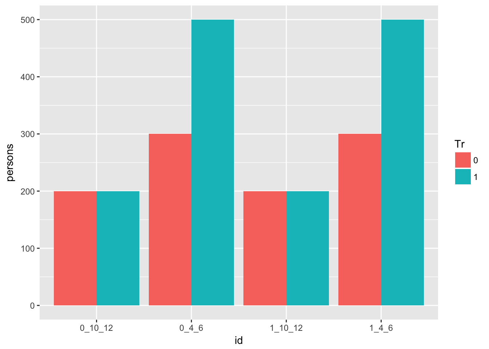
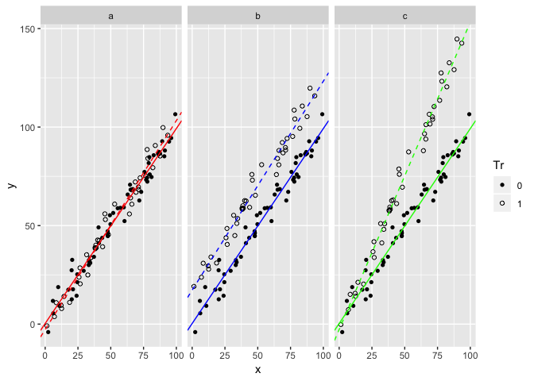
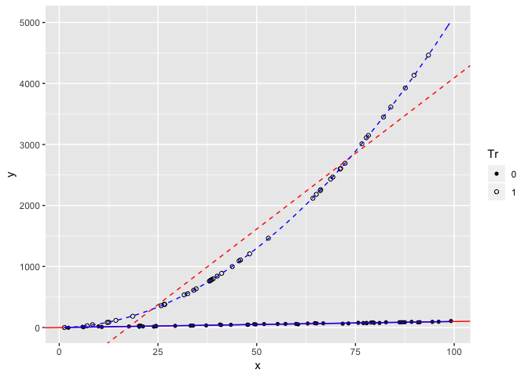
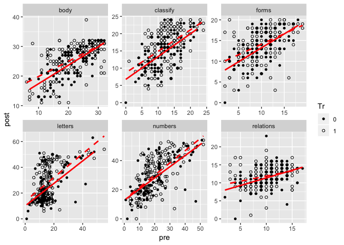
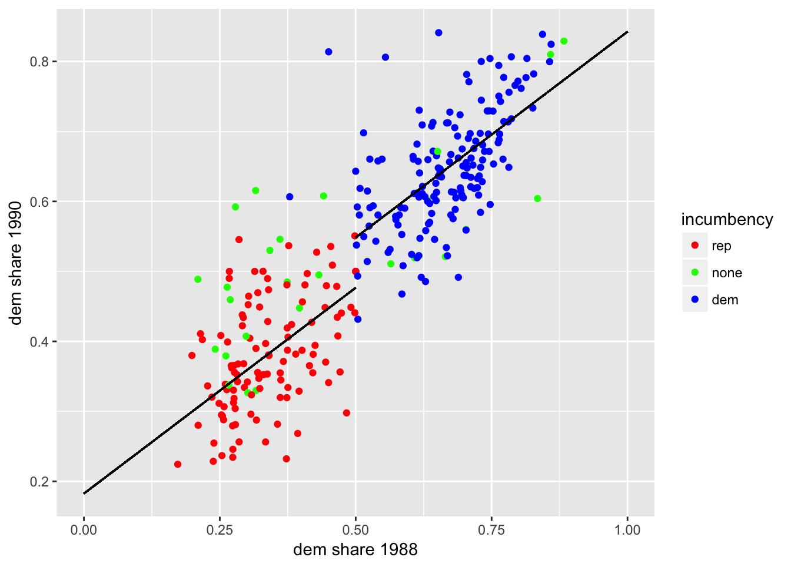

Causal inference using regression on the treatment variable
================

## Question 1

Randomly assign vending machine availability at each school.

## Question 2

Obviously, you cannot randomly assign people to smoke. One possibily
might be to randomly assign cigarette taxes; as this would incentive
some smokers to quit you could plausibly measure the effect the tax had
on lung cancer.

## Question 3

Skip

## Question 4

Create the data:

``` r
dat <- tibble(
  category = 1:8,
  persons = c(rep(300, 2), rep(500, 2), rep(200, 4)),
  x  = factor(rep(c(0, 1), 4)),
  Tr = factor(rep(c(0, 0, 1, 1), 2)),
  y0 = c(rep(4, 4), rep(10, 4)),
  y1 = c(rep(6, 4), rep(12, 4))
)
dat %<>% mutate(y = if_else(Tr == 1, y1, y0))
```

### (a)

The treatment effect is two for all categories so the average is two.

### (b)

``` r
p <- dat %>%
  unite(id, x, y0, y1, remove = F) %>%
  ggplot() +
  geom_bar(
    aes(id, persons, fill = Tr),
    stat = 'identity',
    position = 'dodge'
    )
p
```

<!-- -->

More of the individuals with potential outcomes \((y_0, y_1) = (4, 6)\)
received treatment than did not suggesting treatment assignment was not
random.

### (c)

``` r
dat %>%
  group_by(Tr) %>%
  summarise(y = weighted.mean(y, persons)) %>%
  use_series('y') %>%
  diff()
```

    ## [1] 1.314286

This value is less than the true average treatment effect. Given (c),
this would be expected.

### (d)

``` r
dat %>%
  group_by(x) %>%
  count(y0, wt = persons)
```

    ## # A tibble: 4 x 3
    ## # Groups:   x [2]
    ##   x        y0     n
    ##   <fct> <dbl> <dbl>
    ## 1 0         4   800
    ## 2 0        10   400
    ## 3 1         4   800
    ## 4 1        10   400

``` r
dat %>%
  group_by(x) %>%
  count(Tr, wt = persons)
```

    ## # A tibble: 4 x 3
    ## # Groups:   x [2]
    ##   x     Tr        n
    ##   <fct> <fct> <dbl>
    ## 1 0     0       500
    ## 2 0     1       700
    ## 3 1     0       500
    ## 4 1     1       700

\(x\) does not appear to be a confounder here. The potential outcomes
are the same regardless of level and the probability of treatment is
also the same.

## Question 5

``` r
reg <- lm(y ~ Tr + x, data = dat, weights = persons)
summary(reg)
```

    ## 
    ## Call:
    ## lm(formula = y ~ Tr + x, data = dat, weights = persons)
    ## 
    ## Weighted Residuals:
    ##      1      2      3      4      5      6      7      8 
    ## -41.57 -41.57 -38.33 -38.33  50.91  50.91  60.61  60.61 
    ## 
    ## Coefficients:
    ##               Estimate Std. Error t value Pr(>|t|)  
    ## (Intercept)  6.400e+00  2.316e+00   2.764   0.0397 *
    ## Tr1          1.314e+00  2.547e+00   0.516   0.6279  
    ## x1          -8.702e-16  2.512e+00   0.000   1.0000  
    ## ---
    ## Signif. codes:  0 '***' 0.001 '**' 0.01 '*' 0.05 '.' 0.1 ' ' 1
    ## 
    ## Residual standard error: 61.52 on 5 degrees of freedom
    ## Multiple R-squared:  0.05055,    Adjusted R-squared:  -0.3292 
    ## F-statistic: 0.1331 on 2 and 5 DF,  p-value: 0.8784

## Question 6

This would be ill advised. While access to therapy has been randomized,
the number of sessions attended has not. Among other potential issues,
there may be selection bias stemming from the decision of how many
sessions to actually attend.

## Question 7

The original regressions is:

\[
y_i = \alpha + \theta T_i + \beta x_i + \text{error}_i
\]

while the gain-score model is given by:

\[
g_i = \delta + \gamma T_i + \zeta x_i + \text{error}_i
\]

where \(g_i = y_i - \bar x\). Substituting in for \(g_i\) and
rearranging implies:

\[
y_i = (\delta + \bar x) + \gamma T_i + \zeta x_i + \text{error}_i
\]

which implies:

\[
\begin{align}
\alpha &= \delta + \bar x \\
\beta &= \zeta \\
\theta &= \gamma
\end{align}
\]

## Question 8

First, generate some data:

``` r
set.seed(1)
dat <- tibble(
  x  = runif(100, 0, 100),
  y0 = x + rnorm(100, 0, 5),
  Tr = factor(rbinom(100, 1, 0.5)),
  a = y0,
  b = y0 + 20,
  c = y0 + 0.5 * x
)
dat %<>% gather(scenario, y1, -1:-3)
dat %<>% mutate(y = if_else(Tr == 1, y1, y0))
```

Next, estimate the models:

``` r
reg_fun <- function(model) {
  lm(y ~ Tr + x + Tr:x, data = filter(dat, scenario == model))
}
reg <- map(c('a', 'b', 'c'), reg_fun) ; names(reg) <- c('a', 'b', 'c')
reg_coef <- map(reg, coef) ; names(reg_coef) <- c('a', 'b', 'c')
```

Finally, plot:

``` r
p <- ggplot(dat) +
  geom_point(aes(x, y, shape = Tr)) +
  scale_shape_manual(values = c(16, 1)) +
  facet_wrap(~scenario) +
  geom_abline(
    aes(intercept = reg_coef$a[1], slope = reg_coef$a[3]),
    col = 'red',
    data = filter(dat, scenario == 'a')
  ) +
  geom_abline(
    aes(intercept = sum(reg_coef$a[1:2]), slope = sum(reg_coef$a[3:4])),
    col = 'red', linetype = 2,
    data = filter(dat, scenario == 'a')
  ) +
  geom_abline(
    aes(intercept = reg_coef$b[1], slope = reg_coef$b[3]),
    col = 'blue',
    data = filter(dat, scenario == 'b')
  ) +
  geom_abline(
    aes(intercept = sum(reg_coef$b[1:2]), slope = sum(reg_coef$b[3:4])),
    col = 'blue', linetype = 2,
    data = filter(dat, scenario == 'b')
  ) +
  geom_abline(
    aes(intercept = reg_coef$c[1], slope = reg_coef$c[3]),
    col = 'green',
    data = filter(dat, scenario == 'c')
  ) +
  geom_abline(
    aes(intercept = sum(reg_coef$c[1:2]), slope = sum(reg_coef$c[3:4])),
    col = 'green', linetype = 2,
    data = filter(dat, scenario == 'c')
  )
p
```

<!-- -->

## Question 9

First, generate some data:

``` r
set.seed(1)
dat <- tibble(
  x  = runif(100, 0, 100),
  y0 = x + rnorm(100, 0, 5),
  Tr = factor(rbinom(100, 1, 0.5)),
  a = y0 + 20,
  b = y0 + 0.5 * x ^ 2
)
dat %<>% gather(scenario, y1, -1:-3)
dat %<>% mutate(y = if_else(Tr == 1, y1, y0))
```

### (a)

``` r
dat %>%
  filter(scenario == 'a') %>%
  group_by(Tr) %>%
  summarise_at(vars(y), mean) %>%
  use_series('y') %>%
  diff()
```

    ## [1] 14.45568

``` r
lm(y ~ Tr + x, data = filter(dat, scenario == 'a'))$coefficients[[2]]
```

    ## [1] 20.53401

### (b)

``` r
reg <- list(
  r1 = lm(y ~ Tr + x + x:Tr, data = filter(dat, scenario == 'b')),
  r2 = lm(y ~ Tr + x + I(x ^ 2):Tr, data = filter(dat, scenario == 'b'))
)
reg_coef <- map(reg, coef) ; names(reg_coef) <- c('r1', 'r2')

plot_fun <- function(x, coef = NULL) {
  coef$a + coef$b * x + coef$c * x ^ 2
}
c1 <- list(a = reg_coef$r2[1], b = reg_coef$r2[3], c = reg_coef$r2[4])
c2 <- list(a = sum(reg_coef$r2[1:2]), b = reg_coef$r2[3], c = reg_coef$r2[5])

p <- ggplot(filter(dat, scenario == 'b')) +
  geom_point(aes(x, y, shape = Tr)) +
  scale_shape_manual(values = c(16, 1)) +
  geom_abline(
    aes(intercept = reg_coef$r1[1], slope = reg_coef$r1[3]),
    col = 'red'
  ) +
  geom_abline(
    aes(intercept = sum(reg_coef$r1[1:2]), slope = sum(reg_coef$r1[3:4])),
    col = 'red', linetype = 2
  ) +
  stat_function(
    fun = plot_fun, args = list(coef = c1),
    col = 'blue'
  ) +
  stat_function(
    fun = plot_fun, args = list(coef = c2),
    col = 'blue', linetype = 2
  )
p
```

<!-- -->

## Question 10

Load the data:

``` r
dat <- read_stata(str_c(arm_url, 'sesame/sesame.dta'))
dat %<>% mutate(Tr = factor(if_else(viewenc == 1 | encour == 1, 1, 0)))
```

### (a)

Practically speaking, it might be difficult to get children to actually
watch the program; encouraging them to do so allows them to accept the
information on their own terms. Actual watching would also likely be
more difficult to randomize since it would require some level of
commitment from the subjects.

### (b)

This would require the assumption that test scores would not change for
those children who were not encouraged to watch the
show.

``` r
tests <- c('body', 'classify', 'forms', 'letters', 'numbers', 'relations')

dat %<>%
  select(Tr, contains('pre'), contains('post')) %>%
  mutate(id = row_number()) %>%
  gather(variable, value, -id, -Tr) %>%
  extract(variable, c('time', 'test'), '(^pre|^post)([^pre]+|[^post]+)') %>%
  spread(time, value)
dat$test %<>% factor(labels = tests)

p <- ggplot(aes(pre, post), data = dat) +
  geom_point(aes(shape =  Tr)) + 
  geom_smooth(
    method = 'lm', se = F,
    col = 'red', linetype = 2,
    data = filter(dat, Tr == 1)
    ) +
  geom_smooth(
    method = 'lm', se = F,
    col = 'red', 
    data = filter(dat, Tr == 0)
    ) +
  scale_shape_manual(values = c(16, 1)) +
  facet_wrap(~test, scales = 'free')
p
```

<!-- -->

Given the plots above, this does not seem realistic; test scores improve
for both the control units (dots and solid lines) and the treated units
(circles and dashed lines).

## Question 11

Load the data:

``` r
dat <- knitr::load_cache('arm09-q10_', 'dat')
```

### (a)

``` r
reg1 <- lm(postlet ~ Tr + prelet, data = dat)
summary(reg1)
```

    ## 
    ## Call:
    ## lm(formula = postlet ~ Tr + prelet, data = dat)
    ## 
    ## Residuals:
    ##     Min      1Q  Median      3Q     Max 
    ## -28.600  -7.954  -2.412   7.232  32.396 
    ## 
    ## Coefficients:
    ##             Estimate Std. Error t value    Pr(>|t|)    
    ## (Intercept)  9.63831    1.83971   5.239 0.000000356 ***
    ## Tr1          4.44403    1.47441   3.014     0.00286 ** 
    ## prelet       0.89655    0.08341  10.749     < 2e-16 ***
    ## ---
    ## Signif. codes:  0 '***' 0.001 '**' 0.01 '*' 0.05 '.' 0.1 ' ' 1
    ## 
    ## Residual standard error: 10.95 on 237 degrees of freedom
    ## Multiple R-squared:  0.335,  Adjusted R-squared:  0.3294 
    ## F-statistic: 59.69 on 2 and 237 DF,  p-value: < 2.2e-16

``` r
reg2 <- lm(postnumb ~ Tr + prenumb, data = dat)
summary(reg2)
```

    ## 
    ## Call:
    ## lm(formula = postnumb ~ Tr + prenumb, data = dat)
    ## 
    ## Residuals:
    ##     Min      1Q  Median      3Q     Max 
    ## -37.879  -5.878  -0.478   5.612  23.140 
    ## 
    ## Coefficients:
    ##             Estimate Std. Error t value Pr(>|t|)    
    ## (Intercept) 11.94771    1.55532   7.682 4.12e-13 ***
    ## Tr1          1.94255    1.26863   1.531    0.127    
    ## prenumb      0.80705    0.05734  14.076  < 2e-16 ***
    ## ---
    ## Signif. codes:  0 '***' 0.001 '**' 0.01 '*' 0.05 '.' 0.1 ' ' 1
    ## 
    ## Residual standard error: 9.47 on 237 degrees of freedom
    ## Multiple R-squared:  0.4591, Adjusted R-squared:  0.4546 
    ## F-statistic: 100.6 on 2 and 237 DF,  p-value: < 2.2e-16

In both cases, treatment had a positive effect but it is only
statistically significant for the test on letters.

### (b)

``` r
reg1 <- lm(postlet ~ Tr:factor(regular) + prelet - 1, data = dat)
summary(reg1)
```

    ## 
    ## Call:
    ## lm(formula = postlet ~ Tr:factor(regular) + prelet - 1, data = dat)
    ## 
    ## Residuals:
    ##     Min      1Q  Median      3Q     Max 
    ## -31.446  -7.255  -1.788   5.951  27.227 
    ## 
    ## Coefficients:
    ##                      Estimate Std. Error t value Pr(>|t|)    
    ## prelet                0.82692    0.07908  10.456  < 2e-16 ***
    ## Tr0:factor(regular)0  5.21106    1.95813   2.661  0.00832 ** 
    ## Tr1:factor(regular)0  4.31319    2.98392   1.445  0.14966    
    ## Tr0:factor(regular)1 15.50361    2.13213   7.271 5.25e-12 ***
    ## Tr1:factor(regular)1 16.24652    1.48761  10.921  < 2e-16 ***
    ## ---
    ## Signif. codes:  0 '***' 0.001 '**' 0.01 '*' 0.05 '.' 0.1 ' ' 1
    ## 
    ## Residual standard error: 10.19 on 235 degrees of freedom
    ## Multiple R-squared:  0.8862, Adjusted R-squared:  0.8838 
    ## F-statistic:   366 on 5 and 235 DF,  p-value: < 2.2e-16

``` r
c1 <- summary(reg1)$coefficients[, 1]
s1 <- summary(reg1)$coefficients[, 2]
1 - pt((c1[[5]] - c1[[4]]) / sqrt(s1[[5]] ^ 2 + s1[[4]] ^ 2), 231)
```

    ## [1] 0.3876605

``` r
reg2 <- lm(postnumb ~ Tr:factor(regular) + prenumb - 1, data = dat)
summary(reg2)
```

    ## 
    ## Call:
    ## lm(formula = postnumb ~ Tr:factor(regular) + prenumb - 1, data = dat)
    ## 
    ## Residuals:
    ##     Min      1Q  Median      3Q     Max 
    ## -39.714  -5.661   0.139   5.491  20.209 
    ## 
    ## Coefficients:
    ##                      Estimate Std. Error t value Pr(>|t|)    
    ## prenumb               0.75358    0.05627  13.393  < 2e-16 ***
    ## Tr0:factor(regular)0  9.15791    1.72543   5.308 2.57e-07 ***
    ## Tr1:factor(regular)0  7.75947    2.61637   2.966  0.00333 ** 
    ## Tr0:factor(regular)1 16.29531    1.87007   8.714 5.36e-16 ***
    ## Tr1:factor(regular)1 15.74773    1.42912  11.019  < 2e-16 ***
    ## ---
    ## Signif. codes:  0 '***' 0.001 '**' 0.01 '*' 0.05 '.' 0.1 ' ' 1
    ## 
    ## Residual standard error: 9.088 on 235 degrees of freedom
    ## Multiple R-squared:  0.924,  Adjusted R-squared:  0.9224 
    ## F-statistic: 571.5 on 5 and 235 DF,  p-value: < 2.2e-16

``` r
c2 <- summary(reg2)$coefficients[, 1]
s2 <- summary(reg2)$coefficients[, 2]
1 - pt((c2[[5]] - c2[[4]]) / sqrt(s2[[5]] ^ 2 + s2[[4]] ^ 2), 231)
```

    ## [1] 0.5918809

After interacting the treatment variable with frequency of viewing,
treatment has only a small positive effect for those who watched the
show regularly; these effects were not statistically significant.

### (c)

Given the description of the data in Question 10, it seems more
plausible that the estimates in (a) have a casual interpretation.
Frequency of viewing would seem likely to introduce selection bias.

## Question 12

Load the data:

``` r
dat <- read.table(str_c(arm_url, 'cows/cow.dat'), skip = 4, header = T)
```

### (a)

``` r
rega <- lm(fat ~ level, data = dat)
summary(rega)
```

    ## 
    ## Call:
    ## lm(formula = fat ~ level, data = dat)
    ## 
    ## Residuals:
    ##      Min       1Q   Median       3Q      Max 
    ## -0.78786 -0.31470 -0.04654  0.23714  1.12346 
    ## 
    ## Coefficients:
    ##             Estimate Std. Error t value Pr(>|t|)    
    ## (Intercept)   3.2752     0.1038  31.546  < 2e-16 ***
    ## level         2.0132     0.5582   3.607 0.000736 ***
    ## ---
    ## Signif. codes:  0 '***' 0.001 '**' 0.01 '*' 0.05 '.' 0.1 ' ' 1
    ## 
    ## Residual standard error: 0.4341 on 48 degrees of freedom
    ## Multiple R-squared:  0.2132, Adjusted R-squared:  0.1969 
    ## F-statistic: 13.01 on 1 and 48 DF,  p-value: 0.0007363

The regression does not include the pre-treatment predictors: lactation,
age, and initial weight. As treatment assignment was based on this
information it should be controlled for.

### (b)

``` r
regb <- lm(
  fat ~ level + lactation + age + initial.weight,
  data = dat
  )
summary(regb)
```

    ## 
    ## Call:
    ## lm(formula = fat ~ level + lactation + age + initial.weight, 
    ##     data = dat)
    ## 
    ## Residuals:
    ##      Min       1Q   Median       3Q      Max 
    ## -0.86369 -0.27836  0.00573  0.21592  0.94157 
    ## 
    ## Coefficients:
    ##                  Estimate Std. Error t value   Pr(>|t|)    
    ## (Intercept)     2.8574033  0.5274561   5.417 0.00000227 ***
    ## level           1.8970077  0.5532560   3.429    0.00131 ** 
    ## lactation       0.2840070  0.1693474   1.677    0.10046    
    ## age            -0.0168047  0.0128543  -1.307    0.19775    
    ## initial.weight  0.0003718  0.0005342   0.696    0.48999    
    ## ---
    ## Signif. codes:  0 '***' 0.001 '**' 0.01 '*' 0.05 '.' 0.1 ' ' 1
    ## 
    ## Residual standard error: 0.4204 on 45 degrees of freedom
    ## Multiple R-squared:  0.3085, Adjusted R-squared:  0.247 
    ## F-statistic: 5.018 on 4 and 45 DF,  p-value: 0.001976

Here, each of the pre-treatment predictors are included in the model.

### (c)

``` r
regc <- lm(
  fat ~ factor(level) + lactation + age + initial.weight,
  data = dat
  )
summary(regc)
```

    ## 
    ## Call:
    ## lm(formula = fat ~ factor(level) + lactation + age + initial.weight, 
    ##     data = dat)
    ## 
    ## Residuals:
    ##      Min       1Q   Median       3Q      Max 
    ## -0.80030 -0.31823 -0.00408  0.25431  0.90268 
    ## 
    ## Coefficients:
    ##                    Estimate Std. Error t value   Pr(>|t|)    
    ## (Intercept)       2.9904509  0.5624850   5.316 0.00000357 ***
    ## factor(level)0.1  0.1201635  0.1738695   0.691    0.49321    
    ## factor(level)0.2  0.2722551  0.1750208   1.556    0.12714    
    ## factor(level)0.3  0.5832468  0.1796321   3.247    0.00226 ** 
    ## lactation         0.2880063  0.1722065   1.672    0.10170    
    ## age              -0.0168912  0.0130611  -1.293    0.20283    
    ## initial.weight    0.0002952  0.0005606   0.527    0.60113    
    ## ---
    ## Signif. codes:  0 '***' 0.001 '**' 0.01 '*' 0.05 '.' 0.1 ' ' 1
    ## 
    ## Residual standard error: 0.4268 on 43 degrees of freedom
    ## Multiple R-squared:  0.3187, Adjusted R-squared:  0.2236 
    ## F-statistic: 3.352 on 6 and 43 DF,  p-value: 0.008469

``` r
pdat <- tidy(regc)
pdat <- pdat[1:4, ]
pdat$estimate[2:4] <- pdat$estimate[2:4] + pdat$estimate[1]
pdat %<>% 
  mutate(
    lower = estimate - 2 * std.error,
    upper = estimate + 2 * std.error
  )

p <- ggplot(pdat, aes(term, estimate)) +
  geom_point() +
  geom_errorbar(aes(ymin = lower, ymax = upper), width = 0.2) +
  geom_hline(aes(yintercept = regb$coefficients[2]), col = 'red') +
  scale_x_discrete(labels = str_c('Level = ', seq(0, 0.3, by = 0.1)))
p
```

<!-- -->

## Question 13

### (a)

``` r
dat88 <- read.table(str_c(arm_url, 'congress/cong3/1988.asc'))
names(dat88) <- c('icpsr', 'district', 'incumb', 'dem', 'rep')
dat88 %<>% 
  mutate(
    dshare = dem / (dem + rep),
    iparty = if_else(dshare > 0.5, 1, -1) 
    )

dat90 <- read.table(str_c(arm_url, 'congress/cong3/1990.asc'))
names(dat90) <- c('icpsr', 'district', 'incumb', 'dem', 'rep')
dat90 %<>% mutate(dshare = dem / (dem + rep))

dat <- left_join(dat90, dat88, by = c('icpsr', 'district'))
dat %<>% filter(dshare.x > 0.1 & dshare.x < 0.9)
dat %<>% filter(dshare.y > 0.1 & dshare.y < 0.9)

reg <- lm(dshare.x ~ dshare.y + incumb.x + iparty, data = dat)
summary(reg)
```

    ## 
    ## Call:
    ## lm(formula = dshare.x ~ dshare.y + incumb.x + iparty, data = dat)
    ## 
    ## Residuals:
    ##       Min        1Q    Median        3Q       Max 
    ## -0.169447 -0.045562 -0.006283  0.042293  0.225410 
    ## 
    ## Coefficients:
    ##             Estimate Std. Error t value Pr(>|t|)    
    ## (Intercept)  0.21840    0.02489   8.773  < 2e-16 ***
    ## dshare.y     0.58826    0.04868  12.084  < 2e-16 ***
    ## incumb.x     0.08552    0.01153   7.418 1.25e-12 ***
    ## iparty      -0.04969    0.01346  -3.693 0.000264 ***
    ## ---
    ## Signif. codes:  0 '***' 0.001 '**' 0.01 '*' 0.05 '.' 0.1 ' ' 1
    ## 
    ## Residual standard error: 0.06997 on 298 degrees of freedom
    ## Multiple R-squared:  0.7923, Adjusted R-squared:  0.7902 
    ## F-statistic: 378.8 on 3 and 298 DF,  p-value: < 2.2e-16

### (b)

Note that \(v_{i,t-2}\) determines the value of \(P_{it}\) (assuming no
third-party candidates have been elected). Thus, the relationship
between \(P_{it}\) and \(v_{it}\) can be illustrated below using line
segements for the cases when \(v_{i,t-2} \in (0, 0.5)\) and
\(v_{i,t-2} \in (0.5, 1)\).

``` r
x  <- coef(reg)
y1 <- x[1] + x[2] * c(0.0, 0.5) - x[3] - x[4]
y2 <- x[1] + x[2] * c(0.5, 1.0) + x[3] + x[4]

p <- ggplot(dat) +
  geom_point(aes(dshare.y, dshare.x, col = factor(incumb.x)), alpha = 1) +
  scale_color_manual(
    name = 'incumbency',
    labels = c('rep', 'none', 'dem'),
    values = c('red', 'green', 'blue')
    ) +
  geom_segment(aes(x = 0.0, xend = 0.5, y = y1[1], yend = y1[2])) +
  geom_segment(aes(x = 0.5, xend = 1.0, y = y2[1], yend = y2[2])) +
  labs(x = 'dem share 1988', y = 'dem share 1990')
p
```

<!-- -->

### (c)

The casual effect of incumbency is valid for the data where
\(v_{i,t-2} \approx 0.5\); winners of close elections (and thus
incumbents) are essentially randmonly assigned in these cases.

## Question 14

### (a)

A simple formulation could be: let \(w_i\) be the wage person \(i\)
receives at a job with zero risk of death, let \(x_i\) be the wage
person \(i\) receives at a risky job \(j\), let \(p_j\) be the risk of
death at job \(j\), and finally let \(u_i\) be person \(i\)’s utility
function for wealth. Person \(i\) would choose the risky job if:

\[
p_j u_i(x_i) + (1 - p_j) u_i(\text{dead}) > u_i(w_i)
\]

### (b)

Skip
