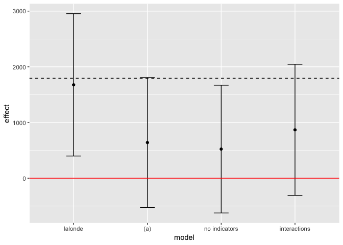
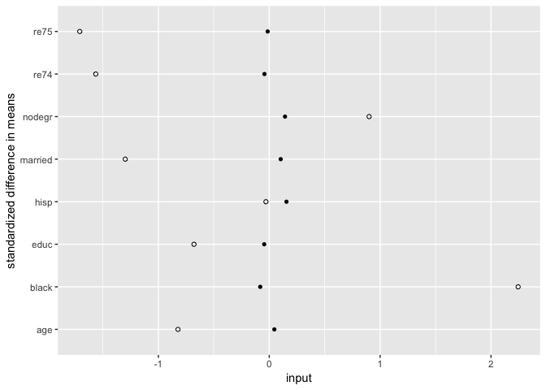

Causal inference using more advanced models
================

## Question 1

### (a)

Note that the experimental data can be loaded via the `arm` package.

``` r
data(lalonde)

Tr <- lalonde$treat == 1

# (i)
benchmark <- mean(lalonde$re78[Tr]) - mean(lalonde$re78[!Tr])

## (ii)
reg_a <- lm(
  re78 ~ treat + re74 + re75 + age + educ + black + hisp + married + nodegr,
  data = lalonde
)
summary(reg_a)
```

    ## 
    ## Call:
    ## lm(formula = re78 ~ treat + re74 + re75 + age + educ + black + 
    ##     hisp + married + nodegr, data = lalonde)
    ## 
    ## Residuals:
    ##    Min     1Q Median     3Q    Max 
    ##  -9776  -4425  -1645   2942  54107 
    ## 
    ## Coefficients:
    ##                Estimate  Std. Error t value Pr(>|t|)   
    ## (Intercept)   785.06815  3374.96958   0.233  0.81617   
    ## treat        1676.34322   638.68218   2.625  0.00898 **
    ## re74            0.08214     0.07742   1.061  0.28930   
    ## re75            0.05276     0.13548   0.389  0.69712   
    ## age            55.31667    45.28395   1.222  0.22254   
    ## educ          395.73388   227.41485   1.740  0.08254 . 
    ## black       -2159.52231  1169.03614  -1.847  0.06539 . 
    ## hisp          164.03055  1549.45743   0.106  0.91574   
    ## married      -138.72363   879.72812  -0.158  0.87477   
    ## nodegr        -70.68187  1004.38735  -0.070  0.94393   
    ## ---
    ## Signif. codes:  0 '***' 0.001 '**' 0.01 '*' 0.05 '.' 0.1 ' ' 1
    ## 
    ## Residual standard error: 6513 on 435 degrees of freedom
    ## Multiple R-squared:  0.05483,    Adjusted R-squared:  0.03527 
    ## F-statistic: 2.804 on 9 and 435 DF,  p-value: 0.00329

### (b)

``` r
# dehejia and wahba data
dat <- read_stata(str_c(arm_url, 'lalonde/NSW.dw.obs.dta'))
dat %<>% rename(nodegr = nodegree)

# (a)
reg_b <- lm(
  re78 ~ treat + re74 + re75 + age + educ + black + hisp + married + nodegr,
  data = dat
)
summary(reg_b)
```

    ## 
    ## Call:
    ## lm(formula = re78 ~ treat + re74 + re75 + age + educ + black + 
    ##     hisp + married + nodegr, data = dat)
    ## 
    ## Residuals:
    ##    Min     1Q Median     3Q    Max 
    ## -60320  -3455    719   3536 110490 
    ## 
    ## Coefficients:
    ##               Estimate Std. Error t value Pr(>|t|)    
    ## (Intercept) 4427.01000  449.17758   9.856  < 2e-16 ***
    ## treat        640.50407  583.24348   1.098 0.272142    
    ## re74           0.29784    0.01112  26.784  < 2e-16 ***
    ## re75           0.51173    0.01112  46.038  < 2e-16 ***
    ## age         -110.15438    5.88059 -18.732  < 2e-16 ***
    ## educ         247.01682   28.79738   8.578  < 2e-16 ***
    ## black       -387.14898  190.57794  -2.031 0.042224 *  
    ## hisp         -50.17502  228.22304  -0.220 0.825990    
    ## married      180.24435  144.32611   1.249 0.211729    
    ## nodegr       645.34708  179.45239   3.596 0.000324 ***
    ## ---
    ## Signif. codes:  0 '***' 0.001 '**' 0.01 '*' 0.05 '.' 0.1 ' ' 1
    ## 
    ## Residual standard error: 7588 on 18657 degrees of freedom
    ## Multiple R-squared:  0.5151, Adjusted R-squared:  0.5148 
    ## F-statistic:  2202 on 9 and 18657 DF,  p-value: < 2.2e-16

``` r
# no indicators
reg_ni <- lm(
  re78 ~ treat + re74 + re75,
  data = dat
)
summary(reg_ni)
```

    ## 
    ## Call:
    ## lm(formula = re78 ~ treat + re74 + re75, data = dat)
    ## 
    ## Residuals:
    ##    Min     1Q Median     3Q    Max 
    ## -60217  -4383   1317   3558 111037 
    ## 
    ## Coefficients:
    ##               Estimate Std. Error t value Pr(>|t|)    
    ## (Intercept) 4494.45033  100.78267  44.595   <2e-16 ***
    ## treat        522.98933  573.70301   0.912    0.362    
    ## re74           0.25260    0.01098  22.996   <2e-16 ***
    ## re75           0.52371    0.01121  46.705   <2e-16 ***
    ## ---
    ## Signif. codes:  0 '***' 0.001 '**' 0.01 '*' 0.05 '.' 0.1 ' ' 1
    ## 
    ## Residual standard error: 7701 on 18663 degrees of freedom
    ## Multiple R-squared:  0.5003, Adjusted R-squared:  0.5002 
    ## F-statistic:  6229 on 3 and 18663 DF,  p-value: < 2.2e-16

``` r
# interactions
m <- 're78 ~ treat + re74 + re75 + age + educ + black + hisp + married + nodegr'
m <- str_c(m, ' + black:nodegr + hisp:nodegr + married:nodegr')
reg_in <- lm(as.formula(m), data = dat)
summary(reg_in)
```

    ## 
    ## Call:
    ## lm(formula = as.formula(m), data = dat)
    ## 
    ## Residuals:
    ##    Min     1Q Median     3Q    Max 
    ## -60241  -3467    727   3544 110826 
    ## 
    ## Coefficients:
    ##                  Estimate Std. Error t value Pr(>|t|)    
    ## (Intercept)    4425.93558  454.37009   9.741   <2e-16 ***
    ## treat           868.91950  588.64997   1.476   0.1399    
    ## re74              0.29764    0.01112  26.771   <2e-16 ***
    ## re75              0.51169    0.01112  46.033   <2e-16 ***
    ## age            -110.58629    5.94124 -18.613   <2e-16 ***
    ## educ            253.36143   28.96911   8.746   <2e-16 ***
    ## black            19.62693  252.54859   0.078   0.9381    
    ## hisp           -309.11485  322.69881  -0.958   0.3381    
    ## married          64.27629  164.21251   0.391   0.6955    
    ## nodegr          479.79591  262.04091   1.831   0.0671 .  
    ## black:nodegr   -893.31514  373.87861  -2.389   0.0169 *  
    ## hisp:nodegr     439.28839  454.71871   0.966   0.3340    
    ## married:nodegr  387.58807  270.76671   1.431   0.1523    
    ## ---
    ## Signif. codes:  0 '***' 0.001 '**' 0.01 '*' 0.05 '.' 0.1 ' ' 1
    ## 
    ## Residual standard error: 7586 on 18654 degrees of freedom
    ## Multiple R-squared:  0.5153, Adjusted R-squared:  0.515 
    ## F-statistic:  1653 on 12 and 18654 DF,  p-value: < 2.2e-16

The point estimate of the effect is sensitive to specification but
significance is not; the effect cannot be distinguished from zero for
any of the three specifications.

``` r
pdat <- map(list(reg_a, reg_b, reg_ni, reg_in), tidy)
pdat <- map_dfr(1:4, function(x) { pdat[[x]]$model <- x ; pdat[[x]] })
pdat %<>% filter(term == 'treat')

p <- ggplot(aes(factor(model), estimate), data = pdat) +
  geom_point() +
  geom_errorbar(
    aes(ymin = estimate - 2 * std.error, ymax = estimate + 2 * std.error),
    width = 0.2
  ) +
  geom_hline(aes(yintercept = 0), col = 'red') +
  geom_hline(aes(yintercept = benchmark), linetype = 2) +
  scale_x_discrete(
    labels = c('lalonde', '(a)', 'no indicators', 'interactions')
    ) +
  labs(x = 'model', y = 'effect')
p
```

<!-- -->

### (c)

``` r
mod <- 'treat ~ re74 + re75 + age + educ + black + hisp + married + nodegr
  + black:nodegr + hisp:nodegr + married:nodegr + I(age ^ 2)'
psm <- glm(
  mod,
  data = dat,
  family = binomial(link = 'logit')
)
mat <- matching(z = dat$treat, score = predict(psm, type = 'link'))
mat <- dat[mat$matched, ]
bal <- do.call(rbind, balance(dat, mat, psm)[1:2])
bal %<>% as_tibble() %>%
  mutate(
    type = c(rep(0, nrow(bal) / 2), rep(1, nrow(bal) / 2)),
    var  = row.names(bal)
  )
p <- ggplot(bal) +
  geom_point(aes(var, diff.std, shape = factor(type))) +
  scale_shape_manual(
    name = 'type',
    values = c(1, 16), labels = c('unmatched', 'matched')
    ) +
  guides(shape = F) +
  coord_flip() +
  labs(x = 'standardized difference in means', y = 'input')
p
```

<!-- -->

``` r
Tr <- mat$treat == 1

# (i)
mean(mat$re78[Tr]) - mean(mat$re78[!Tr])
```

    ## [1] 1699.217

``` r
## (ii)
reg_c <- lm(
  re78 ~ treat + re74 + re75 + age + educ + black + hisp + married + nodegr,
  data = mat
)
summary(reg_c)
```

    ## 
    ## Call:
    ## lm(formula = re78 ~ treat + re74 + re75 + age + educ + black + 
    ##     hisp + married + nodegr, data = mat)
    ## 
    ## Residuals:
    ##    Min     1Q Median     3Q    Max 
    ## -12354  -4580  -2136   3309  54731 
    ## 
    ## Coefficients:
    ##               Estimate Std. Error t value Pr(>|t|)  
    ## (Intercept)  3958.6367  3609.9662   1.097   0.2736  
    ## treat        1851.4876   733.8020   2.523   0.0121 *
    ## re74            0.0629     0.1123   0.560   0.5756  
    ## re75            0.3899     0.1694   2.302   0.0219 *
    ## age           -58.4988    44.5513  -1.313   0.1900  
    ## educ          322.2764   236.6956   1.362   0.1742  
    ## black       -1772.8159  1215.9622  -1.458   0.1457  
    ## hisp        -1660.1006  2176.8829  -0.763   0.4462  
    ## married      1027.4873  1064.4263   0.965   0.3350  
    ## nodegr       -868.3903  1121.5883  -0.774   0.4393  
    ## ---
    ## Signif. codes:  0 '***' 0.001 '**' 0.01 '*' 0.05 '.' 0.1 ' ' 1
    ## 
    ## Residual standard error: 6987 on 360 degrees of freedom
    ## Multiple R-squared:  0.08421,    Adjusted R-squared:  0.06132 
    ## F-statistic: 3.678 on 9 and 360 DF,  p-value: 0.0002011

The results are quite close to the experimental benchmark.

### (d)

For those eligible for the NSW program, participation – on average –
caused an $1851.49 increase in 1978 earnings.

### (e)

``` r
mod <- 'treat ~ re75 + age + educ + black + hisp + married + nodegr
  + black:nodegr + hisp:nodegr + married:nodegr + I(age ^ 2)'
psm <- glm(
  mod,
  data = dat,
  family = binomial(link = 'logit')
)
mat <- matching(z = dat$treat, score = predict(psm, type = 'link'))
mat <- dat[mat$matched, ]
bal <- do.call(rbind, balance(dat, mat, psm)[1:2])
bal %<>% as_tibble() %>%
  mutate(
    type = c(rep(0, nrow(bal) / 2), rep(1, nrow(bal) / 2)),
    var  = row.names(bal)
  )
# p <- ggplot(bal) +
#   geom_point(aes(var, diff.std, shape = factor(type))) +
#   scale_shape_manual(
#     name = 'type',
#     values = c(1, 16), labels = c('unmatched', 'matched')
#     ) +
#   guides(shape = F) +
#   coord_flip() +
#   labs(x = 'standardized difference in means', y = 'input')
# p 
```

``` r
Tr <- mat$treat == 1

# (i)
mean(mat$re78[Tr]) - mean(mat$re78[!Tr])
```

    ## [1] 1669.655

``` r
## (ii)
reg_d <- lm(
  re78 ~ treat + re75 + age + educ + black + hisp + married + nodegr,
  data = mat
)
summary(reg_d)
```

    ## 
    ## Call:
    ## lm(formula = re78 ~ treat + re75 + age + educ + black + hisp + 
    ##     married + nodegr, data = mat)
    ## 
    ## Residuals:
    ##    Min     1Q Median     3Q    Max 
    ## -11054  -4762  -1795   3022  54511 
    ## 
    ## Coefficients:
    ##              Estimate Std. Error t value Pr(>|t|)   
    ## (Intercept) 3703.2744  3446.6675   1.074  0.28334   
    ## treat       1578.7540   718.2720   2.198  0.02858 * 
    ## re75           0.3572     0.1248   2.863  0.00445 **
    ## age          -42.8779    43.0948  -0.995  0.32042   
    ## educ         221.4205   218.0470   1.015  0.31056   
    ## black       -505.5005  1153.6469  -0.438  0.66152   
    ## hisp         422.8042  2130.8990   0.198  0.84283   
    ## married     1132.3344  1034.9219   1.094  0.27463   
    ## nodegr      -673.6977  1086.3900  -0.620  0.53557   
    ## ---
    ## Signif. codes:  0 '***' 0.001 '**' 0.01 '*' 0.05 '.' 0.1 ' ' 1
    ## 
    ## Residual standard error: 6859 on 361 degrees of freedom
    ## Multiple R-squared:  0.05748,    Adjusted R-squared:  0.03659 
    ## F-statistic: 2.752 on 8 and 361 DF,  p-value: 0.005829

Removing `re74` does impact the point estimate of the treatment effect
but the benchmark value is still included in the 95% confidence
interval.

## Question 2

### (a)

Conceptually, a regression discontinuity framework seems
appropriate.

### (b)

``` r
dat <- read_delim(str_c(arm_url, 'bypass/bypass.data.txt'), delim = '\t')

p <- ggplot(dat) +
  geom_point(aes(age, stay, shape = factor(new))) +
  scale_shape_manual(name = 'Tr', values = c(16, 1))
p
```

<!-- -->

The plot above does not seem to support the regression discontinuity
design; there is no apparent jump at the cutoff. There is also partial
overlap which could potentially make the design inappropriate.

### (c)

``` r
lower <- min(dat$age[dat$new == 0])
upper <- max(dat$age[dat$new == 1])

# w/o severity
reg1 <- lm(
  stay ~ new + age,
  data = filter(dat, age >= lower & age <= upper)
  )
summary(reg1)
```

    ## 
    ## Call:
    ## lm(formula = stay ~ new + age, data = filter(dat, age >= lower & 
    ##     age <= upper))
    ## 
    ## Residuals:
    ##     Min      1Q  Median      3Q     Max 
    ## -4.6154 -1.3769 -0.1842  1.1441  4.2711 
    ## 
    ## Coefficients:
    ##             Estimate Std. Error t value Pr(>|t|)  
    ## (Intercept) -13.4772    18.0936  -0.745    0.462  
    ## new          -0.9432     0.8528  -1.106    0.277  
    ## age           0.5421     0.2298   2.359    0.025 *
    ## ---
    ## Signif. codes:  0 '***' 0.001 '**' 0.01 '*' 0.05 '.' 0.1 ' ' 1
    ## 
    ## Residual standard error: 2.248 on 30 degrees of freedom
    ## Multiple R-squared:  0.1913, Adjusted R-squared:  0.1374 
    ## F-statistic: 3.549 on 2 and 30 DF,  p-value: 0.04136

``` r
# w/ severity
reg2 <- lm(
  stay ~ new + age + severity,
  data = filter(dat, age >= lower & age <= upper)
  )
summary(reg2)
```

    ## 
    ## Call:
    ## lm(formula = stay ~ new + age + severity, data = filter(dat, 
    ##     age >= lower & age <= upper))
    ## 
    ## Residuals:
    ##      Min       1Q   Median       3Q      Max 
    ## -0.54019 -0.23794  0.04123  0.21815  0.61645 
    ## 
    ## Coefficients:
    ##             Estimate Std. Error t value   Pr(>|t|)    
    ## (Intercept)  0.53143    2.75024   0.193      0.848    
    ## new         -4.57147    0.16317 -28.017    < 2e-16 ***
    ## age          0.21155    0.03578   5.913 0.00000202 ***
    ## severity     0.28476    0.00791  36.000    < 2e-16 ***
    ## ---
    ## Signif. codes:  0 '***' 0.001 '**' 0.01 '*' 0.05 '.' 0.1 ' ' 1
    ## 
    ## Residual standard error: 0.3382 on 29 degrees of freedom
    ## Multiple R-squared:  0.9823, Adjusted R-squared:  0.9805 
    ## F-statistic: 536.5 on 3 and 29 DF,  p-value: < 2.2e-16

The first regression shows that the new procedure results in
approximately one fewer day in the hospital; however, this effect is not
statistically significant. The second regression shows that the new
procedure results in approximately five fewer days. Clearly, severity is
a confounder that needs to be controlled for.

## Question 3

Rather than tell a specific story let’s just simulate some data using
the regression framework.

### (a)

``` r
set.seed(1)

z  <- rbinom(100, 1, 0.5)
Tr <- 1 + z + rnorm(100, 0, 0.5)
Tr <- as.numeric(Tr >= mean(Tr))
y  <- 10 + 20 * Tr + 0 * z + rnorm(100, 0, 1)

# wald estimator
f1 <- lm(Tr ~ z)
f2 <- lm(y ~ z)
coef(f2)[['z']] / coef(f1)[['z']]
```

    ## [1] 19.96955

``` r
# two-stage estimator
f3 <- lm(Tr ~ z)
f4 <- lm(y ~ f3$fitted.values)
coef(f4)[[2]]
```

    ## [1] 19.96955

### (b)

``` r
set.seed(2)

z  <- rbinom(100, 1, 0.5)
Tr <- 1 + z + rnorm(100, 0, 0.5)
Tr <- as.numeric(Tr >= mean(Tr))
Tr[sample(grep(1, Tr), 10)] <- 0  # 80% compliance
y  <- 10 + 20 * Tr + 10 * z + rnorm(100, 0, 1)

f1 <- lm(Tr ~ z)
f2 <- lm(y ~ z)
coef(f2)[['z']] / coef(f1)[['z']]
```

    ## [1] 38.85551

### (c)

``` r
set.seed(3)

z  <- rbinom(100, 1, 0.5)
Tr <- 1 + z + rnorm(100, 0, 0.5)
Tr <- as.numeric(Tr >= mean(Tr))
Tr[sample(grep(1, Tr), 40)] <- 0  # 20% compliance
y  <- 10 + 20 * Tr + 10 * z + rnorm(100, 0, 1)

f1 <- lm(Tr ~ z)
f2 <- lm(y ~ z)
coef(f2)[['z']] / coef(f1)[['z']]
```

    ## [1] 88.6921

## Question 4

### (a)

Contributions are potentially an intermediate outcome since incumbency
undoubtedly plays a role in how much money a candidate can raise.

### (b)

The treatment variable would be money raised by the candidate and the
outcome would be her corresponding vote share in the election.

### (c)

Ignorability of the instrument is likely satisfied since incumbency is
essentially randomly assigned for close elections (regression
discontinuity design). The exclusion restriction will not be satisfied
since incumbency is likely to have it’s own direct effect on a
candidate’s vote share (indeed, this was explored in Exercise 9.13).

### (d)

Candidate wealth could be used an instrument instead of incumbency; this
would likely impact money raised by the candidate but perhaps not the
votes they receive in the election.
