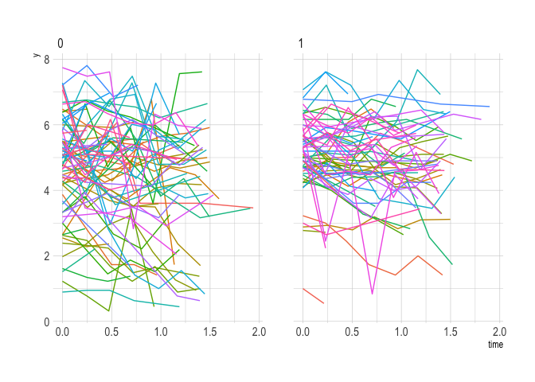

Multilevel structures
================

## Question 1

``` r
apt <- read.table(str_c(arm_url, 'rodents/apt.dat'))
dis <- read.table(str_c(arm_url, 'rodents/dist.dat'))
```

### (a)

\[
P(y_{ij} = 1) = \text{logit}^{-1} \left( \beta_0 + \beta_1 \times \text{defects}_i + \beta_2 \times \text{race}_i + \beta_3 \times \text{floor}_i + \beta_4 \times \text{bldg}_i + \alpha_j \right)
\]

### (b)

\[
\begin{align}
P(y_{i} = 1) &= \text{logit}^{-1} \left( \beta_0 + \beta_1 \times \text{defects}_i + \beta_2 \times \text{race}_i + \beta_3 \times \text{floor}_i + \beta_4 \times \text{bldg}_i + \alpha_{j[i]} \right) \\
\alpha_{j[i]} &\sim N \left( \gamma_0 + \gamma_1 \times \text{defects}_j + \gamma_2 \times \text{poor}_j, \sigma_{\alpha} ^ 2 \right)
\end{align}
\]

## Question 2

Skip

## Question 3

``` r
win32 <- read_table2(str_c(arm_url, 'olympics/olympics1932.txt'), skip = 20)
```

### (a)

``` r
pro32 <- cbind(1:7, win32[seq(1, 14, by = 2), 3:9])
per32 <- cbind(1:7, win32[seq(2, 14, by = 2), 2:8])
names(pro32) <- c('pair', str_c('judge_', 1:7))
names(per32) <- c('pair', str_c('judge_', 1:7))
```

### (b)

``` r
dat <- left_join(
  gather(pro32, judge, score, -pair),
  gather(per32, judge, score, -pair),
  by = c('pair', 'judge')
)
dat %<>% mutate_at(vars(score.x, score.y), as.numeric)
dat$judge %<>% str_replace_all('judge_', '') %>% as.numeric()
names(dat)[3:4] <- c('tech', 'perf')
dat <- dat[c(3:4, 1:2)]
```

### (c)

``` r
dat %<>%
  mutate(
    same = 0,
    same = if_else(pair == 1 & judge == 5, 1, same),
    same = if_else(pair == 2 & judge == 7, 1, same),
    same = if_else(pair == 3 & judge == 1, 1, same),
    same = if_else(pair == 4 & judge == 1, 1, same),
    same = if_else(pair == 7 & judge == 7, 1, same)
  )
```

## Question 4

### (a)

``` r
cd4 <- read_csv(str_c(arm_url, 'cd4/allvar.csv'))
cd4 %<>% mutate(time = visage - baseage)

p <- ggplot(cd4) +
  geom_line(aes(time, CD4PCT, colour = factor(newpid))) +
  scale_y_sqrt() +
  guides(colour = F)
p
```

<!-- -->

### (b)

``` r
p <- ggplot(cd4) +
  geom_point(aes(time, sqrt(CD4PCT), colour = factor(newpid))) +
  geom_smooth(
    aes(time, sqrt(CD4PCT), colour = factor(newpid)),
    method = 'lm', se = F
    ) +
  guides(colour = F)
p
```

<!-- -->

### (c)
