Linear Regression
================

## Question 1

The null hypotheses are that each of the coefficients individually has
no effect on sales in the presence of the others. One can conclude from
their values that the coefficients for `Intercept`, `TV`, and `radio`
are statistically different from zero while the coefficient for
`newspaper` is not.

## Question 2

The KNN classifier and the KNN regression method both rely on the K
nearest neighbors of a set of given predictors. However, the former
predicts a qualitative outcome \(Y_i\) while the latter predicts a
quantative outcome \(f(X_i)\).

## Question 3

We have the following model:

\[
Salary = 50 + 20 \cdot GPA + 0.7 \cdot IQ + 35 \cdot I_{Female} + 0.01 \cdot GPA \times IQ - 10 \cdot GPA \times I_{Female}
\]

### (a)

For a fixed value of \(IQ\) and \(GPA\), males earn more on average than
females provided that \(GPA\) is high enough.

### (b)

Given a female with \(IQ = 110\) and \(GPA = 4.0\), predicted salary is:

\[
50 + 20 \cdot 4.0 + 0.7 * 110 + 35 + 0.01 \cdot 4.0 \times 110 - 10 \cdot 4.0 = 137.1
\]

### (c)

False, we need to know the p-value to have supporting evidence.
Furthermore, the effect of the interaction term will depend on the scale
of the \(IQ\) and \(GPA\) variables.

## Question 4

Comparing linear and cubic regressions given a linear DGP:

### (a)

We would expect the training RSS to be lower using the cubic regression
since it is more flexible.

### (b)

We would expect the test RSS to be higher using the cubic regression due
to overfitting.

### (c)

The cubic regression will always perform better (in terms of training
RSS).

### (d)

Given a non-linear DGP, there is not enough information to know since
the relationship may be close to linear or highly non-linear.

## Question 5

Substitution and rearranging implies:

\[
\hat y_i = x_i \frac{\sum_{j=1}^n x_j y_j}{\sum_{k=1}^n x_k^2} = \sum_{j=1}^n \frac{x_i x_j}{\sum_{k=1}^n x_k^2} y_j = \sum_{j=1}^n a_j y_j
\]

where

\[
a_j = \frac{x_i x_j}{\sum_{k=1}^n x_k^2}
\]

## Question 6

The regression line is given by:

\[
y = \beta_0 + \beta_1 x
\]

Substituting in the fact that \(\beta_0 = \bar y - \beta_1 \bar x\)
implies:

\[
y = \bar y - \beta_1 \bar x + \beta_1 x
\]

Plugging in the point \((\bar x, \bar y)\) implies:

\[
\bar y = \bar y - \beta_1 \bar x + \beta_1 \bar x
\] which obviously holds.

## Question 7

Skip

## Question 8

### (a)

``` r
library(MASS)

lm08 <- lm(mpg ~ horsepower, data = Auto)
summary(lm08)
```

    ## 
    ## Call:
    ## lm(formula = mpg ~ horsepower, data = Auto)
    ## 
    ## Residuals:
    ##      Min       1Q   Median       3Q      Max 
    ## -13.5710  -3.2592  -0.3435   2.7630  16.9240 
    ## 
    ## Coefficients:
    ##              Estimate Std. Error t value Pr(>|t|)    
    ## (Intercept) 39.935861   0.717499   55.66   <2e-16 ***
    ## horsepower  -0.157845   0.006446  -24.49   <2e-16 ***
    ## ---
    ## Signif. codes:  0 '***' 0.001 '**' 0.01 '*' 0.05 '.' 0.1 ' ' 1
    ## 
    ## Residual standard error: 4.906 on 390 degrees of freedom
    ## Multiple R-squared:  0.6059, Adjusted R-squared:  0.6049 
    ## F-statistic: 599.7 on 1 and 390 DF,  p-value: < 2.2e-16

The F-statistic indicates there is a relationship. Based on the p-value,
there is strong evidence of a negative relationship; a one unit increase
in `horsepower` lowers `mpg` by 0.16.

``` r
predict(lm08, tibble(horsepower = c(98)), interval = "confidence")
```

    ##        fit      lwr      upr
    ## 1 24.46708 23.97308 24.96108

``` r
predict(lm08, tibble(horsepower = c(98)), interval = "prediction")
```

    ##        fit     lwr      upr
    ## 1 24.46708 14.8094 34.12476

### (b)

``` r
p <- ggplot(Auto) +
  geom_point(aes(horsepower, mpg)) +
  geom_abline(aes(intercept = coef(lm08)[1], slope = coef(lm08)[2]), col = 'red')
p
```

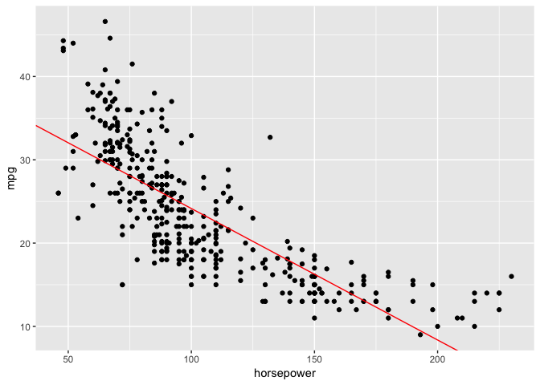<!-- -->

### (c)

``` r
par(mfrow = c(2, 2))
plot(lm08)
```

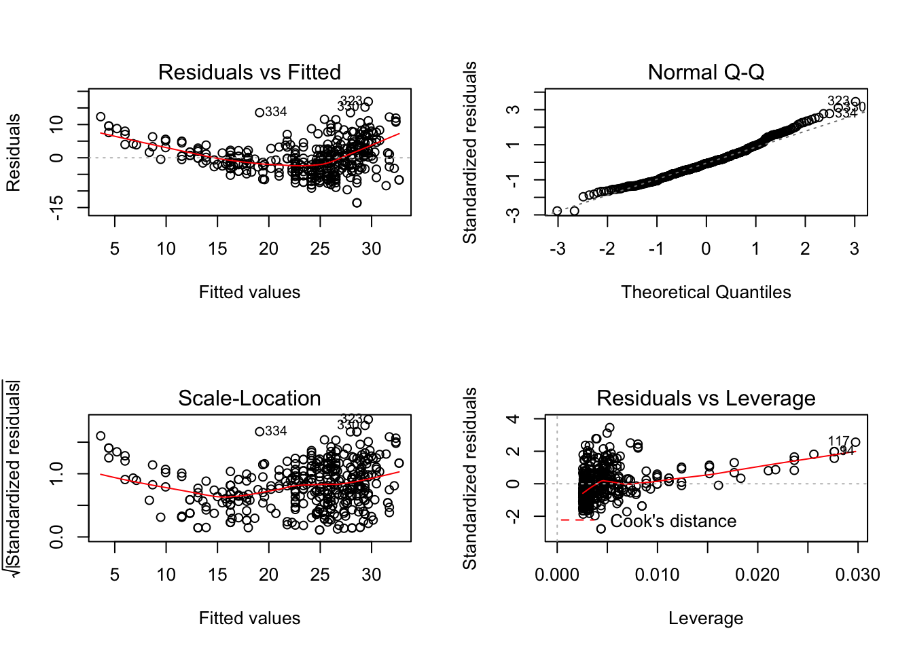<!-- -->

The Residuals vs Fitted plot indicates potential
    non-linearity.

## Question 9

### (a)

``` r
pairs(Auto)
```

<!-- -->

### (b)

``` r
cor(Auto[, 1:8])
```

    ##                     mpg  cylinders displacement horsepower     weight
    ## mpg           1.0000000 -0.7776175   -0.8051269 -0.7784268 -0.8322442
    ## cylinders    -0.7776175  1.0000000    0.9508233  0.8429834  0.8975273
    ## displacement -0.8051269  0.9508233    1.0000000  0.8972570  0.9329944
    ## horsepower   -0.7784268  0.8429834    0.8972570  1.0000000  0.8645377
    ## weight       -0.8322442  0.8975273    0.9329944  0.8645377  1.0000000
    ## acceleration  0.4233285 -0.5046834   -0.5438005 -0.6891955 -0.4168392
    ## year          0.5805410 -0.3456474   -0.3698552 -0.4163615 -0.3091199
    ## origin        0.5652088 -0.5689316   -0.6145351 -0.4551715 -0.5850054
    ##              acceleration       year     origin
    ## mpg             0.4233285  0.5805410  0.5652088
    ## cylinders      -0.5046834 -0.3456474 -0.5689316
    ## displacement   -0.5438005 -0.3698552 -0.6145351
    ## horsepower     -0.6891955 -0.4163615 -0.4551715
    ## weight         -0.4168392 -0.3091199 -0.5850054
    ## acceleration    1.0000000  0.2903161  0.2127458
    ## year            0.2903161  1.0000000  0.1815277
    ## origin          0.2127458  0.1815277  1.0000000

### (c)

``` r
lm09 <- lm(mpg ~ . - name, data = Auto)
summary(lm09)
```

    ## 
    ## Call:
    ## lm(formula = mpg ~ . - name, data = Auto)
    ## 
    ## Residuals:
    ##     Min      1Q  Median      3Q     Max 
    ## -9.5903 -2.1565 -0.1169  1.8690 13.0604 
    ## 
    ## Coefficients:
    ##                Estimate Std. Error t value    Pr(>|t|)    
    ## (Intercept)  -17.218435   4.644294  -3.707     0.00024 ***
    ## cylinders     -0.493376   0.323282  -1.526     0.12780    
    ## displacement   0.019896   0.007515   2.647     0.00844 ** 
    ## horsepower    -0.016951   0.013787  -1.230     0.21963    
    ## weight        -0.006474   0.000652  -9.929     < 2e-16 ***
    ## acceleration   0.080576   0.098845   0.815     0.41548    
    ## year           0.750773   0.050973  14.729     < 2e-16 ***
    ## origin         1.426141   0.278136   5.127 0.000000467 ***
    ## ---
    ## Signif. codes:  0 '***' 0.001 '**' 0.01 '*' 0.05 '.' 0.1 ' ' 1
    ## 
    ## Residual standard error: 3.328 on 384 degrees of freedom
    ## Multiple R-squared:  0.8215, Adjusted R-squared:  0.8182 
    ## F-statistic: 252.4 on 7 and 384 DF,  p-value: < 2.2e-16

Once again the F-statistic indidcates a relationship between `mpg` and
the predicators. The `intercept`, `displacement`, `weight`, `year`, and
`origin` all have statistically significant relationships with the
response. The `year` coefficient suggest that `mpg` has been improving
over time.

### (d)

``` r
par(mfrow = c(2, 2))
plot(lm09)
```

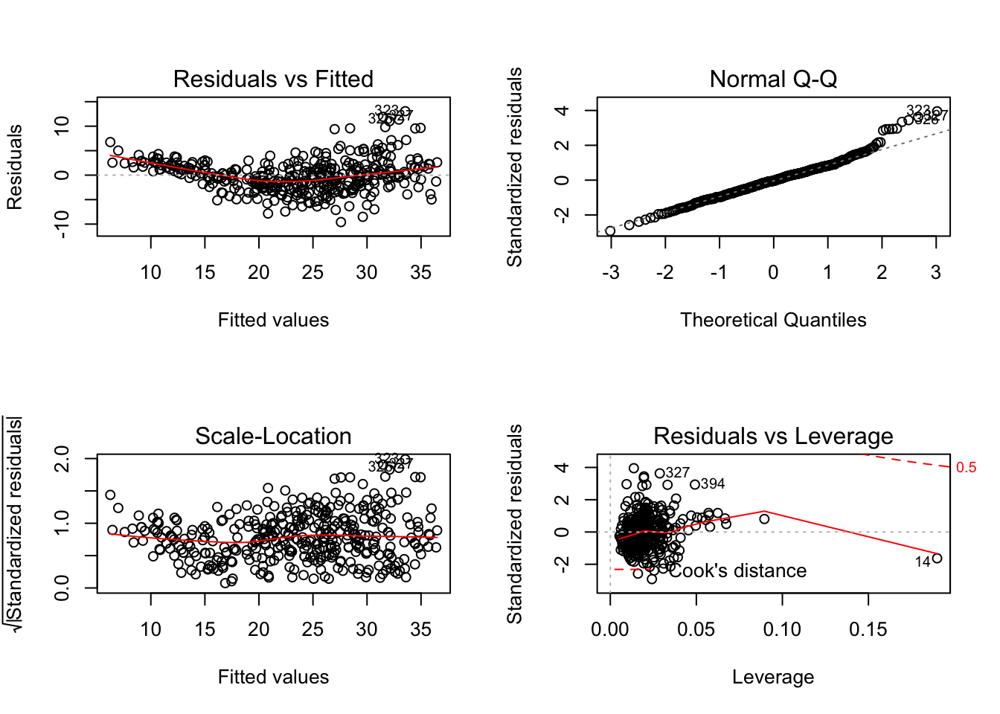<!-- -->

The plots indicate some potential outliers. Observation 14 has high
leverage but a low residual.

### (e)

``` r
lm09e <- lm(mpg ~ . : . , data = Auto[, 1:8])
summary(lm09e)
```

    ## 
    ## Call:
    ## lm(formula = mpg ~ .:., data = Auto[, 1:8])
    ## 
    ## Residuals:
    ##     Min      1Q  Median      3Q     Max 
    ## -7.6303 -1.4481  0.0596  1.2739 11.1386 
    ## 
    ## Coefficients:
    ##                               Estimate   Std. Error t value Pr(>|t|)   
    ## (Intercept)                35.47888748  53.13578860   0.668  0.50475   
    ## cylinders                   6.98857616   8.24797077   0.847  0.39738   
    ## displacement               -0.47853869   0.18935343  -2.527  0.01192 * 
    ## horsepower                  0.50343394   0.34699939   1.451  0.14769   
    ## weight                      0.00413289   0.01759419   0.235  0.81442   
    ## acceleration               -5.85917321   2.17362119  -2.696  0.00735 **
    ## year                        0.69743028   0.60967032   1.144  0.25340   
    ## origin                    -20.89557040   7.09709051  -2.944  0.00345 **
    ## cylinders:displacement     -0.00338326   0.00645510  -0.524  0.60051   
    ## cylinders:horsepower        0.01161333   0.02419810   0.480  0.63157   
    ## cylinders:weight            0.00035746   0.00089549   0.399  0.69000   
    ## cylinders:acceleration      0.27787199   0.16642155   1.670  0.09584 . 
    ## cylinders:year             -0.17412586   0.09714126  -1.793  0.07389 . 
    ## cylinders:origin            0.40216822   0.49262243   0.816  0.41482   
    ## displacement:horsepower    -0.00008491   0.00028846  -0.294  0.76867   
    ## displacement:weight         0.00002472   0.00001470   1.682  0.09342 . 
    ## displacement:acceleration  -0.00347900   0.00334174  -1.041  0.29853   
    ## displacement:year           0.00593380   0.00239072   2.482  0.01352 * 
    ## displacement:origin         0.02398113   0.01946528   1.232  0.21875   
    ## horsepower:weight          -0.00001968   0.00002924  -0.673  0.50124   
    ## horsepower:acceleration    -0.00721274   0.00371945  -1.939  0.05325 . 
    ## horsepower:year            -0.00583751   0.00393847  -1.482  0.13916   
    ## horsepower:origin           0.00223251   0.02930144   0.076  0.93931   
    ## weight:acceleration         0.00023462   0.00022886   1.025  0.30596   
    ## weight:year                -0.00022452   0.00021268  -1.056  0.29182   
    ## weight:origin              -0.00057885   0.00159117  -0.364  0.71623   
    ## acceleration:year           0.05562151   0.02558175   2.174  0.03033 * 
    ## acceleration:origin         0.45831610   0.15665969   2.926  0.00365 **
    ## year:origin                 0.13925702   0.07398950   1.882  0.06062 . 
    ## ---
    ## Signif. codes:  0 '***' 0.001 '**' 0.01 '*' 0.05 '.' 0.1 ' ' 1
    ## 
    ## Residual standard error: 2.695 on 363 degrees of freedom
    ## Multiple R-squared:  0.8893, Adjusted R-squared:  0.8808 
    ## F-statistic: 104.2 on 28 and 363 DF,  p-value: < 2.2e-16

### (f)

Skip

## Question 10

### (a)

``` r
lm10 <- lm(Sales ~ Price + Urban + US, data = Carseats)
summary(lm10)
```

    ## 
    ## Call:
    ## lm(formula = Sales ~ Price + Urban + US, data = Carseats)
    ## 
    ## Residuals:
    ##     Min      1Q  Median      3Q     Max 
    ## -6.9206 -1.6220 -0.0564  1.5786  7.0581 
    ## 
    ## Coefficients:
    ##              Estimate Std. Error t value   Pr(>|t|)    
    ## (Intercept) 13.043469   0.651012  20.036    < 2e-16 ***
    ## Price       -0.054459   0.005242 -10.389    < 2e-16 ***
    ## UrbanYes    -0.021916   0.271650  -0.081      0.936    
    ## USYes        1.200573   0.259042   4.635 0.00000486 ***
    ## ---
    ## Signif. codes:  0 '***' 0.001 '**' 0.01 '*' 0.05 '.' 0.1 ' ' 1
    ## 
    ## Residual standard error: 2.472 on 396 degrees of freedom
    ## Multiple R-squared:  0.2393, Adjusted R-squared:  0.2335 
    ## F-statistic: 41.52 on 3 and 396 DF,  p-value: < 2.2e-16

### (b)

The results suggests:

1.  A statistically significant negative relationship between `Sales`
    and `price`
2.  No relationship between `Sales` and whether the store is located in
    an urban area
3.  A statistically significant positive relationship between `Sales`
    and whether the store is located in the U.S.

### (c)

The model can be written:

\[
Sales = \beta_0 + \beta_1 \cdot Price + \beta_1 \cdot I_{Urban} + \beta_2 \cdot I_{US}
\]

### (d)

The null hypothesis that the coefficient is zero can be rejected for
`Price` and `US`.

### (e)

``` r
lm10e <- lm(Sales ~ Price + US, data = Carseats)
summary(lm10e)
```

    ## 
    ## Call:
    ## lm(formula = Sales ~ Price + US, data = Carseats)
    ## 
    ## Residuals:
    ##     Min      1Q  Median      3Q     Max 
    ## -6.9269 -1.6286 -0.0574  1.5766  7.0515 
    ## 
    ## Coefficients:
    ##             Estimate Std. Error t value   Pr(>|t|)    
    ## (Intercept) 13.03079    0.63098  20.652    < 2e-16 ***
    ## Price       -0.05448    0.00523 -10.416    < 2e-16 ***
    ## USYes        1.19964    0.25846   4.641 0.00000471 ***
    ## ---
    ## Signif. codes:  0 '***' 0.001 '**' 0.01 '*' 0.05 '.' 0.1 ' ' 1
    ## 
    ## Residual standard error: 2.469 on 397 degrees of freedom
    ## Multiple R-squared:  0.2393, Adjusted R-squared:  0.2354 
    ## F-statistic: 62.43 on 2 and 397 DF,  p-value: < 2.2e-16

### (f)

The second model has the same \(R^2\) but a lower \(RSE\).

### (g)

``` r
confint(lm10e)
```

    ##                   2.5 %      97.5 %
    ## (Intercept) 11.79032020 14.27126531
    ## Price       -0.06475984 -0.04419543
    ## USYes        0.69151957  1.70776632

### (h)

``` r
par(mfrow = c(2, 2))
plot(lm10e)
```

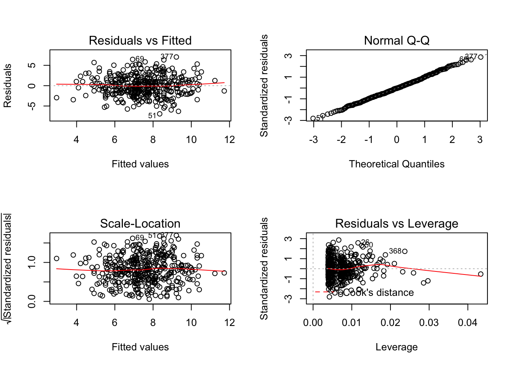<!-- -->

A few points have high leverage but low residuals.

## Question 11

``` r
set.seed(1)
x <- rnorm(100)
y <- 2 * x + rnorm(100)
```

### (a)

``` r
lm11 <- lm(y ~ x + 0)
summary(lm11)
```

    ## 
    ## Call:
    ## lm(formula = y ~ x + 0)
    ## 
    ## Residuals:
    ##     Min      1Q  Median      3Q     Max 
    ## -1.9154 -0.6472 -0.1771  0.5056  2.3109 
    ## 
    ## Coefficients:
    ##   Estimate Std. Error t value Pr(>|t|)    
    ## x   1.9939     0.1065   18.73   <2e-16 ***
    ## ---
    ## Signif. codes:  0 '***' 0.001 '**' 0.01 '*' 0.05 '.' 0.1 ' ' 1
    ## 
    ## Residual standard error: 0.9586 on 99 degrees of freedom
    ## Multiple R-squared:  0.7798, Adjusted R-squared:  0.7776 
    ## F-statistic: 350.7 on 1 and 99 DF,  p-value: < 2.2e-16

### (b)

``` r
lm11b <- lm(x ~ y + 0)
summary(lm11b)
```

    ## 
    ## Call:
    ## lm(formula = x ~ y + 0)
    ## 
    ## Residuals:
    ##     Min      1Q  Median      3Q     Max 
    ## -0.8699 -0.2368  0.1030  0.2858  0.8938 
    ## 
    ## Coefficients:
    ##   Estimate Std. Error t value Pr(>|t|)    
    ## y  0.39111    0.02089   18.73   <2e-16 ***
    ## ---
    ## Signif. codes:  0 '***' 0.001 '**' 0.01 '*' 0.05 '.' 0.1 ' ' 1
    ## 
    ## Residual standard error: 0.4246 on 99 degrees of freedom
    ## Multiple R-squared:  0.7798, Adjusted R-squared:  0.7776 
    ## F-statistic: 350.7 on 1 and 99 DF,  p-value: < 2.2e-16

### (c)

They are the same line written differently.

### (d)

``` r
sqrt(length(x) - 1) * sum(x * y) / 
  sqrt(sum(x ^ 2) * sum(y ^ 2) - (sum(x * y)) ^ 2)
```

    ## [1] 18.72593

### (e)

Relabeling `x` and `y` in the equation above does not effect the
results.

### (f)

``` r
lm11f1 <- lm(y ~ x)
summary(lm11f1)
```

    ## 
    ## Call:
    ## lm(formula = y ~ x)
    ## 
    ## Residuals:
    ##     Min      1Q  Median      3Q     Max 
    ## -1.8768 -0.6138 -0.1395  0.5394  2.3462 
    ## 
    ## Coefficients:
    ##             Estimate Std. Error t value Pr(>|t|)    
    ## (Intercept) -0.03769    0.09699  -0.389    0.698    
    ## x            1.99894    0.10773  18.556   <2e-16 ***
    ## ---
    ## Signif. codes:  0 '***' 0.001 '**' 0.01 '*' 0.05 '.' 0.1 ' ' 1
    ## 
    ## Residual standard error: 0.9628 on 98 degrees of freedom
    ## Multiple R-squared:  0.7784, Adjusted R-squared:  0.7762 
    ## F-statistic: 344.3 on 1 and 98 DF,  p-value: < 2.2e-16

``` r
lm11f2 <- lm(x ~ y)
summary(lm11f2)
```

    ## 
    ## Call:
    ## lm(formula = x ~ y)
    ## 
    ## Residuals:
    ##      Min       1Q   Median       3Q      Max 
    ## -0.90848 -0.28101  0.06274  0.24570  0.85736 
    ## 
    ## Coefficients:
    ##             Estimate Std. Error t value Pr(>|t|)    
    ## (Intercept)  0.03880    0.04266    0.91    0.365    
    ## y            0.38942    0.02099   18.56   <2e-16 ***
    ## ---
    ## Signif. codes:  0 '***' 0.001 '**' 0.01 '*' 0.05 '.' 0.1 ' ' 1
    ## 
    ## Residual standard error: 0.4249 on 98 degrees of freedom
    ## Multiple R-squared:  0.7784, Adjusted R-squared:  0.7762 
    ## F-statistic: 344.3 on 1 and 98 DF,  p-value: < 2.2e-16

``` r
all.equal(summary(lm11f1)[[4]][2, 3], summary(lm11f2)[[4]][2, 3])
```

    ## [1] TRUE

## Question 12

### (a)

If it is the case that \(\sum_1^n x_i^2 = \sum_1^n y_i^2\) then the
coefficients will be equal.

### (b)

See parts (a) and (b) from Question 11.

### (c)

``` r
x <- rnorm(100)
y <- sample(x, 100, replace = F)
lm12c1 <- lm(y ~ x + 0)
summary(lm12c1)
```

    ## 
    ## Call:
    ## lm(formula = y ~ x + 0)
    ## 
    ## Residuals:
    ##      Min       1Q   Median       3Q      Max 
    ## -2.89918 -0.45700  0.03604  0.68400  2.65595 
    ## 
    ## Coefficients:
    ##   Estimate Std. Error t value Pr(>|t|)
    ## x  0.02739    0.10047   0.273    0.786
    ## 
    ## Residual standard error: 1.034 on 99 degrees of freedom
    ## Multiple R-squared:  0.0007501,  Adjusted R-squared:  -0.009343 
    ## F-statistic: 0.07431 on 1 and 99 DF,  p-value: 0.7857

``` r
lm12c2 <- lm(x ~ y + 0)
summary(lm12c2)
```

    ## 
    ## Call:
    ## lm(formula = x ~ y + 0)
    ## 
    ## Residuals:
    ##      Min       1Q   Median       3Q      Max 
    ## -2.93830 -0.48165  0.01423  0.69235  2.64931 
    ## 
    ## Coefficients:
    ##   Estimate Std. Error t value Pr(>|t|)
    ## y  0.02739    0.10047   0.273    0.786
    ## 
    ## Residual standard error: 1.034 on 99 degrees of freedom
    ## Multiple R-squared:  0.0007501,  Adjusted R-squared:  -0.009343 
    ## F-statistic: 0.07431 on 1 and 99 DF,  p-value: 0.7857

## Question 13

### (a)

``` r
X <- rnorm(100, 0, 1)
```

### (b)

``` r
eps <- rnorm(100, 0, 0.25)
```

### (c)

``` r
Y <- -1 + 0.5 * X + eps
```

The vector `Y` has the same length as `X`. In this case,
\(\beta_0 = -1\) and \(\beta_1 = 0.5\).

### (d)

``` r
qplot(X, Y)
```

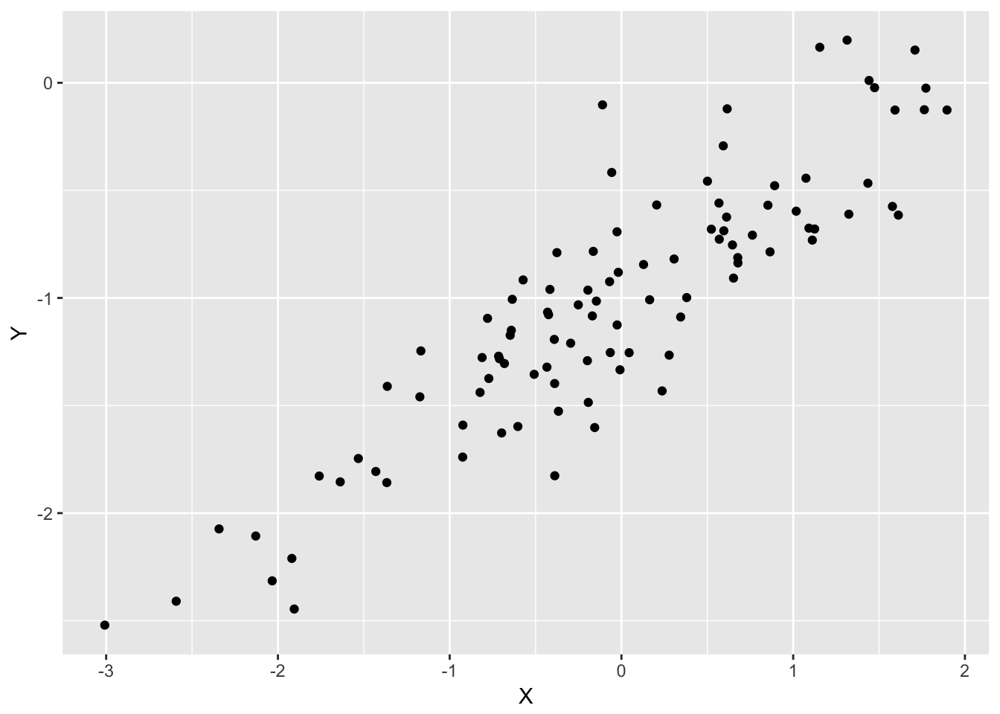<!-- -->

There is a clear linear relationshihp between `X` and `Y` subject to
noise.

### (e)

``` r
lm13 <- lm(Y ~ X)
summary(lm13)
```

    ## 
    ## Call:
    ## lm(formula = Y ~ X)
    ## 
    ## Residuals:
    ##      Min       1Q   Median       3Q      Max 
    ## -0.62578 -0.19797  0.00601  0.14174  0.95540 
    ## 
    ## Coefficients:
    ##             Estimate Std. Error t value Pr(>|t|)    
    ## (Intercept) -1.00144    0.02751  -36.40   <2e-16 ***
    ## X            0.51262    0.02631   19.48   <2e-16 ***
    ## ---
    ## Signif. codes:  0 '***' 0.001 '**' 0.01 '*' 0.05 '.' 0.1 ' ' 1
    ## 
    ## Residual standard error: 0.2746 on 98 degrees of freedom
    ## Multiple R-squared:  0.7948, Adjusted R-squared:  0.7927 
    ## F-statistic: 379.6 on 1 and 98 DF,  p-value: < 2.2e-16

The estimated \(\beta_0\) and \(\beta_1\) are close to their actual
values.

### (f)

``` r
p <- ggplot(tibble(X, Y)) +
  geom_point(aes(X, Y)) +
  geom_abline(aes(intercept = coef(lm13)[1], slope = coef(lm13)[2]), col = 'red')
p
```

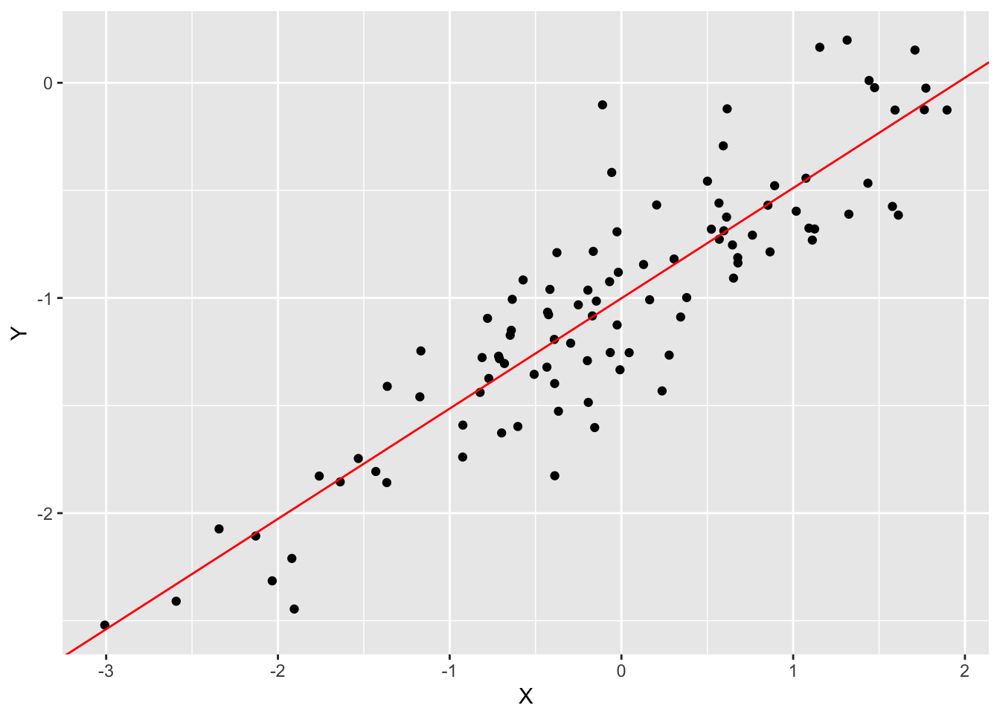<!-- -->

### (g)

``` r
lm13g <- lm(Y ~ X + I(X ^ 2))
summary(lm13g)
```

    ## 
    ## Call:
    ## lm(formula = Y ~ X + I(X^2))
    ## 
    ## Residuals:
    ##      Min       1Q   Median       3Q      Max 
    ## -0.64023 -0.20310  0.00636  0.14062  0.94089 
    ## 
    ## Coefficients:
    ##             Estimate Std. Error t value Pr(>|t|)    
    ## (Intercept) -0.98746    0.03415 -28.918   <2e-16 ***
    ## X            0.50632    0.02790  18.148   <2e-16 ***
    ## I(X^2)      -0.01315    0.01894  -0.695    0.489    
    ## ---
    ## Signif. codes:  0 '***' 0.001 '**' 0.01 '*' 0.05 '.' 0.1 ' ' 1
    ## 
    ## Residual standard error: 0.2753 on 97 degrees of freedom
    ## Multiple R-squared:  0.7958, Adjusted R-squared:  0.7916 
    ## F-statistic:   189 on 2 and 97 DF,  p-value: < 2.2e-16

The polynomial regression offers no discernable improvement in fit.

## Question 14

### (a)

``` r
set.seed(1)
x1 <- runif(100)
x2 <- 0.5 * x1 + rnorm(100) / 10
y  <- 2 + 2 * x1 + 0.3 * x2 + rnorm(100)
```

\(\beta_0 = 2\), \(\beta_1 = 2\), and \(\beta_3 = 0.3\).

### (b)

``` r
cor(x1, x2)
```

    ## [1] 0.8351212

``` r
qplot(x1, x2)
```

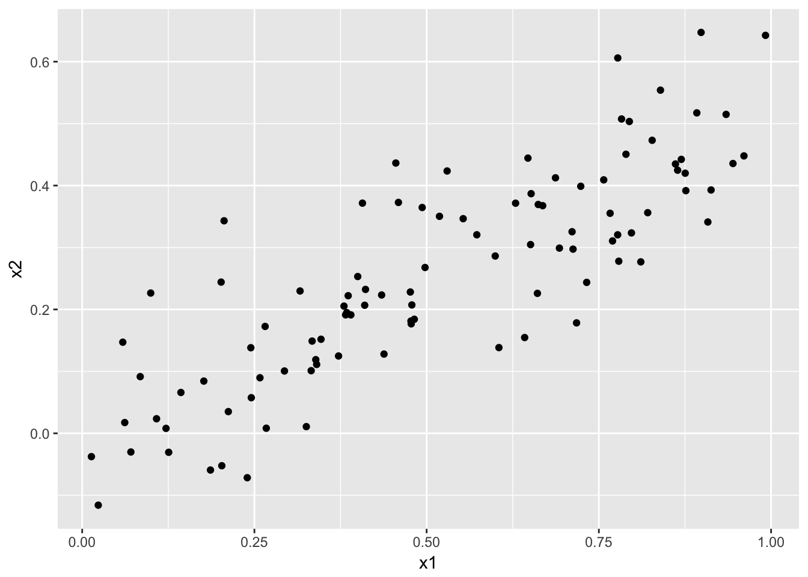<!-- -->

### (c)

``` r
lm14c <- lm(y ~ x1 + x2)
summary(lm14c)
```

    ## 
    ## Call:
    ## lm(formula = y ~ x1 + x2)
    ## 
    ## Residuals:
    ##     Min      1Q  Median      3Q     Max 
    ## -2.8311 -0.7273 -0.0537  0.6338  2.3359 
    ## 
    ## Coefficients:
    ##             Estimate Std. Error t value Pr(>|t|)    
    ## (Intercept)   2.1305     0.2319   9.188 7.61e-15 ***
    ## x1            1.4396     0.7212   1.996   0.0487 *  
    ## x2            1.0097     1.1337   0.891   0.3754    
    ## ---
    ## Signif. codes:  0 '***' 0.001 '**' 0.01 '*' 0.05 '.' 0.1 ' ' 1
    ## 
    ## Residual standard error: 1.056 on 97 degrees of freedom
    ## Multiple R-squared:  0.2088, Adjusted R-squared:  0.1925 
    ## F-statistic:  12.8 on 2 and 97 DF,  p-value: 0.00001164

\(\beta_0 = 2.1305\), \(\beta_1 = 1.4396\), and \(\beta_3 = 1.0097\). We
can reject the null hypothesis for \(\beta_1\) but not \(\beta_2\).

### (d)

``` r
lm14d <- lm(y ~ x1)
summary(lm14d)
```

    ## 
    ## Call:
    ## lm(formula = y ~ x1)
    ## 
    ## Residuals:
    ##      Min       1Q   Median       3Q      Max 
    ## -2.89495 -0.66874 -0.07785  0.59221  2.45560 
    ## 
    ## Coefficients:
    ##             Estimate Std. Error t value Pr(>|t|)    
    ## (Intercept)   2.1124     0.2307   9.155 8.27e-15 ***
    ## x1            1.9759     0.3963   4.986 2.66e-06 ***
    ## ---
    ## Signif. codes:  0 '***' 0.001 '**' 0.01 '*' 0.05 '.' 0.1 ' ' 1
    ## 
    ## Residual standard error: 1.055 on 98 degrees of freedom
    ## Multiple R-squared:  0.2024, Adjusted R-squared:  0.1942 
    ## F-statistic: 24.86 on 1 and 98 DF,  p-value: 0.000002661

We can reject the null hypothesis for \(\beta_1\).

### (e)

``` r
lm14e <- lm(y ~ x2)
summary(lm14e)
```

    ## 
    ## Call:
    ## lm(formula = y ~ x2)
    ## 
    ## Residuals:
    ##      Min       1Q   Median       3Q      Max 
    ## -2.62687 -0.75156 -0.03598  0.72383  2.44890 
    ## 
    ## Coefficients:
    ##             Estimate Std. Error t value  Pr(>|t|)    
    ## (Intercept)   2.3899     0.1949   12.26   < 2e-16 ***
    ## x2            2.8996     0.6330    4.58 0.0000137 ***
    ## ---
    ## Signif. codes:  0 '***' 0.001 '**' 0.01 '*' 0.05 '.' 0.1 ' ' 1
    ## 
    ## Residual standard error: 1.072 on 98 degrees of freedom
    ## Multiple R-squared:  0.1763, Adjusted R-squared:  0.1679 
    ## F-statistic: 20.98 on 1 and 98 DF,  p-value: 0.00001366

We can reject the null hypothesis for \(\beta_1\).

### (f)

No. `x1` and `x2` are collinear so the results make sense.

### (g)

``` r
x1 <- c(x1, 0.1)
x2 <- c(x2, 0.8)
y  <- c(y, 6)
lm14g1 <- lm(y ~ x1 + x2)
summary(lm14g1)
```

    ## 
    ## Call:
    ## lm(formula = y ~ x1 + x2)
    ## 
    ## Residuals:
    ##      Min       1Q   Median       3Q      Max 
    ## -2.73348 -0.69318 -0.05263  0.66385  2.30619 
    ## 
    ## Coefficients:
    ##             Estimate Std. Error t value Pr(>|t|)    
    ## (Intercept)   2.2267     0.2314   9.624 7.91e-16 ***
    ## x1            0.5394     0.5922   0.911  0.36458    
    ## x2            2.5146     0.8977   2.801  0.00614 ** 
    ## ---
    ## Signif. codes:  0 '***' 0.001 '**' 0.01 '*' 0.05 '.' 0.1 ' ' 1
    ## 
    ## Residual standard error: 1.075 on 98 degrees of freedom
    ## Multiple R-squared:  0.2188, Adjusted R-squared:  0.2029 
    ## F-statistic: 13.72 on 2 and 98 DF,  p-value: 0.000005564

``` r
lm14g2 <- lm(y ~ x1)
summary(lm14g2)
```

    ## 
    ## Call:
    ## lm(formula = y ~ x1)
    ## 
    ## Residuals:
    ##     Min      1Q  Median      3Q     Max 
    ## -2.8897 -0.6556 -0.0909  0.5682  3.5665 
    ## 
    ## Coefficients:
    ##             Estimate Std. Error t value Pr(>|t|)    
    ## (Intercept)   2.2569     0.2390   9.445 1.78e-15 ***
    ## x1            1.7657     0.4124   4.282 4.29e-05 ***
    ## ---
    ## Signif. codes:  0 '***' 0.001 '**' 0.01 '*' 0.05 '.' 0.1 ' ' 1
    ## 
    ## Residual standard error: 1.111 on 99 degrees of freedom
    ## Multiple R-squared:  0.1562, Adjusted R-squared:  0.1477 
    ## F-statistic: 18.33 on 1 and 99 DF,  p-value: 0.00004295

``` r
lm14g3 <- lm(y ~ x2)
summary(lm14g3)
```

    ## 
    ## Call:
    ## lm(formula = y ~ x2)
    ## 
    ## Residuals:
    ##      Min       1Q   Median       3Q      Max 
    ## -2.64729 -0.71021 -0.06899  0.72699  2.38074 
    ## 
    ## Coefficients:
    ##             Estimate Std. Error t value   Pr(>|t|)    
    ## (Intercept)   2.3451     0.1912  12.264    < 2e-16 ***
    ## x2            3.1190     0.6040   5.164 0.00000125 ***
    ## ---
    ## Signif. codes:  0 '***' 0.001 '**' 0.01 '*' 0.05 '.' 0.1 ' ' 1
    ## 
    ## Residual standard error: 1.074 on 99 degrees of freedom
    ## Multiple R-squared:  0.2122, Adjusted R-squared:  0.2042 
    ## F-statistic: 26.66 on 1 and 99 DF,  p-value: 0.000001253

``` r
par(mfrow = c(2, 2))
plot(lm14g1)
```

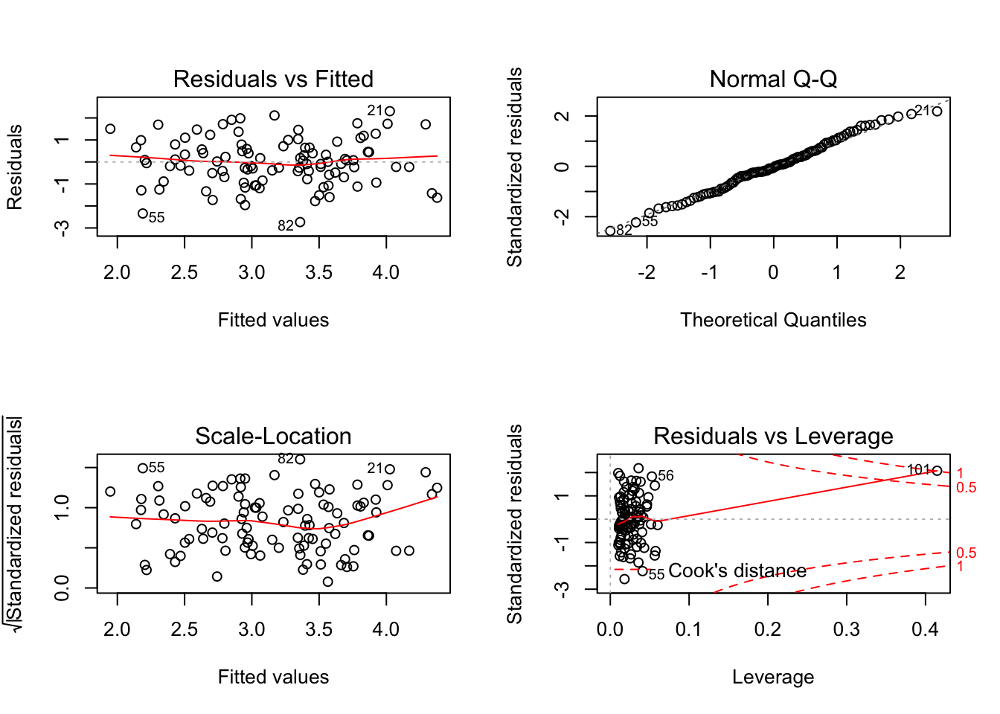<!-- -->

``` r
plot(lm14g2)
```

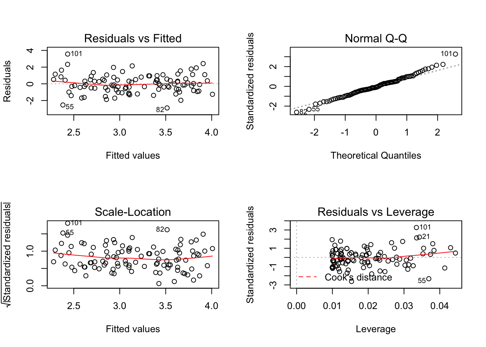<!-- -->

``` r
plot(lm14g3)
```

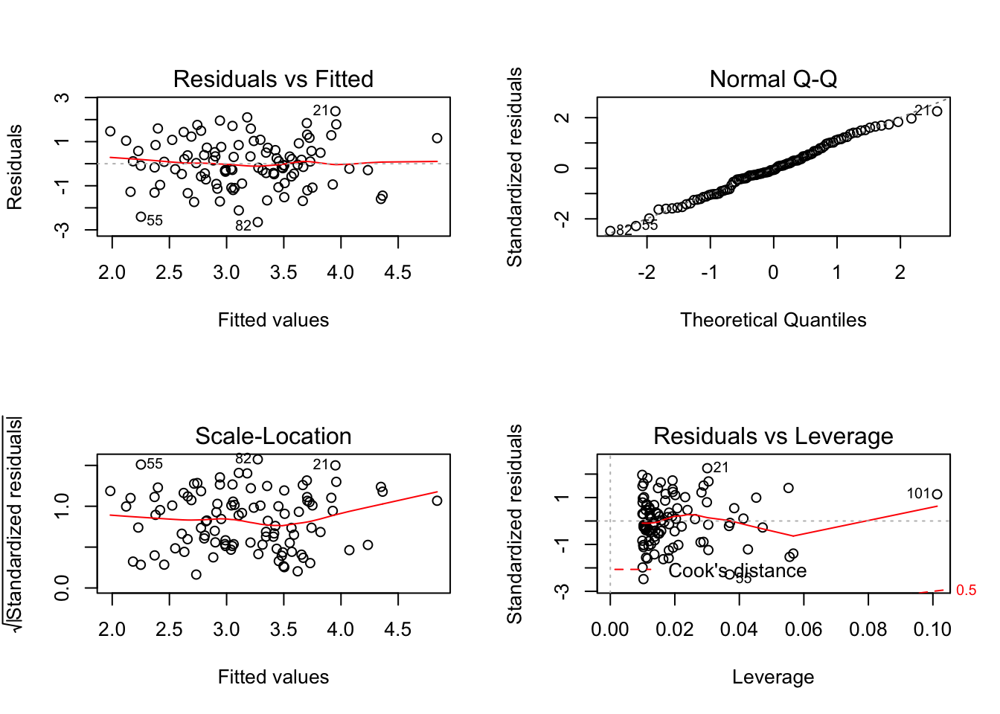<!-- -->

In the second model, the new observation is an outlier. In the first and
third models, the new observation is a high leverage point.

## Question 15

### (a)

Skip

### (b)

``` r
lm15 <- lm(crim ~ ., data = Boston)
summary(lm15)
```

    ## 
    ## Call:
    ## lm(formula = crim ~ ., data = Boston)
    ## 
    ## Residuals:
    ##    Min     1Q Median     3Q    Max 
    ## -9.924 -2.120 -0.353  1.019 75.051 
    ## 
    ## Coefficients:
    ##               Estimate Std. Error t value        Pr(>|t|)    
    ## (Intercept)  17.033228   7.234903   2.354        0.018949 *  
    ## zn            0.044855   0.018734   2.394        0.017025 *  
    ## indus        -0.063855   0.083407  -0.766        0.444294    
    ## chas         -0.749134   1.180147  -0.635        0.525867    
    ## nox         -10.313535   5.275536  -1.955        0.051152 .  
    ## rm            0.430131   0.612830   0.702        0.483089    
    ## age           0.001452   0.017925   0.081        0.935488    
    ## dis          -0.987176   0.281817  -3.503        0.000502 ***
    ## rad           0.588209   0.088049   6.680 0.0000000000646 ***
    ## tax          -0.003780   0.005156  -0.733        0.463793    
    ## ptratio      -0.271081   0.186450  -1.454        0.146611    
    ## black        -0.007538   0.003673  -2.052        0.040702 *  
    ## lstat         0.126211   0.075725   1.667        0.096208 .  
    ## medv         -0.198887   0.060516  -3.287        0.001087 ** 
    ## ---
    ## Signif. codes:  0 '***' 0.001 '**' 0.01 '*' 0.05 '.' 0.1 ' ' 1
    ## 
    ## Residual standard error: 6.439 on 492 degrees of freedom
    ## Multiple R-squared:  0.454,  Adjusted R-squared:  0.4396 
    ## F-statistic: 31.47 on 13 and 492 DF,  p-value: < 2.2e-16

### (c)

Skip

### (d)

``` r
lm15d1 <- lm(crim ~ zn, data = Boston)
par(mfrow = c(2, 2))
plot(lm15d1)
```

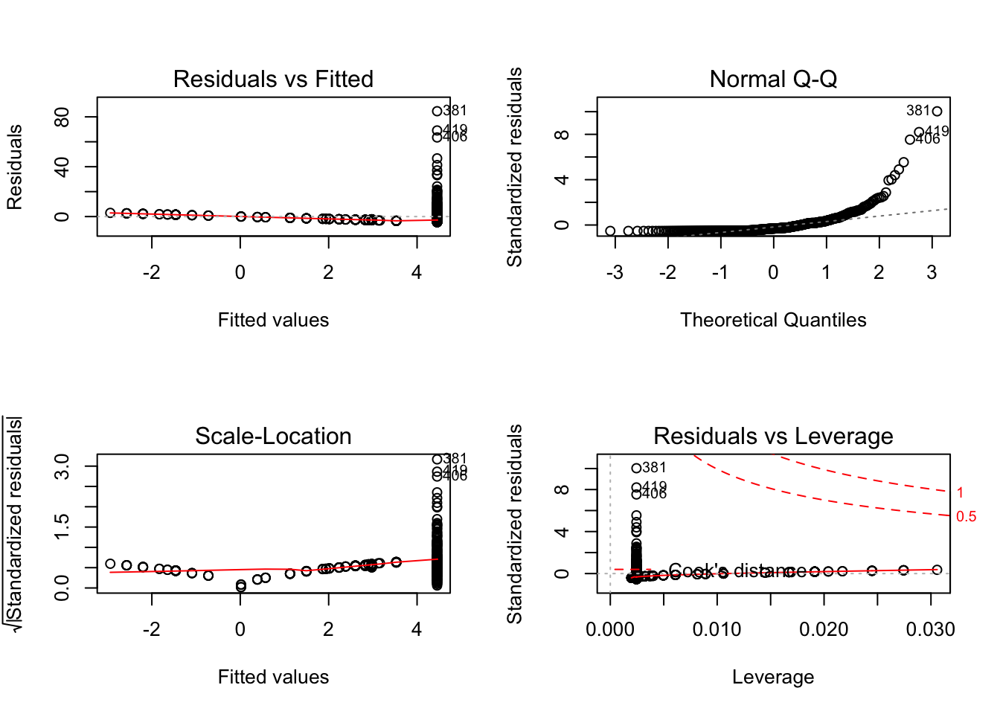<!-- -->

``` r
summary(lm15d1)
```

    ## 
    ## Call:
    ## lm(formula = crim ~ zn, data = Boston)
    ## 
    ## Residuals:
    ##    Min     1Q Median     3Q    Max 
    ## -4.429 -4.222 -2.620  1.250 84.523 
    ## 
    ## Coefficients:
    ##             Estimate Std. Error t value   Pr(>|t|)    
    ## (Intercept)  4.45369    0.41722  10.675    < 2e-16 ***
    ## zn          -0.07393    0.01609  -4.594 0.00000551 ***
    ## ---
    ## Signif. codes:  0 '***' 0.001 '**' 0.01 '*' 0.05 '.' 0.1 ' ' 1
    ## 
    ## Residual standard error: 8.435 on 504 degrees of freedom
    ## Multiple R-squared:  0.04019,    Adjusted R-squared:  0.03828 
    ## F-statistic:  21.1 on 1 and 504 DF,  p-value: 0.000005506

``` r
lm15d2 <- lm(crim ~ poly(zn, 3), data = Boston)
summary(lm15d2)
```

    ## 
    ## Call:
    ## lm(formula = crim ~ poly(zn, 3), data = Boston)
    ## 
    ## Residuals:
    ##    Min     1Q Median     3Q    Max 
    ## -4.821 -4.614 -1.294  0.473 84.130 
    ## 
    ## Coefficients:
    ##              Estimate Std. Error t value  Pr(>|t|)    
    ## (Intercept)    3.6135     0.3722   9.709   < 2e-16 ***
    ## poly(zn, 3)1 -38.7498     8.3722  -4.628 0.0000047 ***
    ## poly(zn, 3)2  23.9398     8.3722   2.859   0.00442 ** 
    ## poly(zn, 3)3 -10.0719     8.3722  -1.203   0.22954    
    ## ---
    ## Signif. codes:  0 '***' 0.001 '**' 0.01 '*' 0.05 '.' 0.1 ' ' 1
    ## 
    ## Residual standard error: 8.372 on 502 degrees of freedom
    ## Multiple R-squared:  0.05824,    Adjusted R-squared:  0.05261 
    ## F-statistic: 10.35 on 3 and 502 DF,  p-value: 0.000001281
