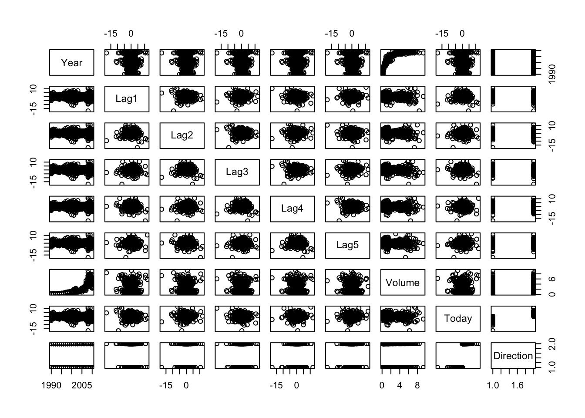
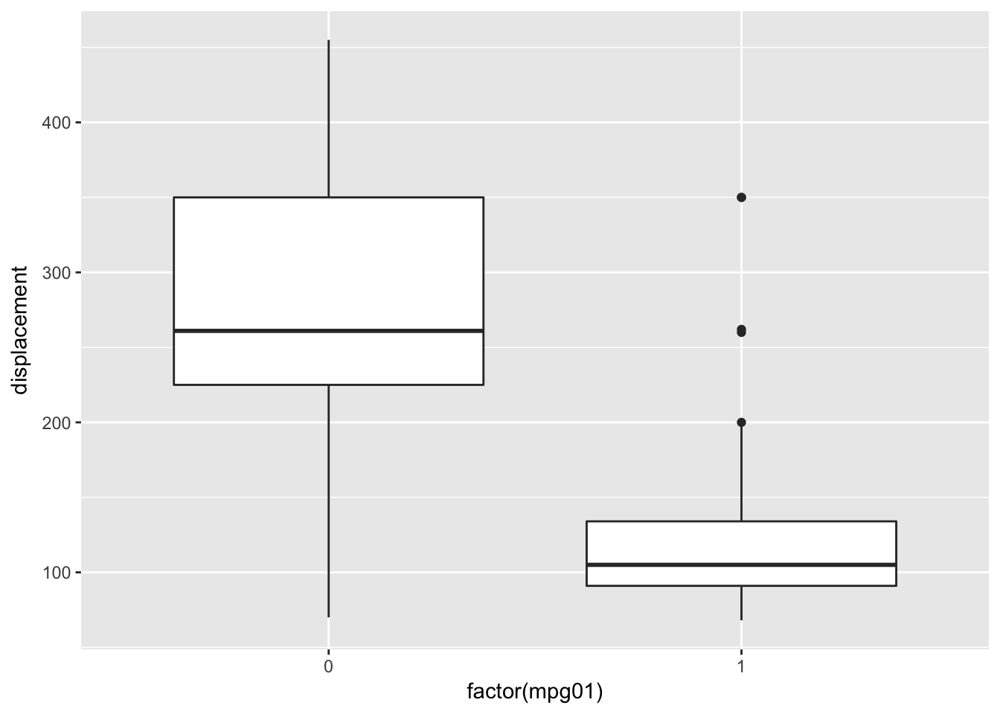
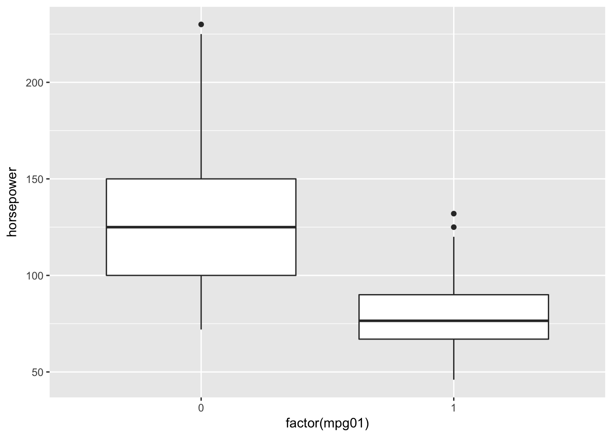
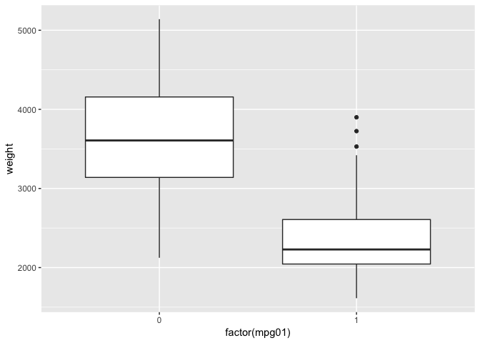
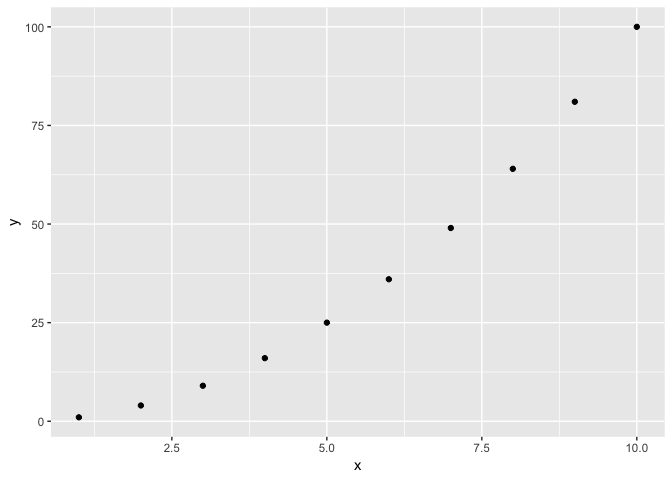
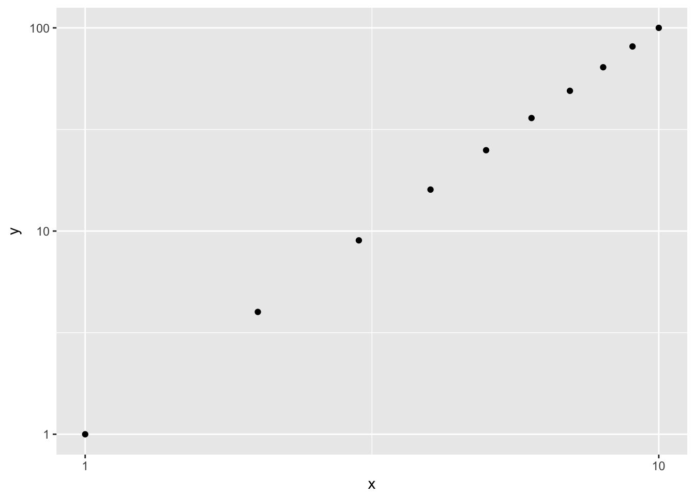
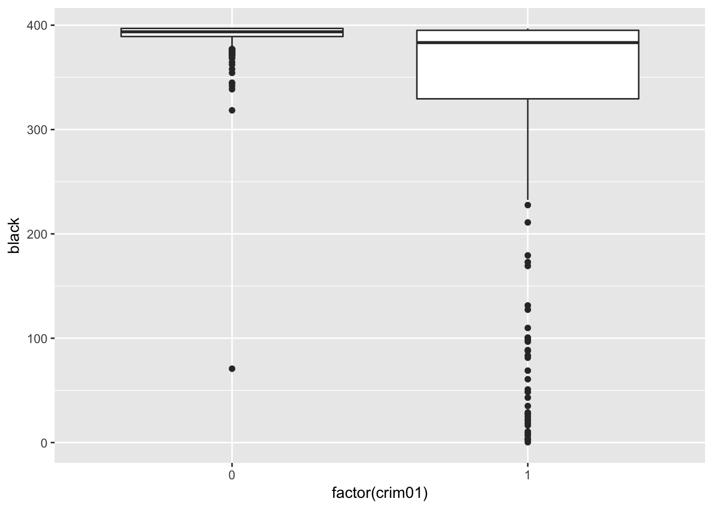
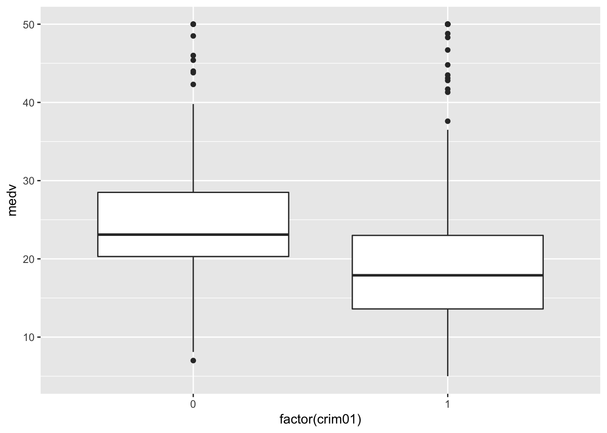
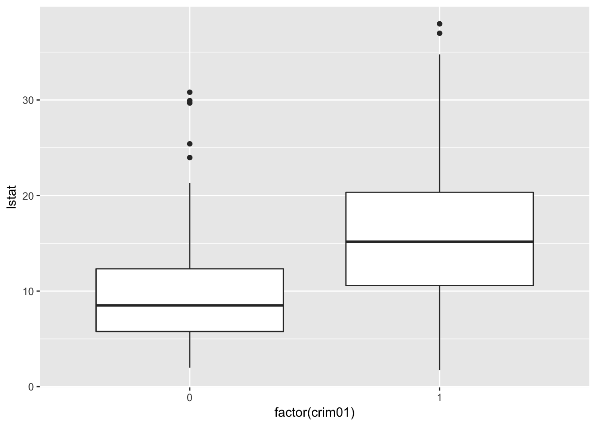
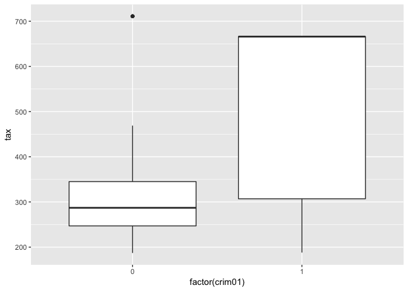

Classification
================

## Question 1

The proof is as follows:

\[
\begin{align}
p(X) &= \frac{e^{\beta_0 + \beta_1 X}}{1 + e^{\beta_0 + \beta_1 X}} \\
p(X) + p(X) e^{\beta_0 + \beta_1 X} &= e^{\beta_0 + \beta_1 X} \\
p(X) &= (1 - p(X)) e^{\beta_0 + \beta_1 X} \\
\frac{p(X)}{1 - p(X)} &= e^{\beta_0 + \beta_1 X}
\end{align}
\]

## Question 2

Let \(x\) remain fixed and observe that we are maximizing over the
parameter \(k\). Suppose that \(\delta_k(x) \geq \delta_i(x)\). We will
show that \(f_k(x) \geq f_i(x)\). From our assumption we have:

\[
x \frac{\mu_k}{\sigma^2} - \frac{\mu_k^2}{2 \sigma^2} + \log(\pi_k) 
\geq 
x \frac{\mu_i}{\sigma^2} - \frac{\mu_i^2}{2 \sigma^2} + \log(\pi_i).
\]

Exponentiation is a monotonically increasing function, so the following
inequality holds:

\[
\pi_k \exp (x \frac{\mu_k}{\sigma^2} - \frac{\mu_k^2}{2 \sigma^2}) 
\geq 
\pi_i \exp (x \frac{\mu_i}{\sigma^2} - \frac{\mu_i^2}{2 \sigma^2})
\]

Multipy this inequality by the positive constant:

\[
c = \frac{\frac{1}{\sqrt{2 \pi}\sigma} \exp(-\frac{1}{2 \sigma^2} x^2)} {\sum { \pi_l \frac{1}{\sqrt{2 \pi} \sigma} \exp(- \frac{1}{2 \sigma^2} (x - \mu_l)^2) }}
\]

and we have that

\[
\frac {\pi_k \frac {1} {\sqrt{2 \pi} \sigma} \exp(- \frac {1} {2 \sigma^2} (x - \mu_k)^2) } {\sum { \pi_l \frac {1} {\sqrt{2 \pi} \sigma} \exp(- \frac {1} {2 \sigma^2} (x - \mu_l)^2) }}
\geq
\frac {\pi_i \frac {1} {\sqrt{2 \pi} \sigma} \exp(- \frac {1} {2 \sigma^2} (x - \mu_i)^2) } {\sum { \pi_l \frac {1} {\sqrt{2 \pi} \sigma} \exp(- \frac {1} {2 \sigma^2} (x - \mu_l)^2) }}
\]

## Question 3

Skip

## Question 4

### (a)

\(0.1 ^ 1\)

### (b)

\(0.1 ^ 2\)

### (c)

\(0.1 ^ {100}\)

### (d)

Based on the above the reasoning is obvious.

### (e)

For \(p = 1\), the length is 1. For \(p = 2\), the length is
\(\sqrt{1}\). In general, the length is \(1 ^ {\frac{1}{p}}\).

## Question 5

### (a)

Given the decision boundary is linear, QDA will perform better on the
training set while LDA will perform better on the test set.

### (b)

Given the decision boundary is non-linear, QDA will perform better on
the training set and the test set.

### (c)

In general, QDA’s performance will increase with n.

### (d)

False, QDA can still suffer from overfitting.

## Question 6

We have \(\beta_0 = -6\), \(\beta_1 = 0.05\), and \(\beta_2 = 1\).

### (a)

Plugging into the equation:

\[
p(40, 3.5) = \frac{e^{-6 + 0.05 \cdot 40 + 1 \cdot 3.5}}{1 + e^{-6 + 0.05 \cdot 40 + 1 \cdot 3.5}} = 0.38
\]

### (b)

Let’s use the log odds formula:

\[
\begin{align}
\log \left(\frac{0.5}{1 - 0.5} \right) &= -6 + 0.05 \cdot X_1 + 1 \cdot 3.5 \\
0.05 \cdot X_1 &= 2.5 \\
X_1 &= 50
\end{align}
\]

## Question 7

Skip

## Question 8

The KNN classifier with \(K = 1\) has zero training error which implies
the test error rate for the classifier is 36%. Hence, the logistic
classifier performs better.

## Question 9

### (a)

We need to solve the following for \(p\):

\[
\begin{align}
\frac{p}{1 - p} &= 0.37 \\
p &= \frac{0.37}{1 + 0.37}
\end{align}
\]

### (b)

The odds are:

\[
q = \frac{0.16}{1 - 0.16}
\]

## Question 10

### (a)

``` r
library(MASS)
library(class)

pairs(Weekly)
```

<!-- -->

There is a clear relationship between `Year` and `Volume`.

### (b)

``` r
glm10 <- glm(
  Direction ~ Lag1 + Lag2 + Lag3 + Lag4 + Lag5 + Volume,
  data = Weekly,
  family = binomial(link = 'logit')
  )
summary(glm10)
```

    ## 
    ## Call:
    ## glm(formula = Direction ~ Lag1 + Lag2 + Lag3 + Lag4 + Lag5 + 
    ##     Volume, family = binomial(link = "logit"), data = Weekly)
    ## 
    ## Deviance Residuals: 
    ##     Min       1Q   Median       3Q      Max  
    ## -1.6949  -1.2565   0.9913   1.0849   1.4579  
    ## 
    ## Coefficients:
    ##             Estimate Std. Error z value Pr(>|z|)   
    ## (Intercept)  0.26686    0.08593   3.106   0.0019 **
    ## Lag1        -0.04127    0.02641  -1.563   0.1181   
    ## Lag2         0.05844    0.02686   2.175   0.0296 * 
    ## Lag3        -0.01606    0.02666  -0.602   0.5469   
    ## Lag4        -0.02779    0.02646  -1.050   0.2937   
    ## Lag5        -0.01447    0.02638  -0.549   0.5833   
    ## Volume      -0.02274    0.03690  -0.616   0.5377   
    ## ---
    ## Signif. codes:  0 '***' 0.001 '**' 0.01 '*' 0.05 '.' 0.1 ' ' 1
    ## 
    ## (Dispersion parameter for binomial family taken to be 1)
    ## 
    ##     Null deviance: 1496.2  on 1088  degrees of freedom
    ## Residual deviance: 1486.4  on 1082  degrees of freedom
    ## AIC: 1500.4
    ## 
    ## Number of Fisher Scoring iterations: 4

`Lag2` is statistically significant.

### (c)

``` r
prob10 <- predict(glm10, data = Weekly, type = 'response')
pred10 <- rep('Down', length(prob10))
pred10[prob10 >= 0.5] <- 'Up'
t10 <- table(pred10, Weekly$Direction)
(t10[1, 1] + t10[2, 2]) / 
  (t10[1, 1] + t10[2, 2] + t10[1, 2] + t10[2, 1])
```

    ## [1] 0.5610652

The classifier is correct 56.1% of the time or has a training error rate
of 43.9%.

### (d)

``` r
train  <- Weekly$Year <= 2008
trainX <- Weekly[train, ]
testX  <- Weekly[!train, ]

glm10d <- glm(
  Direction ~ Lag2, 
  data = trainX, 
  family = binomial(link = 'logit')
  )

prob10d <- predict(glm10d, newdata = testX, type = 'response')
pred10d <- rep('Down', length(prob10d))
pred10d[prob10d >= 0.5] <- 'Up'
t10d <- table(pred10d, testX$Direction)
(t10d[1, 1] + t10d[2, 2]) / 
  (t10d[1, 1] + t10d[2, 2] + t10d[1, 2] + t10d[2, 1])
```

    ## [1] 0.625

### (e)

``` r
lda10 <- lda(Direction ~ Lag2, data = trainX)
lda10
```

    ## Call:
    ## lda(Direction ~ Lag2, data = trainX)
    ## 
    ## Prior probabilities of groups:
    ##      Down        Up 
    ## 0.4477157 0.5522843 
    ## 
    ## Group means:
    ##             Lag2
    ## Down -0.03568254
    ## Up    0.26036581
    ## 
    ## Coefficients of linear discriminants:
    ##            LD1
    ## Lag2 0.4414162

``` r
pred10e <- predict(lda10, newdata = testX)$class
t10e <- table(pred10e, testX$Direction)
(t10e[1, 1] + t10e[2, 2]) / 
  (t10e[1, 1] + t10e[2, 2] + t10e[1, 2] + t10e[2, 1])
```

    ## [1] 0.625

### (f)

``` r
qda10 <- qda(Direction ~ Lag2, data = trainX)
qda10
```

    ## Call:
    ## qda(Direction ~ Lag2, data = trainX)
    ## 
    ## Prior probabilities of groups:
    ##      Down        Up 
    ## 0.4477157 0.5522843 
    ## 
    ## Group means:
    ##             Lag2
    ## Down -0.03568254
    ## Up    0.26036581

``` r
pred10f <- predict(qda10, newdata = testX)$class
t10f <- table(pred10f, testX$Direction)
(t10f[1, 1] + t10f[2, 2]) / 
  (t10f[1, 1] + t10f[2, 2] + t10f[1, 2] + t10f[2, 1])
```

    ## [1] 0.5865385

### (g)

``` r
set.seed(1)

trainX <- as.matrix(Weekly$Lag2[train])
testX  <- as.matrix(Weekly$Lag2[!train])
trainD <- Weekly$Direction[train]

pred10g <- knn(trainX, testX, trainD, k = 1)
t10g <- table(pred10g, Weekly$Direction[!train])
(t10g[1, 1] + t10g[2, 2]) / 
  (t10g[1, 1] + t10g[2, 2] + t10g[1, 2] + t10g[2, 1])
```

    ## [1] 0.5

### (h)

Logistic regressions and LDA have the highest classification rates.

### (i)

Skip

## Question 11

### (a)

``` r
mpg01 <- as.numeric(Auto$mpg >= median(Auto$mpg))
dat <- cbind(Auto, mpg01)
```

### (b)

``` r
pairs(dat)
```

<!-- -->

``` r
qplot(factor(mpg01), displacement, data = dat, geom = 'boxplot')
```

<!-- -->

``` r
qplot(factor(mpg01), horsepower, data = dat, geom = 'boxplot')
```

<!-- -->

``` r
qplot(factor(mpg01), weight, data = dat, geom = 'boxplot')
```

<!-- -->

`displacement`, `horsepower`, and `weight` all appear to be useful
predictors.

### (c)

``` r
library(caret)

train  <- createDataPartition(dat$mpg01, times = 1, p = 0.9, list = F)
trainX <- dat[train, ]
testX  <- dat[-train, ]
```

### (d)

``` r
lda <- lda(mpg01 ~ displacement + horsepower + weight, data = trainX)
pred <- predict(lda, newdata = testX)$class
mean(pred != testX$mpg01)
```

    ## [1] 0.1578947

### (e)

``` r
qda <- qda(mpg01 ~ displacement + horsepower + weight, data = trainX)
pred <- predict(qda, newdata = testX)$class
mean(pred != testX$mpg01)
```

    ## [1] 0.1052632

### (f)

``` r
glm11 <- glm(
  mpg01 ~ displacement + horsepower + weight,
  data = trainX,
  family = binomial(link = 'logit')
  )
prob <- predict(glm11, newdata = testX, type = 'response')
pred <- prob >= 0.5
mean(pred != testX$mpg01)
```

    ## [1] 0.1315789

### (g)

``` r
set.seed(1)

knn_fun <- function(k) {
  pred <- knn(
    dplyr::select(trainX, displacement, horsepower, weight),
    dplyr::select(testX, displacement, horsepower, weight),
    trainX$mpg01,
    k = k
    )
  mean(pred != testX$mpg01)
}

knn_fun(1)
```

    ## [1] 0.1842105

``` r
knn_fun(5)
```

    ## [1] 0.1842105

``` r
knn_fun(10)
```

    ## [1] 0.1842105

## Question 12

### (a)

``` r
Power <- function(x) {2 ^ 3}
```

### (b)

``` r
Power2 <- function(x, a) { x ^ a }
```

### (c)

``` r
Power2(10, 3)
```

    ## [1] 1000

``` r
Power2(8, 17)
```

    ## [1] 2251799813685248

``` r
Power2(131, 3)
```

    ## [1] 2248091

### (d)

``` r
Power3 <- function(x, a) { out <- x ^ a ; return(out) }
```

### (e)

``` r
x <- 1:10
y <- x ^ 2
qplot(x, y)
```

<!-- -->

``` r
qplot(x, y, log = 'xy')
```

<!-- -->

### (f)

``` r
PowerPlot <- function(x, a) { qplot(x, x ^ a) }
```

## Question 13

``` r
crim01 <- as.numeric(Boston$crim >= median(Boston$crim)) 
dat <- cbind(Boston, crim01)

qplot(factor(crim01), black, data = dat, geom = 'boxplot')
```

<!-- -->

``` r
qplot(factor(crim01), medv , data = dat, geom = 'boxplot')
```

<!-- -->

``` r
qplot(factor(crim01), lstat, data = dat, geom = 'boxplot')
```

<!-- -->

``` r
qplot(factor(crim01), tax  , data = dat, geom = 'boxplot')
```

<!-- -->

``` r
train <- createDataPartition(dat$crim01, times = 1, p = 0.75, list = F)
trainX <- dat[train, ]
testX  <- dat[-train, ]

m1 <- glm(
  crim01 ~ black + medv + tax,
  data = trainX,
  family = binomial(link = 'logit')
  )
summary(m1)
```

    ## 
    ## Call:
    ## glm(formula = crim01 ~ black + medv + tax, family = binomial(link = "logit"), 
    ##     data = trainX)
    ## 
    ## Deviance Residuals: 
    ##     Min       1Q   Median       3Q      Max  
    ## -3.1874  -0.7285  -0.2243   0.4882   1.9695  
    ## 
    ## Coefficients:
    ##              Estimate Std. Error z value Pr(>|z|)    
    ## (Intercept)  2.229595   2.161265   1.032  0.30225    
    ## black       -0.017058   0.005363  -3.181  0.00147 ** 
    ## medv         0.019906   0.016253   1.225  0.22065    
    ## tax          0.009587   0.001242   7.720 1.17e-14 ***
    ## ---
    ## Signif. codes:  0 '***' 0.001 '**' 0.01 '*' 0.05 '.' 0.1 ' ' 1
    ## 
    ## (Dispersion parameter for binomial family taken to be 1)
    ## 
    ##     Null deviance: 526.79  on 379  degrees of freedom
    ## Residual deviance: 345.35  on 376  degrees of freedom
    ## AIC: 353.35
    ## 
    ## Number of Fisher Scoring iterations: 7

``` r
prob <- predict(m1, newdata = testX, type = 'response')
pred <- prob >= 0.5
mean(pred != testX$crim01)
```

    ## [1] 0.2222222

``` r
m2 <- lda(crim01 ~ black + medv + tax, data = trainX)
pred <- predict(m2, newdata = testX)$class
mean(pred != testX$crim01)
```

    ## [1] 0.2301587

``` r
knn_fun <- function(k) {
  pred <- knn(
    dplyr::select(trainX, black, medv, tax),
    dplyr::select(testX, black, medv, tax),
    trainX$crim01,
    k = k
    )
  mean(pred != testX$crim01)
}

knn_fun(1)
```

    ## [1] 0.1031746

``` r
knn_fun(50)
```

    ## [1] 0.1666667
