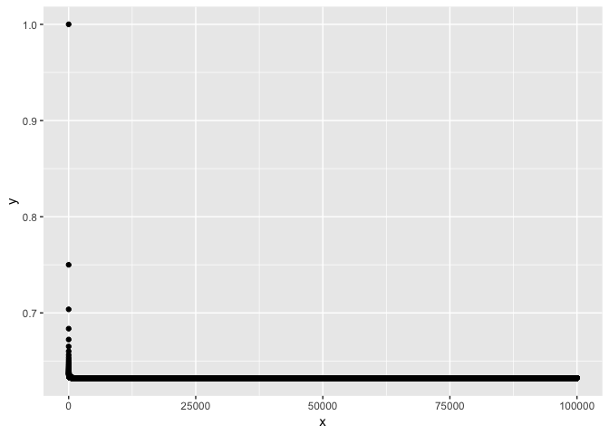
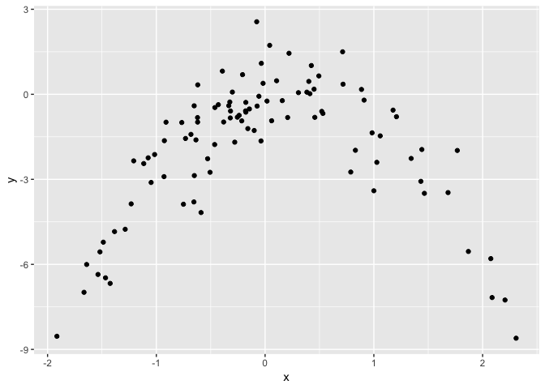

Resampling Methods
================

## Question 1

We have the following identities:

\[
\begin{align}
Var(X+Y) &= Var(X) + Var(Y) + 2 Cov(X,Y) \\
Var(cX) &= c^2 Var(X) \\
Cov(cX,Y) &= Cov(X,cY) = c Cov(X,Y)
\end{align}
\]

Therefore:

\[
\begin{align}
Var(\alpha X + (1 - \alpha) Y) &= Var(\alpha X) + Var((1 - \alpha) Y) + 2 Cov(\alpha X, (1 - \alpha) Y) \\
&= \alpha^2 \sigma_X^2 + (1 - \alpha)^2 \sigma_Y^2 + 2 \alpha (1 - \alpha) \sigma_{XY}
\end{align}
\]

Taking the derivative of the above with respect to \(\alpha\) and
setting it equal to zero yields:

\[
2 \alpha \sigma_X^2 - 2 \sigma_Y^2 + 2 \alpha \sigma_Y^2 + 2 \sigma_{XY} - 4 \alpha \sigma_{XY} = 0
\]

which after some rearranging gives the result.

## Question 2

### (a)

The probability the first bootstrap observation is the jth observation
is \(\frac{1}{n}\) so the probability is \(1 - \frac{1}{n}\).

### (b)

The probability the second bootstrap observation is the jth observation
is \(\frac{1}{n}\) so the probability is \(1 - \frac{1}{n}\).

### (c)

The samples are independent and are taken with replacement so the
probability the jth observation is not in the set is
\((1 - \frac{1}{n})^n\)

### (d)

\(1 - (1 - 0.2)^5 = 0.672\)

### (e)

\(1 - (1 - 0.01)^{100} = 0.633\)

### (f)

\(1 - (1 - 0.0001)^{10000} = 0.632\)

### (g)

``` r
x <- 1:100000
y <- 1 - (1 - 1 / x) ^ x
qplot(x, y)
```

<!-- -->

### (h)

``` r
set.seed(1)
store <- rep(NA, 10000)
for (i in 1:10000) {
  store[i] <- sum(sample(1:100, replace = T) == 4) > 0
}
mean(store)
```

    ## [1] 0.6408

## Question 3

### (a)

The data is divided into \(k\) equally sized subsets. One subset is
removed to act as a validation set and the others are used to estimate
the model. This produces \(k\) estimates of MSE with the overall
estimate being the average of these.

### (b)

The k-fold approach reduces bias relative to the validation set approach
since it uses more observations to train the model. It also reduces
computation time relative to the LOOCV approach.

## Question 4

Take random samples from \(X\) with replacement, estimate the model,
make the prediction, and store it. Repeat this process and use the
standard deviation of the stored
predictions.

## Question 5

### (a)

``` r
glm05a <- glm(default ~ income + balance, data = Default, family = binomial)
summary(glm05a)
```

    ## 
    ## Call:
    ## glm(formula = default ~ income + balance, family = binomial, 
    ##     data = Default)
    ## 
    ## Deviance Residuals: 
    ##     Min       1Q   Median       3Q      Max  
    ## -2.4725  -0.1444  -0.0574  -0.0211   3.7245  
    ## 
    ## Coefficients:
    ##                  Estimate    Std. Error z value  Pr(>|z|)    
    ## (Intercept) -11.540468437   0.434756357 -26.545   < 2e-16 ***
    ## income        0.000020809   0.000004985   4.174 0.0000299 ***
    ## balance       0.005647103   0.000227373  24.836   < 2e-16 ***
    ## ---
    ## Signif. codes:  0 '***' 0.001 '**' 0.01 '*' 0.05 '.' 0.1 ' ' 1
    ## 
    ## (Dispersion parameter for binomial family taken to be 1)
    ## 
    ##     Null deviance: 2920.6  on 9999  degrees of freedom
    ## Residual deviance: 1579.0  on 9997  degrees of freedom
    ## AIC: 1585
    ## 
    ## Number of Fisher Scoring iterations: 8

### (b)

``` r
set.seed(1)

train  <- createDataPartition(Default$default, times = 1, p = 0.5, list = F)
trainX <- Default[train, ]
testX  <- Default[-train, ]

glm05b <- glm(default ~ income + balance, data = trainX, family = binomial)
summary(glm05b)
```

    ## 
    ## Call:
    ## glm(formula = default ~ income + balance, family = binomial, 
    ##     data = trainX)
    ## 
    ## Deviance Residuals: 
    ##     Min       1Q   Median       3Q      Max  
    ## -2.3843  -0.1459  -0.0591  -0.0220   3.7177  
    ## 
    ## Coefficients:
    ##                  Estimate    Std. Error z value Pr(>|z|)    
    ## (Intercept) -11.197200964   0.594920124 -18.821   <2e-16 ***
    ## income        0.000014586   0.000006981   2.089   0.0367 *  
    ## balance       0.005539878   0.000312246  17.742   <2e-16 ***
    ## ---
    ## Signif. codes:  0 '***' 0.001 '**' 0.01 '*' 0.05 '.' 0.1 ' ' 1
    ## 
    ## (Dispersion parameter for binomial family taken to be 1)
    ## 
    ##     Null deviance: 1463.76  on 5000  degrees of freedom
    ## Residual deviance:  795.62  on 4998  degrees of freedom
    ## AIC: 801.62
    ## 
    ## Number of Fisher Scoring iterations: 8

``` r
prob <- predict(glm05b, newdata = testX, type = 'response')
pred <- rep('Yes', length(prob))
pred[prob < 0.5] <- 'No'
mean(pred != testX$default)
```

    ## [1] 0.02540508

The test error rate is 2.5%.

### (c)

``` r
train <- createDataPartition(Default$default, times = 3, p = 0.5)

store <- rep(NA, 3)
for (i in 1:3) {
  trainX <- Default[train[[i]], ]
  testX  <- Default[-train[[i]], ]
  glm05c <- glm(default ~ income + balance, data = trainX, family = binomial)
  prob <- predict(glm05c, newdata = testX, type = 'response')
  pred <- rep('Yes', length(prob))
  pred[prob < 0.5] <- 'No'
  store[i] <- mean(pred != testX$default)
}
```

### (d)

``` r
set.seed(1)

train  <- createDataPartition(Default$default, times = 1, p = 0.5, list = F)
trainX <- Default[train, ]
testX  <- Default[-train, ]

glm05d <- glm(
  default ~ income + balance + student, 
  data = trainX, 
  family = binomial
  )
summary(glm05d)
```

    ## 
    ## Call:
    ## glm(formula = default ~ income + balance + student, family = binomial, 
    ##     data = trainX)
    ## 
    ## Deviance Residuals: 
    ##     Min       1Q   Median       3Q      Max  
    ## -2.3727  -0.1433  -0.0579  -0.0213   3.7451  
    ## 
    ## Coefficients:
    ##                  Estimate    Std. Error z value Pr(>|z|)    
    ## (Intercept) -10.328525763   0.680270322 -15.183   <2e-16 ***
    ## income       -0.000007799   0.000011582  -0.673   0.5007    
    ## balance       0.005635289   0.000317544  17.746   <2e-16 ***
    ## studentYes   -0.796108870   0.326036710  -2.442   0.0146 *  
    ## ---
    ## Signif. codes:  0 '***' 0.001 '**' 0.01 '*' 0.05 '.' 0.1 ' ' 1
    ## 
    ## (Dispersion parameter for binomial family taken to be 1)
    ## 
    ##     Null deviance: 1463.76  on 5000  degrees of freedom
    ## Residual deviance:  789.72  on 4997  degrees of freedom
    ## AIC: 797.72
    ## 
    ## Number of Fisher Scoring iterations: 8

``` r
prob <- predict(glm05d, newdata = testX, type = 'response')
pred <- rep('Yes', length(prob))
pred[prob < 0.5] <- 'No'
mean(pred != testX$default)
```

    ## [1] 0.02580516

The test error rate increases slightly to 2.6% after adding
`student`.

## Question 6

### (a)

``` r
glm06a <- glm(default ~ income + balance, data = Default, family = binomial)
summary(glm06a)$coefficients
```

    ##                    Estimate     Std. Error    z value      Pr(>|z|)
    ## (Intercept) -11.54046843668 0.434756357487 -26.544680 2.958355e-155
    ## income        0.00002080898 0.000004985167   4.174178  2.990638e-05
    ## balance       0.00564710294 0.000227373142  24.836280 3.638120e-136

### (b)

``` r
boot_fun <- function(data, index) {
  g <- glm(
    default ~ income + balance, 
    data = Default[index, ], 
    family = binomial
    )
  coef(g)[2:3]
}
```

### (c)

``` r
set.seed(1)

boot(Default, boot_fun, R = 50)
```

    ## 
    ## ORDINARY NONPARAMETRIC BOOTSTRAP
    ## 
    ## 
    ## Call:
    ## boot(data = Default, statistic = boot_fun, R = 50)
    ## 
    ## 
    ## Bootstrap Statistics :
    ##          original            bias       std. error
    ## t1* 0.00002080898 -0.00000005466926 0.000004542214
    ## t2* 0.00564710294 -0.00006974833667 0.000228281875

### (d)

The standard errors are similar using the bootstrap.

## Question 7

### (a)

``` r
glm07a <- glm(Direction ~ Lag1 + Lag2, data = Weekly, family = binomial)
summary(glm07a)
```

    ## 
    ## Call:
    ## glm(formula = Direction ~ Lag1 + Lag2, family = binomial, data = Weekly)
    ## 
    ## Deviance Residuals: 
    ##    Min      1Q  Median      3Q     Max  
    ## -1.623  -1.261   1.001   1.083   1.506  
    ## 
    ## Coefficients:
    ##             Estimate Std. Error z value Pr(>|z|)    
    ## (Intercept)  0.22122    0.06147   3.599 0.000319 ***
    ## Lag1        -0.03872    0.02622  -1.477 0.139672    
    ## Lag2         0.06025    0.02655   2.270 0.023232 *  
    ## ---
    ## Signif. codes:  0 '***' 0.001 '**' 0.01 '*' 0.05 '.' 0.1 ' ' 1
    ## 
    ## (Dispersion parameter for binomial family taken to be 1)
    ## 
    ##     Null deviance: 1496.2  on 1088  degrees of freedom
    ## Residual deviance: 1488.2  on 1086  degrees of freedom
    ## AIC: 1494.2
    ## 
    ## Number of Fisher Scoring iterations: 4

### (b)

``` r
glm07b <- glm(Direction ~ Lag1 + Lag2, data = Weekly[-1, ], family = binomial)
summary(glm07b)
```

    ## 
    ## Call:
    ## glm(formula = Direction ~ Lag1 + Lag2, family = binomial, data = Weekly[-1, 
    ##     ])
    ## 
    ## Deviance Residuals: 
    ##     Min       1Q   Median       3Q      Max  
    ## -1.6258  -1.2617   0.9999   1.0819   1.5071  
    ## 
    ## Coefficients:
    ##             Estimate Std. Error z value Pr(>|z|)    
    ## (Intercept)  0.22324    0.06150   3.630 0.000283 ***
    ## Lag1        -0.03843    0.02622  -1.466 0.142683    
    ## Lag2         0.06085    0.02656   2.291 0.021971 *  
    ## ---
    ## Signif. codes:  0 '***' 0.001 '**' 0.01 '*' 0.05 '.' 0.1 ' ' 1
    ## 
    ## (Dispersion parameter for binomial family taken to be 1)
    ## 
    ##     Null deviance: 1494.6  on 1087  degrees of freedom
    ## Residual deviance: 1486.5  on 1085  degrees of freedom
    ## AIC: 1492.5
    ## 
    ## Number of Fisher Scoring iterations: 4

### (c)

``` r
predict(glm07b, newdata = Weekly[1, ], type = 'response')
```

    ##         1 
    ## 0.5713923

``` r
Weekly$Direction[1]
```

    ## [1] Down
    ## Levels: Down Up

The model predicts Up which is incorrect.

### (d)

``` r
glm_err <- function(i) {
  g <- glm(Direction ~ Lag1 + Lag2, data = Weekly[-i, ], family = binomial)
  p <- predict(glm07b, newdata = Weekly[i, ], type = 'response')
  o <- round(p)
  as.numeric(o != as.numeric(Weekly$Direction[i]) - 1)
}
store <- map_dbl(1:nrow(Weekly), glm_err)
```

### (e)

``` r
mean(store)
```

    ## [1] 0.4435262

The test error rate using LOOCV is 44.4%.

## Question 8

### (a)

``` r
set.seed(1)
y <- rnorm(100)
x <- rnorm(100)
y <- x - 2 * x ^ 2 + rnorm(100)
```

In this case, \(n=100\) and \(p=2\) with the model given by:

\[
y = x - 2 x ^ 2 + \epsilon
\]

### (b)

``` r
qplot(x, y)
```

<!-- -->

### (c)

``` r
set.seed(1)

dat <- tibble(x = x, y = y)

glm08c <- glm(y ~ x, data = dat)
cv.glm(dat, glm08c)$delta
```

    ## [1] 5.890979 5.888812

``` r
glm08c <- glm(y ~ poly(x, 2), data = dat)
cv.glm(dat, glm08c)$delta
```

    ## [1] 1.086596 1.086326

``` r
glm08c <- glm(y ~ poly(x, 3), data = dat)
cv.glm(dat, glm08c)$delta
```

    ## [1] 1.102585 1.102227

``` r
glm08c <- glm(y ~ poly(x, 4), data = dat)
cv.glm(dat, glm08c)$delta
```

    ## [1] 1.114772 1.114334

### (d)

``` r
set.seed(2)

glm08d <- glm(y ~ x, data = dat)
cv.glm(dat, glm08d)$delta
```

    ## [1] 5.890979 5.888812

``` r
glm08d <- glm(y ~ poly(x, 2), data = dat)
cv.glm(dat, glm08d)$delta
```

    ## [1] 1.086596 1.086326

``` r
glm08d <- glm(y ~ poly(x, 3), data = dat)
cv.glm(dat, glm08d)$delta
```

    ## [1] 1.102585 1.102227

``` r
glm08d <- glm(y ~ poly(x, 4), data = dat)
cv.glm(dat, glm08d)$delta
```

    ## [1] 1.114772 1.114334

The results are identical to (c). This would be expected since LOOCV
uses \(n\) folds.

### (e)

The quadratic fit has the smallest error which would be expected given
the DGP is quadratic.

### (f)

``` r
glm08f <- glm(y ~ x, data = dat)
summary(glm08f)$coefficients
```

    ##               Estimate Std. Error    t value            Pr(>|t|)
    ## (Intercept) -1.8185184  0.2364064 -7.6923393 0.00000000001143164
    ## x            0.2430443  0.2478503  0.9806091 0.32920018537348095

``` r
glm08f <- glm(y ~ poly(x, 2), data = dat)
summary(glm08f)$coefficients
```

    ##               Estimate Std. Error   t value     Pr(>|t|)
    ## (Intercept)  -1.827707  0.1032351 -17.70431 3.804657e-32
    ## poly(x, 2)1   2.316401  1.0323515   2.24381 2.711854e-02
    ## poly(x, 2)2 -21.058587  1.0323515 -20.39866 7.333860e-37

``` r
glm08f <- glm(y ~ poly(x, 3), data = dat)
summary(glm08f)$coefficients
```

    ##                Estimate Std. Error     t value     Pr(>|t|)
    ## (Intercept)  -1.8277074  0.1037248 -17.6207390 7.610579e-32
    ## poly(x, 3)1   2.3164010  1.0372479   2.2332183 2.785714e-02
    ## poly(x, 3)2 -21.0585869  1.0372479 -20.3023667 1.636959e-36
    ## poly(x, 3)3  -0.3048398  1.0372479  -0.2938929 7.694742e-01

``` r
glm08f <- glm(y ~ poly(x, 4), data = dat)
summary(glm08f)$coefficients
```

    ##                Estimate Std. Error     t value     Pr(>|t|)
    ## (Intercept)  -1.8277074  0.1041467 -17.5493533 1.444977e-31
    ## poly(x, 4)1   2.3164010  1.0414671   2.2241711 2.850549e-02
    ## poly(x, 4)2 -21.0585869  1.0414671 -20.2201171 3.457023e-36
    ## poly(x, 4)3  -0.3048398  1.0414671  -0.2927023 7.703881e-01
    ## poly(x, 4)4  -0.4926249  1.0414671  -0.4730105 6.372907e-01

The linear and quadratic coefficients are significant which is
consistent with the LOOCV results.

## Question 9

### (a)

``` r
mean(Boston$medv)
```

    ## [1] 22.53281

### (b)

``` r
sd(Boston$medv) / sqrt(nrow(Boston))
```

    ## [1] 0.4088611

### (c)

``` r
boot_fun <- function(data, index) { mean(data$medv[index]) }
b <- boot(Boston, boot_fun, R = 1000)
b
```

    ## 
    ## ORDINARY NONPARAMETRIC BOOTSTRAP
    ## 
    ## 
    ## Call:
    ## boot(data = Boston, statistic = boot_fun, R = 1000)
    ## 
    ## 
    ## Bootstrap Statistics :
    ##     original     bias    std. error
    ## t1* 22.53281 -0.0196087   0.4196688

The standard error is larger using the bootstrap.

### (d)

``` r
bci <- boot.ci(b)
ci1 <- bci$normal[2:3]
ci2 <- t.test(Boston$medv)$conf.int
```

The confidence interval using the bootstrap is slighlty larger.

### (e)

``` r
median(Boston$medv)
```

    ## [1] 21.2

### (f)

``` r
boot_fun <- function(data, index) { median(data$medv[index]) }
b <- boot(Boston, boot_fun, R = 1000)
b
```

    ## 
    ## ORDINARY NONPARAMETRIC BOOTSTRAP
    ## 
    ## 
    ## Call:
    ## boot(data = Boston, statistic = boot_fun, R = 1000)
    ## 
    ## 
    ## Bootstrap Statistics :
    ##     original   bias    std. error
    ## t1*     21.2 -0.04115   0.3796621

### (g)

``` r
quantile(Boston$medv, probs = 0.1)
```

    ##   10% 
    ## 12.75

### (h)

``` r
boot_fun <- function(data, index) { quantile(data$medv[index], probs = 0.1) }
b <- boot(Boston, boot_fun, R = 1000)
b
```

    ## 
    ## ORDINARY NONPARAMETRIC BOOTSTRAP
    ## 
    ## 
    ## Call:
    ## boot(data = Boston, statistic = boot_fun, R = 1000)
    ## 
    ## 
    ## Bootstrap Statistics :
    ##     original  bias    std. error
    ## t1*    12.75 0.03245   0.4997742
