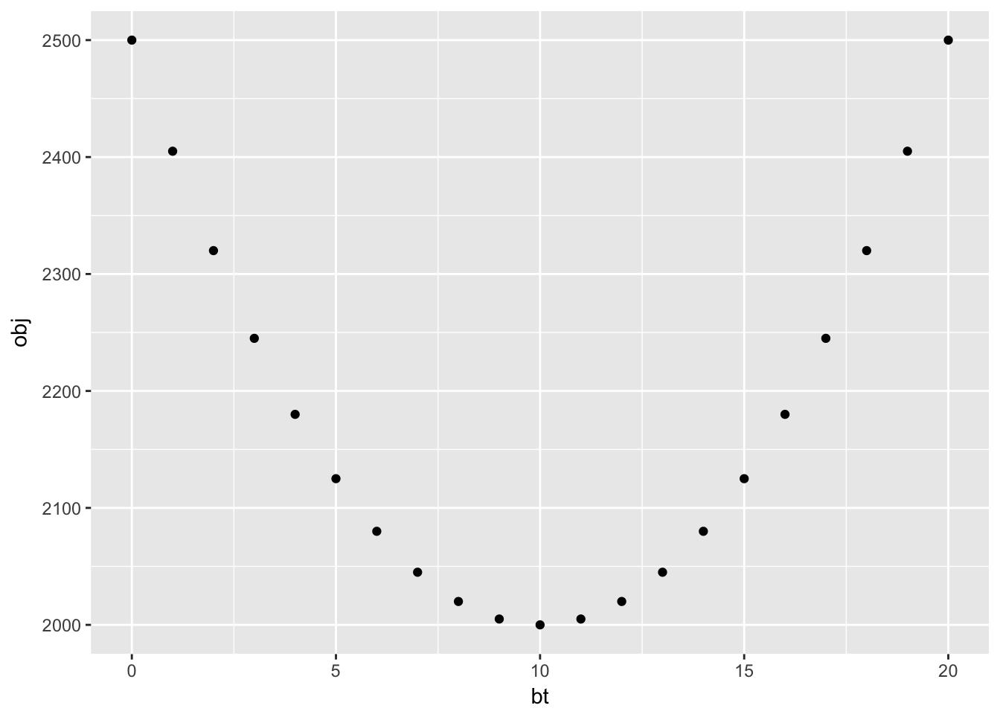
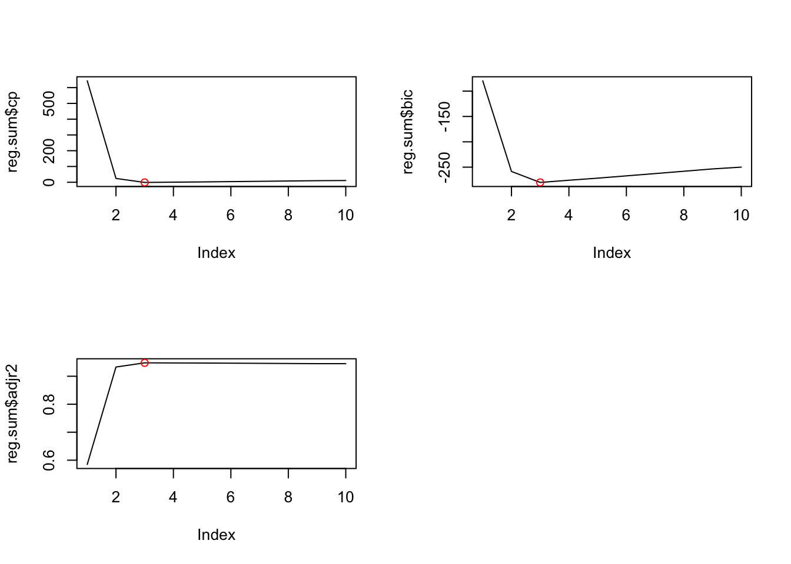
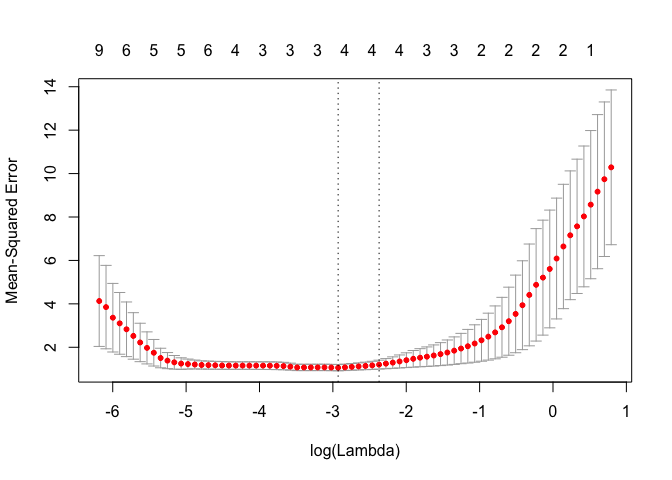
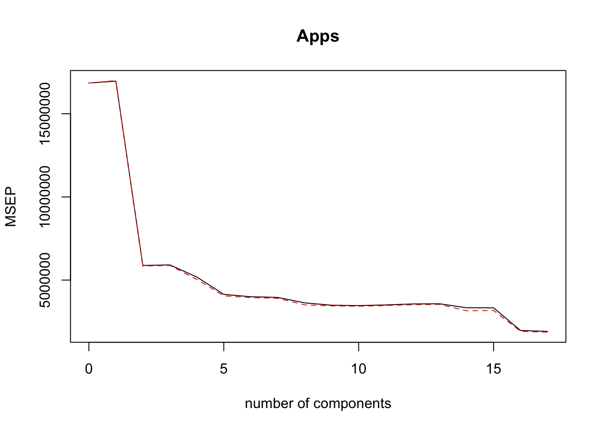
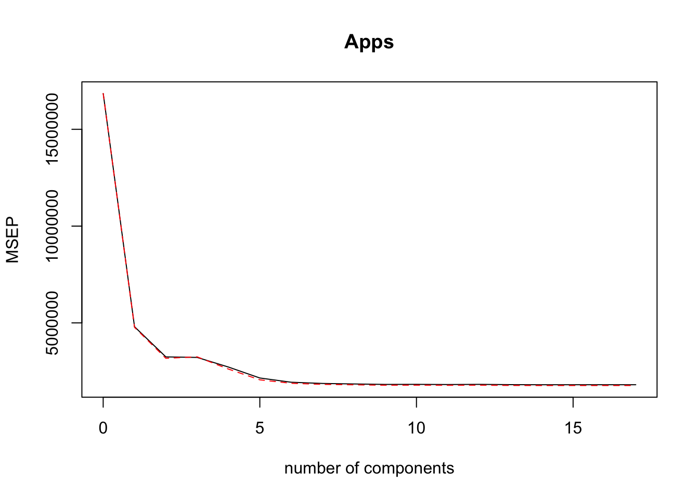
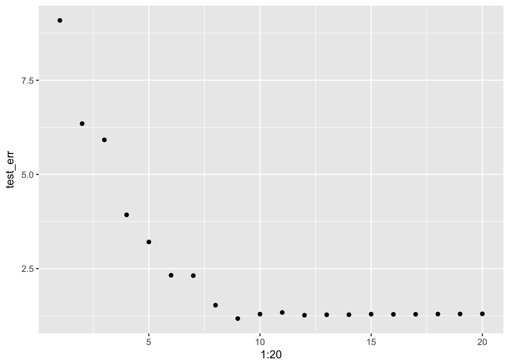
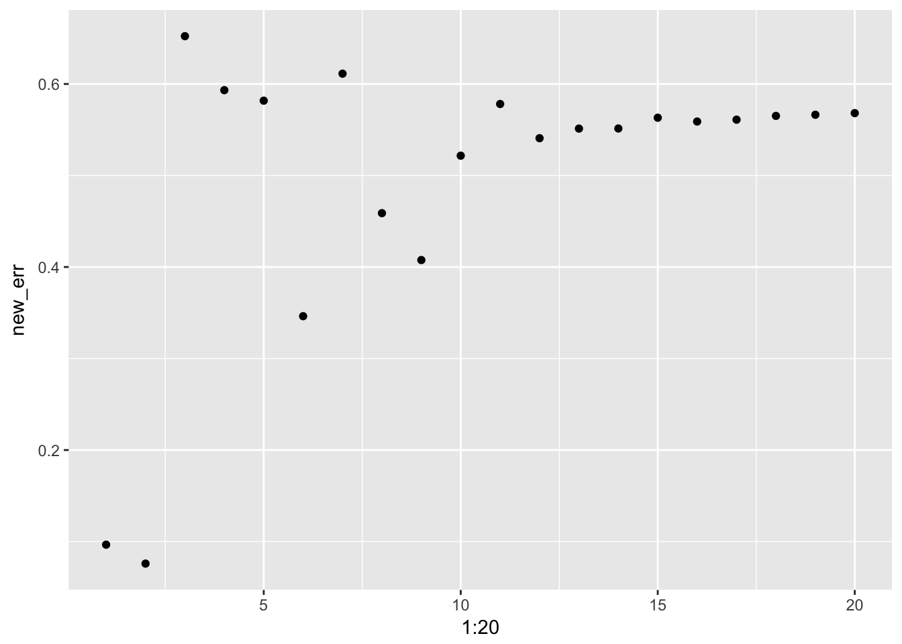

Linear Model Selection and Regularization
================

## Question 1

### (a)

Best subset selection since it has no path dependence.

### (b)

Most likely best subset selection.

### (c)

True, True, False, False, False.

## Question 2

### (a)

iii - Lasso is inherently less flexible and lowers variance as
\(\lambda\) moves away from zero.

### (b)

iii - Same as lasso.

### (c)

ii - Non-linear methods are inherently more flexible but increase
variance.

## Question 3

Note that as \(s\) moves away from zero, the solution moves toward OLS.

### (a)

iv - Moving toward OLS increases flexibility lowering RSS.

### (b)

ii - Moving toward OLS reduces bias but eventually increases variance.

### (c)

iii - Moving toward OLS increases variance.

### (d)

iv - Moving toward OLS decreases bias.

### (e)

v - Irreducible error is constant by definition.

## Question 4

Note that as \(\lambda\) moves away from zero, the solution moves away
from OLS.

### (a)

iii - Moving away from OLS reduces flexibility raising RSS.

### (b)

ii - Moving away from OLS reduces variance but eventually increases
bias.

### (c)

iv - Moving away from OLS decreases variance,

### (d)

iii - Moving away from OLS increases bias.

### (e)

v - Irreducible error is constant by definition.

## Question 5

### (a)

The minimization problem is given by:

\[
\min_\beta \; \sum_{i=1}^n \left( y_i - \beta_0 - \sum_{j=1}^p \beta_j x_{ij} \right)^2 + \lambda \sum_{j=1}^p \beta_j^2
\]

### (b)

Plugging in values this becomes:

\[
\min_\beta \; (y_1 - \beta_1 x_{11} - \beta_2 x_{12})^2 + (y_2 - \beta_1 x_{21} - \beta_2 x_{22})^2 + \lambda (\beta_1^2 + \beta_2^2)
\]

The first order conditions are:

\[
\begin{aligned}
2 (y_1 - \beta_1 x_{11} - \beta_2 x_{12}) x_{11} + (y_2 - \beta_1 x_{12} - \beta_2 x_{22}) x_{12} + 2 \lambda \beta_1 &= 0 \\
2 (y_1 - \beta_1 x_{11} - \beta_2 x_{12}) x_{12} + (y_2 - \beta_1 x_{12} - \beta_2 x_{22}) x_{22} + 2 \lambda \beta_2 &= 0 \\
\end{aligned} 
\]

Note that \(x_{11} = x_{12}\) and \(x_{21} = x_{22}\), thus substracting
these equations implies:

\[
2 \lambda \beta_1 - 2 \lambda \beta_2 = 0
\]

so that \(\hat \beta_1 = \hat \beta_2\).

### (c)

Using the constrained optimization formulation of the lasso problem we
have that:

\[
\min_\beta \; \sum_{i=1}^n \left( y_i - \beta_0 - \sum_{j=1}^p \beta_j x_{ij} \right)^2 \quad \text{s.t.} \quad \lvert \beta_1 \rvert + \lvert \beta_2 \rvert \leq s
\]

where the constraint constitutes a diamond centered at \((0, 0)\) in the
\((\beta_1, \beta_2)\) plane.

### (d)

Note that the after some substitution, the objective function becomes:

\[
2 \left[ y_1 - (\beta_1 + \beta_2) x_{11}) \right]^2
\]

which is equivalent to minimzing:

\[
y_1 - (\beta_1 + \beta_2) x_{11}
\]

Contours of this function are lines with slope negative one in the
\((\beta_1, \beta_2)\) plane. These countours are parallel to the edges
of the diamond constraint so the solution will not be unique.

## Question 6

### (a)

``` r
y1 <- 50
lm <- 4
bt <- -0:20
obj <- (y1 - bt) ^ 2 + lm * bt ^2
qplot(bt, obj)
```

<!-- -->

The minimum should occur at \(\frac{50}{1 + 4} = 10\).

### (b)

``` r
y1 <- 20
lm <- 10
bt <- 5:25
obj <- (y1 - bt) ^ 2 + lm * abs(bt)
qplot(bt, obj)
```

<!-- -->

The minimum should occur at \(20 - \frac{10}{2} = 15\).

## Question 7

### (a)

The model implies:

\[
y_i \sim N(\beta_0 + \sum_{j=1}^p \beta_j x_{ij}, \sigma_2)
\]

so the likelihood is given by:

\[
\begin{aligned}
f(Y \mid X, \beta) &= \prod_{i=1}^n p(y_i \mid x_i, \beta) \\
&= \prod_{i=1}^n \frac{1}{\sqrt{2 \pi \sigma^2}} \exp \left( - \frac{(y_i - \beta_0 - \sum_{j = 1}^{p} \beta_j x_{ij})^2}{2 \sigma^2} \right) \\
&= \left( \frac{1}{\sqrt{2 \pi \sigma^2}} \right)^n \exp \left( - \frac{1}{2 \sigma^2} \sum_{i=1}^{n} \left( y_i - \beta_0 - \sum_{j = 1}^{p} \beta_j x_{ij} \right)^2 \right)
\end{aligned}
\]

### (b)

The prior is given by:

\[
p(\beta) = \prod_{j=1}^p \frac{1}{2b} \exp \left( - \frac{\lvert \beta_j \rvert}{b} \right)
\]

so the posterior is given by:

\[ 
\begin{aligned} 
f(Y \mid X, \beta) p(\beta) &= \left( \frac{1}{\sqrt{2 \pi \sigma^2}} \right)^n \exp \left( - \frac{1}{2 \sigma^2} \sum_{i=1}^{n} \left( y_i - \beta_0 - \sum_{j = 1}^{p} \beta_j x_{ij} \right)^2 \right) \left( \frac{1}{2b} \right)^p \exp \left( - \sum_{j=1}^p \frac{\lvert \beta_j \rvert}{b} \right) \\
&= \left( \frac{1}{\sqrt{2 \pi \sigma^2}} \right)^n \left( \frac{1}{2b} \right)^p \exp \left( - \frac{1}{2 \sigma^2} \sum_{i=1}^{n} \left( y_i - \beta_0 - \sum_{j = 1}^{p} \beta_j x_{ij} \right)^2 - \frac{1}{b} \sum_{j=1}^p \lvert \beta_j \rvert \right) 
\end{aligned}
\]

### (c)

The mode is where the posterior will achieve its highest value:

\[
\max_{\beta} \; \left( \frac{1}{\sqrt{2 \pi \sigma^2}} \right)^n \left( \frac{1}{2b} \right)^n \exp \left( - \frac{1}{2 \sigma^2} \sum_{i=1}^{n} \left( y_i - \beta_0 - \sum_{j = 1}^{p} \beta_j x_{ij} \right)^2 - \frac{1}{b} \sum_{j=1}^p \lvert \beta_j \rvert \right)
\]

which is equivalent to:

\[
\max_{\beta} \; - \frac{1}{2 \sigma^2} \sum_{i=1}^{n} \left( y_i - \beta_0 - \sum_{j = 1}^{p} \beta_j x_{ij} \right)^2 - \frac{1}{b} \sum_{j=1}^p \lvert \beta_j \rvert
\]

which is equivalent to:

\[
\min_{\beta} \; \frac{1}{2 \sigma^2} \left[ \sum_{i=1}^{n} \left( y_i - \beta_0 - \sum_{j = 1}^{p} \beta_j x_{ij} \right)^2 + \frac{2 \sigma^2}{b} \sum_{j=1}^p \lvert \beta_j \rvert \right]
\]

which is equivalent to:

\[
\min_{\beta} \; \sum_{i=1}^{n} \left( y_i - \beta_0 - \sum_{j = 1}^{p} \beta_j x_{ij} \right)^2 + \frac{2 \sigma^2}{b} \sum_{j=1}^p \lvert \beta_j \rvert 
\]

which is identical to the lasso estimate when
\(\lambda = \frac{2 \sigma^2}{b}\).

### (d)

The prior is given by:

\[
p(\beta) = \prod_{j=1}^p \frac{1}{\sqrt{2 \pi c}} \exp \left( - \frac{\beta_j^2}{2c} \right)
\]

so the posterior is given by:

\[ 
\begin{aligned} 
f(Y \mid X, \beta) p(\beta) &= \left( \frac{1}{\sqrt{2 \pi \sigma^2}} \right)^n \exp \left( - \frac{1}{2 \sigma^2} \sum_{i=1}^{n} \left( y_i - \beta_0 - \sum_{j = 1}^{p} \beta_j x_{ij} \right)^2 \right) \left( \frac{1}{\sqrt{2 \pi c}} \right)^p \exp \left( - \sum_{j=1}^p \frac{\beta_j^2}{2 c} \right) \\
&= \left( \frac{1}{\sqrt{2 \pi \sigma^2}} \right)^n \left( \frac{1}{2b} \right)^n \exp \left( - \frac{1}{2 \sigma^2} \sum_{i=1}^{n} \left( y_i - \beta_0 - \sum_{j = 1}^{p} \beta_j x_{ij} \right)^2 - \frac{1}{2 c} \sum_{j=1}^p \beta_j^2 \right) 
\end{aligned}
\]

### (e)

Using a similar argument as before, the mode is determined by:

\[
\min_{\beta} \; \sum_{i=1}^{n} \left( y_i - \beta_0 - \sum_{j = 1}^{p} \beta_j x_{ij} \right)^2 + \frac{\sigma^2}{c} \sum_{j=1}^p \beta_j^2
\]

which is identical to the ridge estimate when
\(\lambda = \frac{\sigma^2}{c}\).

## Question 8

### (a)

``` r
set.seed(1)
X <- rnorm(100)
eps <- rnorm(100)
```

### (b)

``` r
Y <- 3 + 2 * X - 3 * X ^2 + 0.3 * X ^ 3 + eps
```

### (c)

``` r
dat <- tibble(y = Y, x = X)
reg.fit <- regsubsets(y ~ poly(x, 10, raw = T), data = dat, nvmax = 10)
reg.sum <- summary(reg.fit)

par(mfrow = c(2, 2))
plot(reg.sum$cp, type = 'l')
points(
  which.min(reg.sum$cp),
  reg.sum$cp[which.min(reg.sum$cp)],
  col = 'red'
  )
plot(reg.sum$bic, type = 'l')
points(
  which.min(reg.sum$bic),
  reg.sum$bic[which.min(reg.sum$bic)],
  col = 'red'
  )
plot(reg.sum$adjr2, type = 'l')
points(
  which.max(reg.sum$adjr2),
  reg.sum$adjr2[which.max(reg.sum$adjr2)],
  col = 'red'
  )
```

<!-- -->

\(C_p\), \(BIC\), and adjusted \(R^2\) point to a model with three
predictors.

``` r
predict.regsubsets <- function (object ,newdata ,id ,...){
  form <- as.formula(object$call [[2]])
  mat <- model.matrix(form, newdata)
  coefi <- coef(object ,id = id)
  mat[, names(coefi)] %*% coefi
}

k <- 5
train <- createFolds(dat$y, k = k)

cv.err <- matrix(NA, k, 10, dimnames = list(NULL, paste(1:10)))
for (j in 1:k) {
  fit <- regsubsets(y ~ poly(x, 10), data = dat[-train[[j]], ], nvmax = 10)
  for (i in 1:10) {
    coefi <- coef(fit, id = i)
    pred <- predict.regsubsets(fit, dat[train[[j]], ], id = i)
    cv.err[j, i] <- mean((dat$y[train[[j]]] - pred) ^ 2)
  }
}
which.min(apply(cv.err, 2, mean))
```

    ## 1 
    ## 1

Cross validation points to a model with one predictor.

### (d)

``` r
reg.fit <- regsubsets(
  y ~ poly(x, 10, raw = T), 
  data = dat, 
  nvmax = 10, 
  method = 'forward'
  )
reg.sum <- summary(reg.fit)

par(mfrow = c(2, 2))
plot(reg.sum$cp, type = 'l')
points(
  which.min(reg.sum$cp),
  reg.sum$cp[which.min(reg.sum$cp)],
  col = 'red'
  )
plot(reg.sum$bic, type = 'l')
points(
  which.min(reg.sum$bic),
  reg.sum$bic[which.min(reg.sum$bic)],
  col = 'red'
  )
plot(reg.sum$adjr2, type = 'l')
points(
  which.max(reg.sum$adjr2),
  reg.sum$adjr2[which.max(reg.sum$adjr2)],
  col = 'red'
  )
```

<!-- -->

\(C_p\), \(BIC\), and adjusted \(R^2\) point to a model with three
predictors.

``` r
reg.fit <- regsubsets(
  y ~ poly(x, 10, raw = T), 
  data = dat, 
  nvmax = 10, 
  method = 'backward'
  )
reg.sum <- summary(reg.fit)

par(mfrow = c(2, 2))
plot(reg.sum$cp, type = 'l')
points(
  which.min(reg.sum$cp),
  reg.sum$cp[which.min(reg.sum$cp)],
  col = 'red'
  )
plot(reg.sum$bic, type = 'l')
points(
  which.min(reg.sum$bic),
  reg.sum$bic[which.min(reg.sum$bic)],
  col = 'red'
  )
plot(reg.sum$adjr2, type = 'l')
points(
  which.max(reg.sum$adjr2),
  reg.sum$adjr2[which.max(reg.sum$adjr2)],
  col = 'red'
  )
```

<!-- -->

\(C_p\), \(BIC\), and adjusted \(R^2\) point to a model with three
predictors.

### (e)

``` r
x <- model.matrix(y ~ poly(x, 10, raw = T), data = dat)[, -1]
y <- dat$y
grid <- 10 ^ seq(10, -2, length = 100)
train <- createDataPartition(dat$y, times = 1, p = 0.5, list = F)

lasso <- glmnet(x[train, ], y[train], alpha = 1, lambda = grid)
cv <- cv.glmnet(x[train, ], y[train], alpha = 1)
plot(cv)
```

<!-- -->

``` r
final <- glmnet(x, y, alpha = 1)
predict(final, type = 'coefficients', s = cv$lambda.min)[1:11,]
```

    ##            (Intercept)  poly(x, 10, raw = T)1  poly(x, 10, raw = T)2 
    ##          3.02807035689          2.21657023480         -3.08589177666 
    ##  poly(x, 10, raw = T)3  poly(x, 10, raw = T)4  poly(x, 10, raw = T)5 
    ##          0.00000000000          0.00000000000          0.05268742750 
    ##  poly(x, 10, raw = T)6  poly(x, 10, raw = T)7  poly(x, 10, raw = T)8 
    ##          0.00000000000          0.00004537778          0.00000000000 
    ##  poly(x, 10, raw = T)9 poly(x, 10, raw = T)10 
    ##          0.00000000000          0.00000000000

Lasso comes close to returning the true coefficients with the exception
of the third degree term which had the weakest impact on the response.
It also has non-zero coefficients on the fifth, seventh, and tenth
terms.

### (f)

``` r
dat$y <- 3 + 7 * dat$x ^ 7 + eps
y <- dat$y

reg.fit <- regsubsets(y ~ poly(x, 10, raw = T), data = dat, nvmax = 10)
reg.sum <- summary(reg.fit)

which.min(reg.sum$cp)
```

    ## [1] 2

``` r
coef(reg.fit, id = which.min(reg.sum$cp))
```

    ##           (Intercept) poly(x, 10, raw = T)2 poly(x, 10, raw = T)7 
    ##             3.0704904            -0.1417084             7.0015552

``` r
which.min(reg.sum$bic)
```

    ## [1] 1

``` r
coef(reg.fit, id = which.min(reg.sum$bic))
```

    ##           (Intercept) poly(x, 10, raw = T)7 
    ##               2.95894               7.00077

``` r
which.max(reg.sum$adjr2)
```

    ## [1] 4

``` r
coef(reg.fit, id = which.max(reg.sum$adjr2))
```

    ##           (Intercept) poly(x, 10, raw = T)1 poly(x, 10, raw = T)2 
    ##             3.0762524             0.2914016            -0.1617671 
    ## poly(x, 10, raw = T)3 poly(x, 10, raw = T)7 
    ##            -0.2526527             7.0091338

BIC picks the most accurate model. The other metrics point to models
that have good estimates of the true coefficients but contain addtional
predictors.

``` r
train <- createDataPartition(dat$y, times = 1, p = 0.5, list = F)

lasso <- glmnet(x[train, ], y[train], alpha = 1, lambda = grid)
cv <- cv.glmnet(x[train, ], y[train], alpha = 1)

final <- glmnet(x, y, alpha = 1)
predict(final, type = 'coefficients', s = cv$lambda.min)[1:11, ]
```

    ##            (Intercept)  poly(x, 10, raw = T)1  poly(x, 10, raw = T)2 
    ##               4.256089               0.000000               0.000000 
    ##  poly(x, 10, raw = T)3  poly(x, 10, raw = T)4  poly(x, 10, raw = T)5 
    ##               0.000000               0.000000               0.000000 
    ##  poly(x, 10, raw = T)6  poly(x, 10, raw = T)7  poly(x, 10, raw = T)8 
    ##               0.000000               6.693415               0.000000 
    ##  poly(x, 10, raw = T)9 poly(x, 10, raw = T)10 
    ##               0.000000               0.000000

## Question 9

### (a)

``` r
set.seed(1)
train <- createDataPartition(College$Apps, times = 1, p = 0.5, list = F)
```

### (b)

``` r
lm.fit <- lm(Apps ~ ., dat = College[train, ])
lm.pre <- predict(lm.fit, newdata = College[-train, ])
mean((College$Apps[-train] - lm.pre) ^ 2)
```

    ## [1] 1042003

### (c)

``` r
x <- model.matrix(Apps ~ ., data = College)[, -1]
y <- College$Apps
grid = 10 ^ seq(4, -2, length=100)

ridge.fit <- cv.glmnet(x[train, ], y[train], alpha = 0, lambda = grid)
ridge.pre <- predict(ridge.fit, s = ridge.fit$lambda.min, newx = x[-train, ])
mean((y[-train] - ridge.pre) ^ 2)
```

    ## [1] 1041953

### (d)

``` r
lasso.fit <- cv.glmnet(x[train, ], y[train], alpha = 1, lambda = grid)
lasso.pre <- predict(lasso.fit, s = lasso.fit$lambda.min, newx = x[-train, ])
mean((y[-train] - lasso.pre) ^ 2)
```

    ## [1] 980343.1

### (e)

``` r
pcr.fit <- pcr(Apps ~ ., data = College[train, ], scale = T, validation = 'CV')
validationplot(pcr.fit, val.type = 'MSEP')
```

<!-- -->

``` r
pcr.pre <- predict(pcr.fit, College[-train,], ncomp = 17)
mean((College$Apps[-train] - pcr.pre) ^ 2)
```

    ## [1] 1042003

### (f)

``` r
pls.fit <- plsr(Apps ~ ., data = College[train, ], scale = T, validation = 'CV')
validationplot(pls.fit, val.type = 'MSEP')
```

<!-- -->

``` r
pls.pre <- predict(pls.fit, College[-train,], ncomp = 10)
mean((College$Apps[-train] - pls.pre) ^ 2)
```

    ## [1] 1074531

### (g)

In terms of RSS the models can be ranked from best to worst as follows:

1.  Lasso
2.  Ridge
3.  OLS
4.  PCR
5.  PLS

In fact, OLS and PCR are indentical in this case.

## Question 10

### (a)

``` r
set.seed(1)
beta <- rnorm(20)
beta[sample(20, 10, replace = F)] <- 0
X <- matrix(rnorm(20 * 1000), 1000, 20)
Y <- X %*% beta + rnorm(1000)
dat <- cbind(Y, X) %>% as_tibble()
names(beta) <- names(dat[, -1])
```

### (b)

``` r
train <- createDataPartition(Y, times = 1, p = 0.1, list = F)
```

### (c)

``` r
reg_fit <- regsubsets(V1 ~ ., data = dat[train, ], nvmax = 20)
train_err <- rep(NA, 20) 
for (i in 1:20) {
  coefi <- coef(reg_fit, id = i)
  pred  <- model.matrix(V1 ~ ., data = dat[train, ])[, names(coefi)] %*% coefi
  train_err[i] <- mean((dat$V1[train] - pred) ^ 2)
}
qplot(1:20, train_err)
```

<!-- -->

### (d)

``` r
test_err <- rep(NA, 20)
for (i in 1:20) {
  coefi <- coef(reg_fit, id = i)
  pred  <- model.matrix(V1 ~ ., data = dat[-train, ])[, names(coefi)] %*% coefi
  test_err[i] <- mean((dat$V1[-train] - pred) ^ 2)
}
qplot(1:20, test_err)
```

<!-- -->

### (e)

``` r
which.min(test_err)
```

    ## [1] 9

### (f)

``` r
coef(reg_fit, id = which.min(test_err))
```

    ## (Intercept)          V4          V5          V6          V7         V12 
    ##  0.07369269 -0.81630580  1.57225942  0.67552411 -0.88923804  1.54025134 
    ##         V15         V19         V20         V21 
    ## -2.27460407  1.01885659  0.80340879  0.41943572

``` r
beta
```

    ##         V2         V3         V4         V5         V6         V7 
    ##  0.0000000  0.1836433 -0.8356286  1.5952808  0.3295078 -0.8204684 
    ##         V8         V9        V10        V11        V12        V13 
    ##  0.0000000  0.0000000  0.0000000  0.0000000  1.5117812  0.0000000 
    ##        V14        V15        V16        V17        V18        V19 
    ##  0.0000000 -2.2146999  0.0000000  0.0000000  0.0000000  0.9438362 
    ##        V20        V21 
    ##  0.8212212  0.5939013

Most notably, the model does not pick up any of the zero valued true
coefficents.

### (g)

``` r
new_err <- rep(NA, 20)
for (i in 1:20) {
  coefi <- coef(reg_fit, id = i)
  coefi <- coefi[!names(coefi) %in% '(Intercept)'] 
  new_err[i] <- sqrt(sum((beta[names(coefi)] - coefi) ^ 2))
}
qplot(1:20, new_err)
```

<!-- -->

``` r
which.min(new_err)
```

    ## [1] 2

``` r
coef(reg_fit, id = which.min(new_err))
```

    ## (Intercept)          V5         V15 
    ##   0.2766645   1.6517971  -2.1639778

The model with two predictors has coefficients that are nearest to the
true coefficients.

## Question 11

### (a)

``` r
set.seed(1)
train <- createDataPartition(Boston$crim, times = 1, p = 0.5, list = F)

reg_fit <- regsubsets(crim ~ ., data = Boston[train, ], nvmax = 13)
reg_err <- rep(NA, 13)
for (i in 1:13) {
  coefi <- coef(reg_fit, id = i)
  pred  <- model.matrix(crim ~ ., data = Boston[-train, ])[, names(coefi)]
  pred  <- pred %*% coefi
  reg_err[i] <- mean((Boston$crim[-train] - pred) ^ 2)
}
reg_err[which.min(reg_err)]
```

    ## [1] 45.19815

``` r
ridge_fit <- cv.glmnet(
  as.matrix(Boston[train, -1]),
  as.matrix(Boston[train, 1]),
  alpha = 0,
  lambda = 10 ^ seq(4, -2, length = 100)
  )
ridge_pre <- predict(
  ridge_fit,
  s = ridge_fit$lambda.min,
  newx = as.matrix(Boston[-train, -1])
  )
mean((Boston$crim[-train] - ridge_pre) ^ 2)
```

    ## [1] 45.48509

``` r
lasso_fit <- cv.glmnet(
  as.matrix(Boston[train, -1]),
  as.matrix(Boston[train, 1]),
  alpha = 1,
  lambda = 10 ^ seq(4, -2, length = 100)
  )
lasso_pre <- predict(
  lasso_fit,
  s = lasso_fit$lambda.min,
  newx = as.matrix(Boston[-train, -1])
  )
mean((Boston$crim[-train] - lasso_pre) ^ 2)
```

    ## [1] 46.29341

``` r
pcr_fit <- pcr(crim ~ ., data = Boston[train, ], scale = T, validation = 'CV')
pcr_pre <- predict(pcr_fit, Boston[-train, ], ncomps = 10)
mean((Boston$crim[-train] - pcr_pre) ^ 2)
```

    ## [1] 48.71114

``` r
pls_fit <- plsr(crim ~ ., data = Boston[train, ], scale = T, validation = 'CV')
pls_pre <- predict(pls_fit, Boston[-train, ], ncomps = 6)
mean((Boston$crim[-train] - pls_pre) ^ 2)
```

    ## [1] 46.19932

Best subset selection
